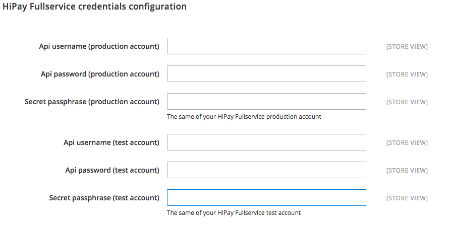
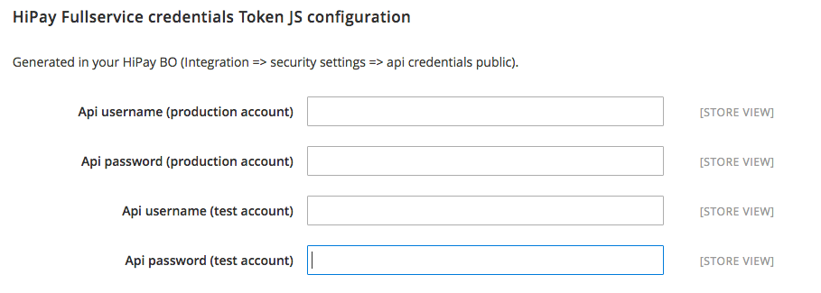
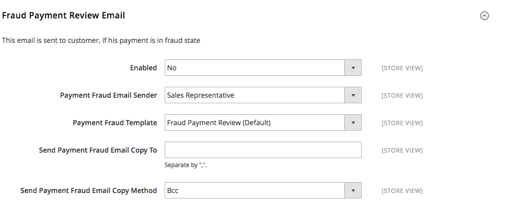

# Module configuration

Before using the HiPay Enterprise module for Magento 2, the following settings are required and must be configured:

1. Credentials configuration,
2. Fraud emails configuration.

In your Magento Admin Panel, select:  
```
Stores => Configuration => Sales [HiPay Enterprise]
```

Then, you need to enter your credentials, provided by HiPay.


## Credentials

### HiPay Enterprise credentials configuration  
HiPay Enterprise API credentials are required to use the HiPay Enterprise module for Magento 2.

|Field|Description|
|-----|-----|
|Api username (production account)|Retrieve it from your HiPay Enterprise back office (https://merchant.hipay-tpp.com) in "Integration" => "Security Settings" |
|Api password (production account)|Retrieve it from your HiPay Enterprise back office (https://merchant.hipay-tpp.com) in "Integration" => "Security Settings" |
|Secret passphrase (production account)|Enter the same value as in your HiPay Enterprise back office (https://merchant.hipay-tpp.com) in "Integration" => "Security Settings" |
|Api username (test account)|Retrieve it from your HiPay Enterprise back office (https://merchant.hipay-tpp.com) in "Integration" => "Security Settings" |
|Api password (test account)|Retrieve it from your HiPay Enterprise back office (https://merchant.hipay-tpp.com) in "Integration" => "Security Settings" |
|Secret passphrase (test account)|Enter the same value as in your HiPay Enterprise back office (https://merchant.hipay-tpp.com) in "Integration" => "Security Settings" |



### HiPay Enterprise credentials Direct Post configuration

Generated in your HiPay Enterprise back office ("Integration" => "Security Settings" => "Api credentials" => "Credentials accessibility": Public), these newly created HiPay Enterprise API credentials are required to use the HiPay Enterprise module for Magento 2.

|Field|Description|
|-----|-----|
|Api username (production account)|Retrieve it from your HiPay Enterprise back office (https://merchant.hipay-tpp.com) in "Integration" => "Security Settings" |
|Api password (production account)|Retrieve it from your HiPay Enterprise back office (https://merchant.hipay-tpp.com) in "Integration" => "Security Settings" |
|Api username (test account)|Retrieve it from your HiPay Enterprise back office (https://merchant.hipay-tpp.com) in "Integration" => "Security Settings" |
|Api password (test account)|Retrieve it from your HiPay Enterprise back office (https://merchant.hipay-tpp.com) in "Integration" => "Security Settings" |



### HiPay Enterprise credentials MO/TO configuration  
MO/TO API credentials are optional.  
They are required only if you need to pay an order created in your Magento Admin Panel.

|Field|Description|
|-----|-----|
|Api username (production account)|Retrieve it from your HiPay Enterprise back office (https://merchant.hipay-tpp.com) in "Integration" => "Security Settings" |
|Api password (production account)|Retrieve it from your HiPay Enterprise back office (https://merchant.hipay-tpp.com) in "Integration" => "Security Settings" |
|Secret passphrase (production account)|Enter the same value as in your HiPay Enterprise back office (https://merchant.hipay-tpp.com) in "Integration" => "Security Settings" |
|Api username (test account)|Retrieve it from your HiPay Enterprise back office (https://merchant.hipay-tpp.com) in "Integration" => "Security Settings" |
|Api password (test account)|Retrieve it from your HiPay Enterprise back office (https://merchant.hipay-tpp.com) in "Integration" => "Security Settings" |
|Secret passphrase (test account)|Enter the same value as in your HiPay Enterprise back office (https://merchant.hipay-tpp.com) in "Integration" => "Security Settings" |


## Email templates

Based on the screening results of HiPay's Fraud Protection Service, emails can be sent to final customers.
There are 3 email templates:  

*  **Fraudulent**: This email is sent to the customer if the payment is fraudulent.
*  **Accepted**: This email is sent to the customer if the payment is approved by the merchant.
*  **Denied**: This email is sent to the customer if the payment is denied by the merchant.

They all have the same configuration:

|Field|Description|
|-----|-----|
|Enabled|Enable/Disable sending|
|Payment Fraud Email Sender|Set the email sender|
|Payment Fraud Template|Set the email template. You can **customize it** in your Magento 2 Admin Panel. To do so, go to *"Marketing" => "Communications" [Email Templates]*. Click on *"Add New Template"*, then load the HiPay email template you want and modify it.|
|Send Payment Fraud Email Copy To|Email addresses you want to add in copy|
|Send Payment Fraud Email Copy Method|Select email copy method (Cc or Bcc)|


