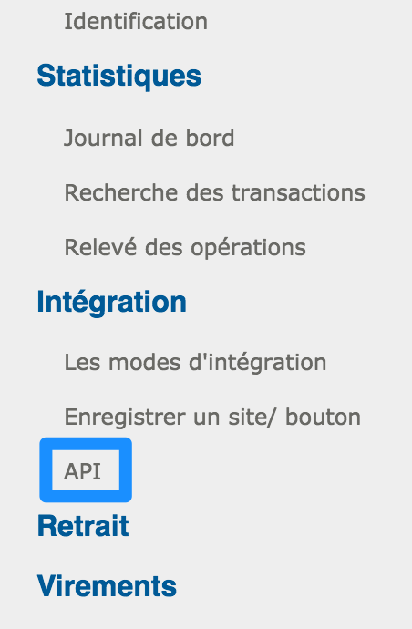
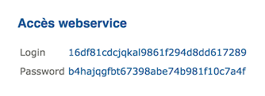
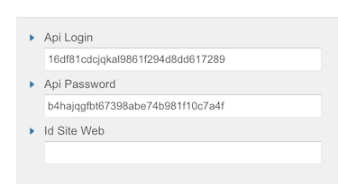
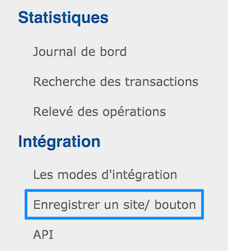
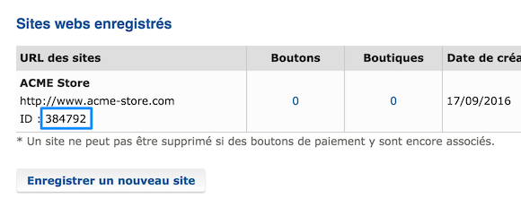

# HiPay Professional integration for WiziShop

## Preamble
HiPay Professional is fully integrated into WiziShop, allowing you to accept payments from your WiziShop online store. You don't need any technical knowledge in order to leverage this turnkey integration.

# Prerequisites

You need a WiziShop account. If you don't have one yet, you can create a store directly on the [WiziShop website](https://www.wizishop.fr/).

# Objective

The HiPay Professional integration into WiziShop allows you to accept payments in your WiziShop store, using either credit or debit cards (MasterCard, Visa, etc.) or local payment methods such as SOFORT, Multibanco, iDEAL, Przelewy24, Carte Bancaire, Bancontact, etc.

# Configuration

You don't need to install any software in order to make this integration work. You just need to configure it through the WiziShop back office.

Please follow the steps below in order to plug HiPay Professional to WiziShop.

## 1. WiziShop back office payment section

Log in to the WiziShop back office and go to the payment section.

Once logged in, move your cursor over "*Configuration*" in order to display the sub-menu and click on the "*Paiement*" tab:

Then, find the HiPay Professional integration and click on the button to add it:

## 2. HiPay Professional account

If you don't have a HiPay Professional account yet, create one by clicking on the link displayed on the WiziShop back office. If you already have one, you can skip this step:

## 3. HiPay Professional back office

Log in to your HiPay Professional back office. To do so, go on the [HiPay Professional website](https://www.hipaydirect.com) and click on "LOGIN".

## 4. API credentials

On the HiPay Professional back office, click on the API link of the Integration menu:

Then, find your credentials:

Copy and paste the API Login and API Password into WiziShop, as follows:

## 5. Website information

In your HiPay Professional back office, go to the websites section:

Then, find your website ID, as follows:

Finally, copy and paste this website ID into WiziShop:

Do not forget to choose a category of product when the category selector appears below the website ID field.

## 6. Payment workflow customization (optional)

Optionally, you can customize the payment workflow by clicking on the link allowing you to do so on the WiziShop back office. For example, these options allow you to change the payment logo as well as its label. These options are visible by clicking on the link at the bottom of the page, above the "Sauvegarder" button.

## 7. Save

When your integration is configured, click on the "Sauvegarder" button at the bottom of the page.

And that's it! Your payment workflow is all set on your WiziShop store. Please make a test order on your store in order to confirm that everything works well.