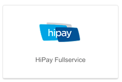

# HiPay Fullservice integration for WiziShop

## Preamble
HiPay Fullservice is fully integrated into WiziShop, allowing you to accept payments from your WiziShop online store. You don't need any technical knowledge in order to leverage this turnkey integration.

# Prerequisites

## HiPay Fullservice account

You need a HiPay Fullservice account. The HiPay Fullservice platform will process payments of your customers in a wide variety of payment methods (major credit and debit cards such as Visa, MasterCard and American Express as well as local payment methods).

If you don't have an account yet, contact us on [the HiPay Fullservice website](http://www.hipayfullservice.com/).

## WiziShop account

You need a WiziShop account. If you don't have one yet, you can subscribe directly on [the WiziShop website](https://www.wizishop.fr/).

# Objective

The HiPay Fullservice integration into WiziShop allows you to accept payments in your WiziShop store, either in credit or debit cards (MasterCard, Visa, …) or with local payment methods such as SOFORT, Multibanco, iDeal, Przelewy24, Carte Bancaire, Bancontact, etc.

# Configuration

You don't need to install any software in order to make this integration work. You just need to configure it through the WiziShop back office.

Follow the steps below in order to plug HiPay Fullservice to WiziShop.

## 1. WiziShop back office payment section

Log in to the WiziShop back office and go to the payment section.

Once logged in, move your cursor over "*Configuration*" in order to display the submenu and click on the "*Payment*" tab:

Then, find the HiPay Fullservice integration and click on it:

## 2. Configuration

Follow the configuration steps described on the WiziShop back office's HiPay Fullservice integration page. You will need to log in to [the HiPay Fullservice back office](merchant.hipay-tpp.com) in order to configure the integration.

At the end of the configuration, you should have filled the form like this:

## 3. Payment workflow customization (optional)

You may customize the payment page by uploading your own CSS (cascading style sheet) file. For more information, refer to the [HiPay Fullservice platform documentation](/getting-started/platform-hipay-fullservice/overview/). You will be able to upload your CSS file by using the appropriate button on the WiziShop back office.

Optionally, you can customize the payment workflow by clicking on the link allowing you to do so on the WiziShop back office. For example, these options allow you to change the payment logo as well as its label. These options are visible by clicking on the link at the bottom of the page, above the "Save" button.

## 4. Save

When your integration is configured, click on the "Save" button at the bottom of the page.

That's it! Your payment workflow is all set up on your WiziShop store. Make a test order on your shop in order to confirm that everything works well.