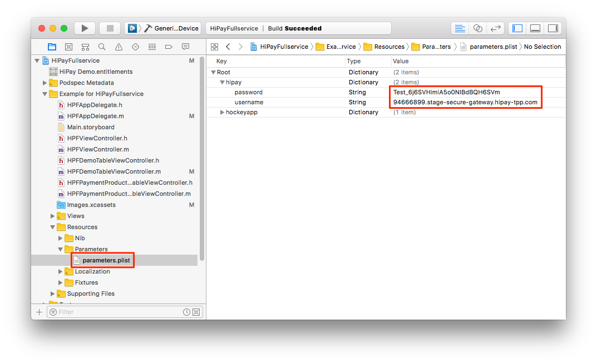

# Testing the demo app

## Preamble

The HiPay Enterprise SDK for iOS comes with a demo application which allows you to quickly test the built-in payment screen integration.

This demo application presents a screen that allows you to generate a payment screen based on many parameters such as: amount, payment product categories, etc.

This particular screen is not part of the SDK and your users will not see it. It is part of the demo application and has been created for testing purposes only.

## Installation guide

### Cloning the repository

First, you need to check out the repository. Go to your projects folder and type the following command:

	$ git clone https://github.com/hipay/hipay-fullservice-sdk-ios.git

Then, go to the project directory:

	$ cd hipay-fullservice-sdk-ios

### CocoaPods

This project has been built using [CocoaPods][cocoapods], the most popular package manager for Cocoa projects. If you have already installed CocoaPods on your workstation, you can skip this section.

If not, install it by typing the following command:

	$ sudo gem install cocoapods

### Setting up the project

First, go to the demo app directory:

	$ cd Example

To generate the project workspace, run the following command:

	$ pod install

### Opening the project

Open the `HiPayFullservice.xcworkspace` workspace by typing the following command:

	$ open HiPayFullservice.xcworkspace

### Adding the test credentials

To try the demo application with our HiPay Enterprise API test credentials, open the `parameters.plist` file and set these API credentials:

- Username : `94666899.stage-secure-gateway.hipay-tpp.com`
- Password : `Test_6j6SVHimlA5o0NIBdBQH6SVm`

### Running the demo app

Finally, build and run the `HiPayFullservice-Example` target.

[repo]: https://github.com/hipay/hipay-fullservice-sdk-ios
[cocoapods]: https://cocoapods.org/

### Unit tests

Unit tests are included as part of the demo app. If you want to run the unit tests, you first need to install the demo app by following this guide: [Testing the demo app](#testing-the-demo-app).

When the project is opened in Xcode, make sure that the `HiPayFullservice-Example` target is selected.

Finally, click on *Product* and *Test* to run the unit tests.
