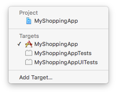
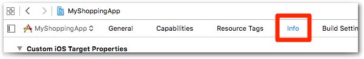
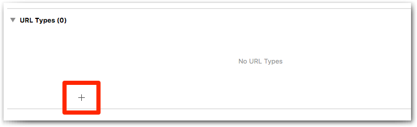
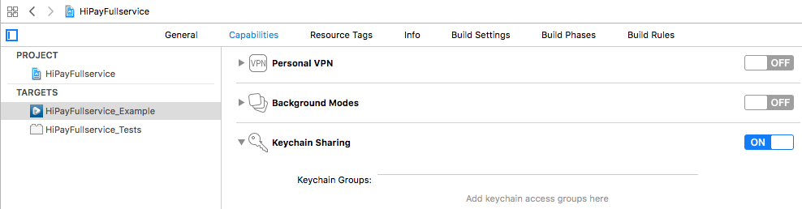
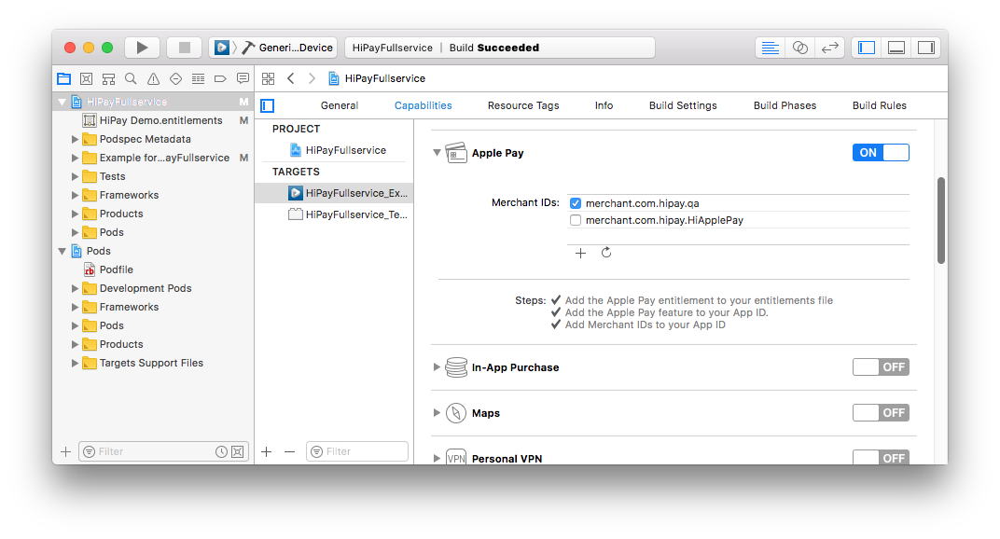
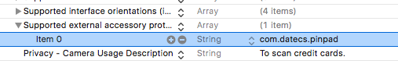
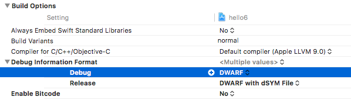

# Configuration

You need to follow all the steps below before integrating the payment workflow.

## Step 1 — Import header files

First and foremost, if you choose the default installation, you need to add this line in order to use the SDK in an Objective-C app:

```objectivec
#import <HiPayFullservice/HiPayFullservice.h>
```

If you added the Core instead of the default installation line (`pod 'HiPayFullservice/Core'`), you need to import directly the relevant sections.

```objectivec
#import <HiPayFullservice/Core.h>
#import <HiPayFullservice/HPFErrors.h>
#import <HiPayFullservice/HPFPOSManager.h>
```

In the case of a Swift project, you must rely on [an Objective-C bridging header](https://developer.apple.com/documentation/swift/imported_c_and_objective-c_apis/importing_objective-c_into_swift) to expose this framework (Objective-C files).

## Step 2 — Configure the SDK

Then, you need to provide the SDK with a few parameters, such as the credentials and targeted environment.

### Credentials

Get a valid HiPay Enterprise API username and password. If you don't have any, please refer to the [Prerequisites and recommendations](#prerequisites-and-recommendations) section.

### Determine your app URL scheme

Sometimes, your users may be redirected to web pages, for example to follow the 3-D Secure workflow or to process payments with payment methods which cannot be natively supported by the SDK.

To do so, the SDK presents your users with a `SafariViewController` web page. Eventually, your users will be redirected back to your app using an [app URL scheme][apple-scheme].

To find your app URL schemes, open your Xcode project settings:


Make sure that your app project is selected:



Open the "Info" tab:



Expand the "URL Types" section:


You can then either re-use an existing scheme or create a new one. To do so, click on the "+" button:



Fill out the form by setting a proper identifier and a URL scheme, as follows:


Eventually, you will need to use one of the values defined in the "URL Schemes" field. In this case, it's **myshoppingapp**.

### Set up the configuration

The following code allows you to configure the SDK. We recommend putting it in your *App Delegate*'s `application:didFinishLaunchingWithOptions:` method implementation.

#### Objective-C
```objectivec
// AppDelegate.m — application:didFinishLaunchingWithOptions:

[[HPFClientConfig sharedClientConfig] setEnvironment:HPFEnvironmentStage
                                      username:@"YOUR API USERNAME"
                                      password:@"YOUR API PASSWORD"
                                      appURLscheme:@"myshoppingapp"];

/** Optional
[[HPFClientConfig sharedClientConfig] setPaymentCardStorageEnabled:YES withTouchID:YES];

[[HPFClientConfig sharedClientConfig] setPaymentCardScanEnabled:YES];

[[HPFClientConfig sharedClientConfig] setApplePayEnabled:YES
                                      privateKeyPassword:@"YOUR P12 CERTIFICATE PASSWORD"
                                      merchantIdentifier:"YOUR MERCHANT IDENTIFIER"];
**/
```

#### Swift
```Swift
// AppDelegate.swift — application:didFinishLaunchingWithOptions:

HPFClientConfig.shared()
    .setEnvironment(HPFEnvironment.stage,
    username: "YOUR API USERNAME",
    password: "YOUR API PASSWORD",
    appURLscheme: "myshoppingapp")

/** Optional
HPFClientConfig.shared().setPaymentCardStorageEnabled(true, withTouchID: true)

HPFClientConfig.shared().isPaymentCardScanEnabled = true

HPFClientConfig.shared().setApplePayEnabled(false, privateKeyPassword: "YOUR P12 CERTIFICATE PASSWORD", merchantIdentifier: "YOUR MERCHANT IDENTIFIER")
**/
```

Do not forget to **replace the username and password arguments with your API username and password**. Also, **pass your own URL scheme** (determined in the previous section).

#### Payment card storage [OPTIONAL]

Note that if you enable the **payment card storage option**, since XCode 8.0 you need to **turn on the Keychain sharing in the Capabilities section of your project** to make it work.

You can find more information in the [Card storage feature](#usage-making-payments-core-wrapper-advanced-integration-card-storage-feature) page.    


    

#### Payment card scan [OPTIONAL]

At the same time, if you enable the **payment scan card option**, since iOS 10 you must **declare access to camera** to make it work or the app will crash.    
You must add the NSCameraUsageDescription key to your Info.plist with a string value explaining to the user how the app uses this data. (e.g. "To scan credit cards.")    


    

#### Apple Pay option [OPTIONAL]

If you enable the **Apple Pay option**, you need to **turn on Apple Pay in the Capabilities section of your project** and add your **Merchant ID** to make it work.

You need an HiPay Enterprise account configured with Apple Pay to get this functionality. Please contact the HiPay support team.

You can find more information about the Apple Pay configuring environment in the official developer documentation.  
[https://developer.apple.com/library/content/ApplePay_Guide/Configuration.html#//apple_ref/doc/uid/TP40014764-CH2-SW1](https://developer.apple.com/library/content/ApplePay_Guide/Configuration.html#//apple_ref/doc/uid/TP40014764-CH2-SW1)

You can find the implementation in the [Tokenizing an encrypted Apple Pay token](#usage-making-payments-core-wrapper-advanced-integration-tokenizing-an-encrypted-apple-pay-token) page.    




Once your app goes live, you need to set the environment to `HPFEnvironmentProd`.

#### In-store mobile point of sale option (mPOS) [OPTIONAL]

This section is relevant only if you need to use the SDK for processing transactions in a physical store, on a mobile point of sale (mPOS).

For using the payment terminal device provided by HiPay, follow these steps:

Add the item depicted below to the .plist file of your application.  

  

If you set the "Debug Information Format" setting to "DWARF", you get rid of three warnings.  



To start using the mPOS payment terminal, please read the integration guide in the "[In-store physical payments with a mPOS](#usage-making-payments-in-store-physical-payments-with-a-mpos)" paragraph.

## Step 3 — Handle callback redirection

If the SDK presents your users with a web page (for 3-D Secure or specific payment methods), they will eventually be redirected back to your app thanks to the app URL scheme.

In order for the SDK to be aware of the redirection and to receive the callback data, you need to implement the `application:handleOpenURL:` method in your *App Delegate*, as follows:

### Objective-C
```objectivec
// AppDelegate.m

- (BOOL)application:(UIApplication *)application handleOpenURL:(NSURL *)url {
    return [[HPFGatewayClient sharedClient] handleOpenURL:url];
}
```

### Swift
```Swift
// AppDelegate.swift

func application(application: UIApplication, handleOpenURL url: NSURL) -> Bool {
    return HPFGatewayClient.shared().handleOpen(url)
}
```

And that's it: the HiPay Enterprise SDK for iOS is properly configured.

[apple-scheme]: https://developer.apple.com/library/ios/featuredarticles/iPhoneURLScheme_Reference/Introduction/Introduction.html#//apple_ref/doc/uid/TP40007899
