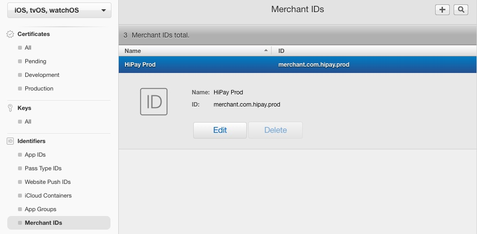
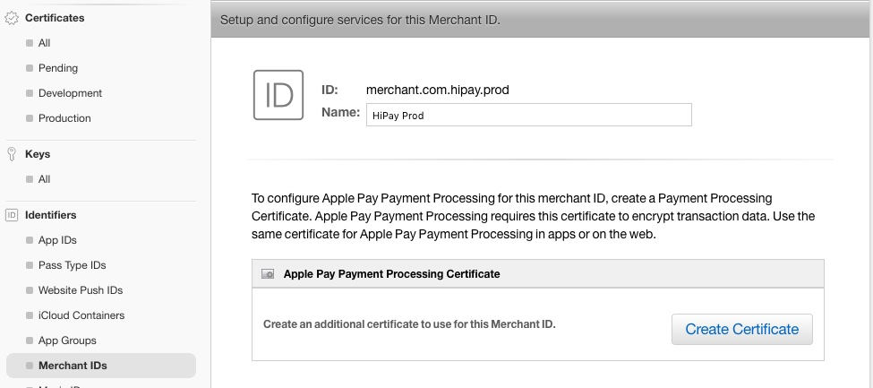
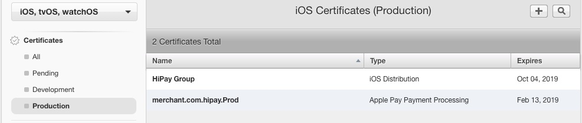
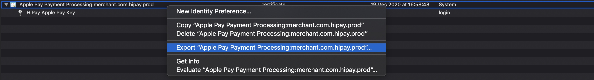
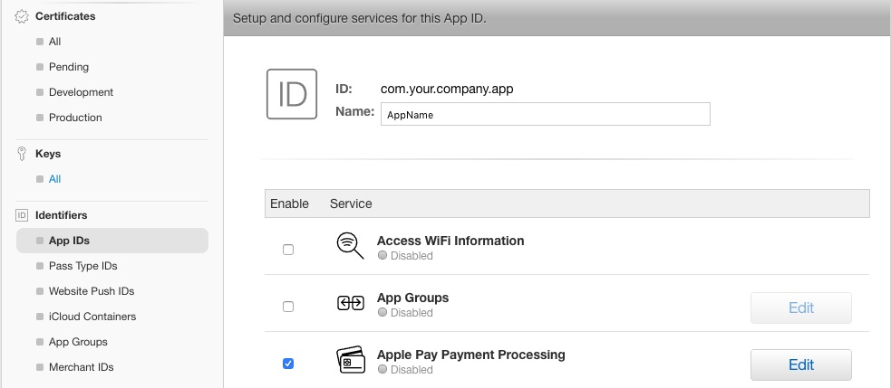
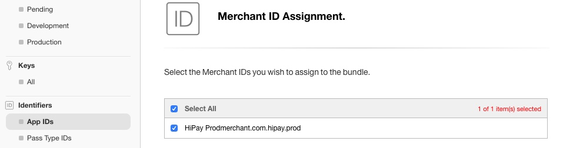
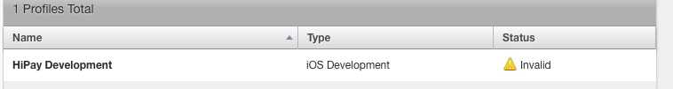
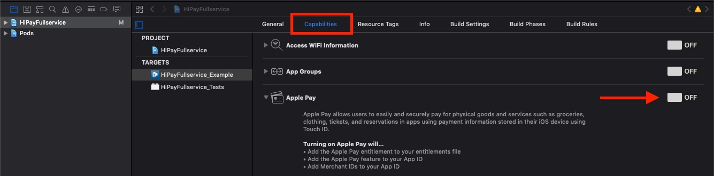
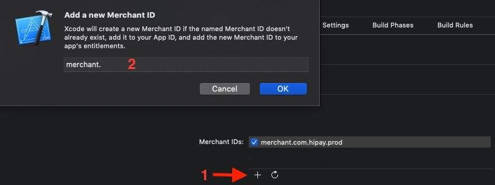

# Apple Pay


Apple Pay gives a secure and easy way to pay within apps and websites. Before starting, You should read this official document provided by Apple : https://developer.apple.com/apple-pay/Getting-Started-with-Apple-Pay.pdf

## Configuration

### Merchant ID creation

To use Apple Pay, you have to create an unique identifier, named **Merchant ID**.
firstly, log in to your Apple developer account in certificate section at https://developer.apple.com/account/ios/certificate/. Choose **Merchant IDs** from the left menu in **Identifiers** section, then, enter the merchant description. The Identifier field has to be unique and begin with "merchant". It is recommended to use the reverse domain name like the following example : **merchant.com.yourcompany**. Then click on **Continue** button.

We recommend to use two merchant ID, one for the production environment and one for the staging environment.


Verify the filled informations before to click on **Register** button.


### Apple Pay Payment Processing certificate generation

This certificate is associated with the merchant ID and used to encrypt payment's information between Apple Pay servers and HiPay. Every 25 months, this certificate expires. So you should revoke it before it expire and recreate it.

1. Select the Merchant ID and click on **Edit** button in **Merchant IDs** section.



2. Then click on **Create certificate** button.



3. Follow exactly Apple's information below **Create a CSR file. (Optional)** title.

4. When the **Certificate Signing Request (CSR)** file is save on your disk, click on **Continue** button.

5. Click on **Choose File** button and select the certificate file with the **.certSigningRequest** extension.
6. Click **Continue**.
7. Click on **Download** button and add the certificate (**.cer**) to your keychain by clicking on it.
8. Click **Done**
9. Repeat all steps for all your environments.

Your new Apple Pay Payment Processing certificate can be found in the production certificate list.



You can find more informations about certificate signing request creation here : https://help.apple.com/developer-account/#/devb2e62b839?sub=devf31990e3f

### Export the certificate

HiPay will decrypt token sent by Apple Pay thanks to your Apple Pay Payment Processing certificate. In order, to do that, you have to export your private and public key to HiPay's servers. After the reception, we will add it to our back office.

1. Launch Keychain on your Mac.
2. Search your **Apple Pay Payment Processing certificate** and the private key associated (it has be generated when you created the certificate).
3. Select two items and export them.



4. Name the file and export it in **.p12** extension.
5. Protect the file with a strong password.
6. Send a mail to support@hipay.com and include the file.

### Edit App ID

After merchant ID creation and the Apple Pay Processing certificate. You must assign Apple Pay with your iOS application.

1. Click on **App IDs** in **Identifiers** section.
2. Select your **App ID** by clicking on it.
3. Click on **Edit** at the bottom of all application services.
4. Click on **Edit** in the Apple Pay Payment Processing section.



5. Assign your Merchant ID to the Apple Pay bundle.



6. Click on **Continue**.
7. Review your assignment and click on **Assign**.

### Regenerate Provisioning Profiles

After the Apple Pay bundle assignment, Provisioning Profiles must be regenerated because they are invalided.



1. Click on **All** in **Provisioning Profiles** section.
2. Select the Profile.
3. Click on **Edit**.
4. Click on **Generate**.
5. Click on it to add to XCode.

## Setup SDK

### Add capability

In your project settings in XCode, under the capabilities tab, enable Apple Pay.



Then add the same Merchant ID than created before by clicking on the **(+)** button.



### Integration code

In order to use Apple Pay in your application,  you will have to use Apple's framework name **PassKit**. All classes used in the framework are prefixed by **PK**.

#### AppDelegate

In your AppDelegate file, add this following method to enable Apple Pay with the HiPay SDK :

**Objective-C**

```objc
[[HPFClientConfig sharedClientConfig] setApplePayEnabled:YES
                                      privateKeyPassword:@"YOUR P12 CERTIFICATE PASSWORD"
                                      merchantIdentifier:@"merchant.com.your.company.app"];
```

**Swift**

```objc
HPFClientConfig.shared().setApplePayEnabled(true,
                                            privateKeyPassword: "YOUR P12 CERTIFICATE PASSWORD",
                                            merchantIdentifier: "merchant.com.your.company.app")
```

- `merchantIdentifier` : Your merchant ID created in [Merchant ID creation](#apple-pay-configuration-merchant-id-creation) section.

-  `privateKeyPassword` It's the same password used in [Certificate export](#apple-pay-configuration-export-the-certificate) section.

#### Apple Pay Button

You should read theses Apple Pay's guidelines provided by Apple before continuing : https://developer.apple.com/apple-pay/marketing/

We use the **PKPaymentButton** class to show the official Apple Pay button. You can customize it with its type (**PKPaymentButtonType**) and its style (**PKPaymentButtonStyle**) parameters.

In this example below, we use the `canMakePayments` method of the **PKPaymentAuthorizationViewController** class to determine the button's style in accordance with the capacity of the device to make payments with particular networks.

**Objective-C**
```objc
#import <UIKit/UIKit.h>
#import <PassKit/PassKit.h>

@interface MyApplePayViewController <PKPaymentAuthorizationViewControllerDelegate>

@end

@implementation MyApplePayViewController

- (void)viewDidLoad {
    [super viewDidLoad];

    PKPaymentButtonType type;
    if ([PKPaymentAuthorizationViewController canMakePaymentsUsingNetworks:@[PKPaymentNetworkVisa, PKPaymentNetworkMasterCard, PKPaymentNetworkAmex]]) {
        type = PKPaymentButtonTypeBuy;
    }
    else {
        type = PKPaymentButtonTypeSetUp;
    }

    PKPaymentButton *button = [[PKPaymentButton alloc] initWithPaymentButtonType:type paymentButtonStyle:PKPaymentButtonStyleWhiteOutline];

    // TODO: Add button to view and set its constraints
}
```

**Swift**
```objc
import PassKit

class MyApplePayViewController: UIViewController, PKPaymentAuthorizationViewControllerDelegate {

    override func viewDidLoad() {
        super.viewDidLoad()

        var type : PKPaymentButtonType
        if PKPaymentAuthorizationViewController.canMakePayments(usingNetworks: [PKPaymentNetwork.visa, PKPaymentNetwork.masterCard, PKPaymentNetwork.amex]) {
            type = PKPaymentButtonType.buy;
        }
        else {
            type = PKPaymentButtonType.setUp
        }

        let button = PKPaymentButton(paymentButtonType: type, paymentButtonStyle: PKPaymentButtonStyle.whiteOutline)

        // TODO: Add button to view and set its constraints
    }
}
```

### Payment Screen

Then, we create an object of type **PKPaymentSummaryItem** which contains a description of the purchased item with its price.

To initialize the payment controller, you must create a request of the **PKPaymentRequest** class first. You can configure its attributes : `merchantIdentifier` , `countryCode`, `supportedNetworks`, `paymentSummaryItems` and many more.
After the request creation, we present the **PKPaymentAuthorizationViewController** Apple Pay controller to the user with this request.

More informations about request : https://developer.apple.com/library/archive/ApplePay_Guide/CreateRequest.html

**Objective-C**
```objc
PKPaymentSummaryItem *item = [PKPaymentSummaryItem summaryItemWithLabel:@"Item description" amount:<#PRICE#>];

PKPaymentRequest *paymentRequest = [[PKPaymentRequest alloc] init];
paymentRequest.paymentSummaryItems = @[item];
paymentRequest.merchantIdentifier = [[HPFClientConfig sharedClientConfig] merchantIdentifier];
paymentRequest.merchantCapabilities = PKMerchantCapability3DS;
paymentRequest.countryCode = @"FR";
paymentRequest.currencyCode = @"EUR";
paymentRequest.supportedNetworks = @[PKPaymentNetworkAmex, PKPaymentNetworkMasterCard, PKPaymentNetworkVisa];

PKPaymentAuthorizationViewController *paymentAuthorizationVC = [[PKPaymentAuthorizationViewController alloc] initWithPaymentRequest:paymentRequest];
paymentAuthorizationVC.delegate = self;
[self presentViewController:paymentAuthorizationVC animated:YES completion:nil];

```

**Swift**
```objc
let item = PKPaymentSummaryItem.init(label: "Item description", amount: <#PRICE#>)

let paymentRequest = PKPaymentRequest.init()
paymentRequest.paymentSummaryItems = [item]
paymentRequest.merchantIdentifier = HPFClientConfig.sharedClientConfig.merchantIdentifier
paymentRequest.countryCode = "FR"
paymentRequest.currencyCode = "EUR"
paymentRequest.supportedNetworks = [.amex, .masterCard, .visa]

if let paymentAuthorizationVC = PKPaymentAuthorizationViewController(paymentRequest: paymentRequest) {
    paymentAuthorizationVC.delegate = self
    present(paymentAuthorizationVC, animated: true, completion: nil)
} else {
    print("Error : init PKPaymentAuthorizationViewController")
}
```

### Apple Pay token

When the user authorizes a payment request, the **PassKit** framework creates a payment token by coordinating with Apple’s server and the Secure Element. This token has to be sent to our HiPay's servers. To obtain Apple Pay's token, your Apple Pay controller should be conform to the **PKPaymentAuthorizationViewControllerDelegate** protocol. so we use the `paymentAuthorizationViewController:didAuthorizePayment:completion` delegate's method to retrieve this token. More precisely, this method returns an object of type **PKPayment** when the user validated his payment by Touch ID or Face ID. This object of type **PKPayment** contains an attribute of **PKPaymentToken** class named **token**, which contains **paymentData** attribute.

This response can be serialized in JSON file and sent to the **apple-pay/token** endpoint with the **generateTokenWithApplePayToken: privateKeyPassword:andCompletionHandler** SecureVaultClient method. The return object of the method is a **HPFPaymentCardToken** token type. Then, We will be able to create a **Order** and complete the payment. To decrypt the Apple Pay token and retrieve payment informations, back office uses the private key of the certificate **Apple Pay Payment Processing**.

More information about Apple Pay token : https://developer.apple.com/library/archive/documentation/PassKit/Reference/PaymentTokenJSON/PaymentTokenJSON.html

**Objective-C**

```objc
- (void) paymentAuthorizationViewController:(PKPaymentAuthorizationViewController *)controller
                        didAuthorizePayment:(PKPayment *)payment
                                 completion:(void (^)(PKPaymentAuthorizationStatus))completion
{
    NSString *decodedString = [[NSString alloc] initWithData:payment.token.paymentData
                                                encoding:NSUTF8StringEncoding];

    [[HPFSecureVaultClient sharedClient] generateTokenWithApplePayToken:decodedString
                                                     privateKeyPassword:@"YOUR P12 CERTIFICATE PASSWORD"
                                                   andCompletionHandler:^(HPFPaymentCardToken * _Nullable cardToken, NSError * _Nullable error) {

             /* Create HPFOrderRequest if tokenization was completed successfully.
              * Otherwise, handle the error object */
     }];
}
```

**Swift**
```objc
func paymentAuthorizationViewController(controller: PKPaymentAuthorizationViewController,
    didAuthorizePayment payment: PKPayment, completion: @escaping (PKPaymentAuthorizationStatus) -> Void) {

    let decodedToken = String(data: payment.token.paymentData, encoding: .utf8)

    HPFSecureVaultClient.shared().generateToken(withApplePayToken: decodedString,
                                               privateKeyPassword: "YOUR P12 CERTIFICATE PASSWORD") { (hipayToken, error) in

             /* Create HPFOrderRequest if tokenization was completed successfully.
              * Otherwise, handle the error object */
    }

}
```
