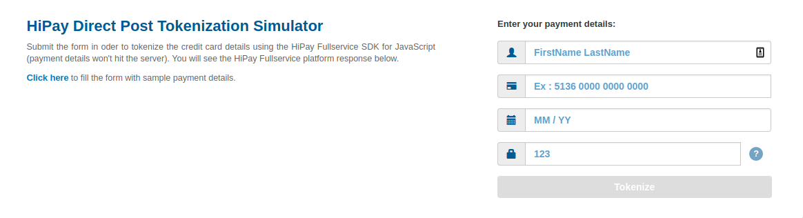

# HiPay Enterprise JavaScript SDK for tokenization (Direct Post)

The HiPay Enterprise JavaScript SDK for tokenization allows you to tokenize credit or debit cards using the HiPay Enterprise payment platform, directly from your web browser. It enables you to offer a unified payment workflow to your customers while remaining PCI compliant.

# Security principle

Payment data (e.g.: card number, card verification code...) will never hit your server: they will remain in the browser and will be sent directly to the HiPay Enterprise Secure Vault. With this method (called "Direct Post" in the PCI Council's terminology), you can create your own payment form, hosted on your server. Once the user validates the form, payment data are sent to the HiPay Enterprise platform through the HiPay Enterprise JavaScript SDK, which returns a token. Then, you can process payments with the token on the server side.

# Installation

### Using Bower

The easiest way to use the SDK is to install it using [Bower](http://bower.io). To do so, type the following command into a terminal window:

```sh
$ bower install hipay-fullservice-sdk-js
```

### Cloning the repository

You can clone the repository by typing the following command into a terminal window:

```sh
$ git clone git://github.com/hipay/hipay-fullservice-sdk-js
```

### Downloading the archive

You can also download the source code in ZIP format.

# Example app

## Scope

You can test our example app, which is available in the `example/public` directory. This app leverages both the HiPay JavaScript SDK and PHP SDK in order to tokenize the card number (in the browser, using the JavaScript SDK) and create a transaction with this token on the server side using the PHP SDK.



## Setup

### Prerequisites

The example app is plug-and-play with Docker. This procedure requires Docker to be installed on your machine.

### Procedure

In order to test the example app, open a terminal and execute setup.sh with init parameter

	$ ./setup.sh init

Copy the file `example/config/credentials.php.dist` to `example/config/credentials.php` and open it to put your own HiPay Enterprise private credentials. Follow the instructions inserted in PHP comments.
Then, copy the file `example/public/credentials_public.json.dist` to `example/public/credentials_public.json` and open it to put your own HiPay Enterprise public credentials.

Finally, open your web browser and go to http://localhost:8080. 
You should see the form shown in the screenshot above.

# Integration guide

The following integration guide describes step by step how to use the HiPay Enterprise JavaScript SDK for tokenization. The implementation can also be found in the example app (please see the previous section).

## Importing the JavaScript SDK

To use the SDK, you need to add the following script tag to your HTML pages:

```html
<script type="text/javascript" src="dist/hipay-fullservice-sdk-2.js"></script>
```
For better performance, you can use the minified version:

```html
<script type="text/javascript" src="dist/hipay-fullservice-sdk-2.min.js"></script>
```

## HTML-side integration
Then, you need to add a payment form to your checkout page. Here is a basic HTML example using Bootstrap and jQuery:

```html
<div id="main" class="container">
    <div class="row">
        <div class="col-sm-12 col-lg-7">
            <!-- Main component for a primary marketing message or call to action -->
            <div class="scontainer" id ="infos-txt" class="">
                <h1 class="main-title" id="price">HiPay Direct Post Tokenization Simulator</h1>
                <p id="order">Submit the form in order to tokenize the credit card details using the HiPay Enterprise SDK for JavaScript (payment details won't hit the server). Please see the HiPay Enterprise platform response below.</p>
                <div id="code"></div>
                <p id="link-area">
                    <a class="" role="link" href="#null" id="link">Click here</a> to fill the form with sample payment details.
                </p>
                <p id="charge" >
                    <a class="btn btn-lg btn-primary" role="button" href="#null" id="charge-button" style="display: none;">Create a test charge on this token (server-side PHP SDK)</a>
                </p>
            </div>
        </div>

        <div class="col-sm-12 col-lg-5">
            <div class="scontainer" id="form">

                <p class="form-description details">
                    Enter your payment details:
                </p>

                <div class="row">
                    <div class="col-lg-12">
                        <div class="form-group">
                            <label class="sr-only" for="input-name">First name Name</label>
                            <div class="input-group">
                                <div class="input-group-addon-icon input-group-addon"><span class="glyphicon glyphicon-user" aria-hidden="true"></span></div>

                                <input type="text" class="form-control" id="input-name" placeholder="" value="">
                            </div>
                        </div>
                    </div>
                </div>
                <div class="row">
                    <div class="col-lg-12">
                        <div class="form-group">
                            <label class="sr-only" for="input-card">Card number</label>
                            <div class="input-group">
                                <div class="input-group-addon-icon input-group-addon"><span class="glyphicon glyphicon-credit-card" aria-hidden="true"></span></div>
                                <input type="tel" class="form-control" id="input-card"  placeholder="" autocomplete="off" pattern="\d*" name="cardNumber" value="">
                            </div>
                            <div id="creditCardNumberMessageContainer" class="inputMessageContainer"></div>
                        </div>
                    </div>
                </div>


                <div class="row">
                    <div class="col-lg-12">
                        <div class="form-group">
                            <label class="sr-only" for="input-name">MM / YY</label>
                            <div class="input-group">
                                <div class="input-group-addon-icon input-group-addon"><span class="glyphicon glyphicon-calendar" aria-hidden="true"></span></div>
                                <input type="text" class="form-control" id="input-expiry-date" value="">
                                <input tabindex="-1" style="position: absolute; left: -999em; width:1px" type="tel" class="form-control" id="expiration-month" value="">
                                <input tabindex="-1" style="position: absolute; left: -999em;width:1px" type="tel" class="form-control" id="expiration-year" value="">

                               </div>
                            <div id="creditCardExpiryDateMessageContainer" class="inputMessageContainer"></div>

                        </div>
                    </div>
                </div>

                <div class="row">
                    <div class="col-lg-12">

                        <div class="form-group">
                            <label class="sr-only" for="input-cvv">123</label>
                            <div id="container-cvv" class="input-group">
                                <div class="input-group-addon-icon input-group-addon"><span class="glyphicon glyphicon-lock" aria-hidden="true"></span></div>
                                <input class="form-control" id="input-cvv" placeholder="123" maxlength="3" value="">
                                <span id="cvv-button" class="input-group-addon"><button type="button" data-toggle="modal" data-target="#cvv-modal">?</button></span>
                            </div>
                            <div id="creditCardCVVMessageContainer" class="inputMessageContainer"></div>
                        </div>
                    </div>
                </div>


                <div class="row">
                    <div class="col-lg-12">
                        <div id="submit-zone">
                            <div id="error"></div>
                            <button class="btn btn-large" type="button" data-toggle="modal" data-target="#other-method-modal" id="pay-button">Tokenize</button>
                        </div>
                    </div>
                </div>

            </div>
        </div>

    </div>

</div>
```


Another example without jQuery:

```html
<div id="main" class="container">
    <!-- Main component for a primary marketing message or call to action -->
    <div class="scontainer" id="infos-txt" class="">
        <h1 class="main-title" id="price">HiPay Direct Post Tokenization Simulator</h1>
        <p id="order">Submit the form in oder to tokenize the credit card details using the HiPay Fullservice SDK for JavaScript (payment details won't hit the server). You will see the HiPay Fullservice platform response below.</p>
        <div id="code"></div>
        <p id="link-area">
            <a class="" role="link" href="#null" id="link">Click here</a> to fill the form with sample payment details.
        </p>
        <p id="charge">
            <a class="btn btn-lg btn-primary" role="button" href="#null" id="charge-button" style="display: none;">Create a test charge on this token (server-side PHP SDK)</a>
        </p>
    </div>
    <div class="scontainer" id="form">
        <p class="form-description details">
            Enter your payment details:
        </p>
        <div class="row">
            <label class="sr-only" for="input-name-custom">Prénom Nom</label>
            <div class="input-group">
                <div class="input-group-addon-icon input-group-addon"><span class="glyphicon glyphicon-user" aria-hidden="true"></span></div>
                <input type="text" class="form-control" id="input-name-custom" autocomplete="cc-name" x-autocompletetype="cc-name" placeholder="" value="" data-hipay-id="card-holder" data-hipay-tabable="true">
            </div>
        </div>
        <div class="row">
            <label class="sr-only" for="input-card-custom">Card number</label>
            <div class="input-group">
                <div class="input-group-addon-icon input-group-addon"><span class="glyphicon glyphicon-credit-card" aria-hidden="true"></span></div>
                <input type="tel" class="form-control" id="input-card-custom" autocomplete="cc-number" x-autocompletetype="cc-number" placeholder="" pattern="\d*" name="cardNumber" value="" data-hipay-id="card-number" data-hipay-tabable="true">
            </div>
            <div id="creditCardNumberMessageContainer" class="inputMessageContainer"></div>
        </div>
        <div class="row">
            <label class="sr-only" for="input-expiry-date">MM / YY</label>
            <div class="input-group">
                <div class="input-group-addon-icon input-group-addon"><span class="glyphicon glyphicon-calendar" aria-hidden="true"></span></div>
                <input type="text" class="form-control" id="input-expiry-date" value="" data-hipay-id="card-expiry-date" data-hipay-tabable="true">
            </div>
            <div id="creditCardExpiryDateMessageContainer" class="inputMessageContainer"></div>
        </div>
        <div class="row">
            <label class="sr-only" for="input-cvv">123</label>
            <div id="container-cvv" class="input-group">
                <div class="input-group-addon-icon input-group-addon"><span class="glyphicon glyphicon-lock" aria-hidden="true"></span></div>
                <input class="form-control" id="input-cvv" placeholder="123" maxlength="3" value="" data-hipay-id="card-cvv" data-hipay-tabable="true">
                <span id="cvv-button" class="input-group-addon"><button id="cvv-modal" type="button" data-toggle="modal" data-target="#cvv-modal">?</button></span>
            </div>
            <div id="creditCardCVVMessageContainer" class="inputMessageContainer">
                <p id="container-cvv-help-message"></p>
            </div>
        </div>
        <div class="row">
            <div id="submit-zone">
                <div id="error-container"></div>
                <button class="btn btn-large" type="button" data-toggle="modal" data-target="#other-method-modal" id="pay-button" data-hipay-id="pay-button">Tokenize</button>
            </div>
        </div>
    </div>
</div>
```

## JavaScript processing
You can verify the validity of the form with HiPay.Form.paymentFormDataIsValid().
In this example, the submit button is disabled until the form is valid.

Example with jQuery:
```js
$("#pay-button").prop('disabled', !HiPay.Form.paymentFormDataIsValid());
```

Example without jQuery:
```js
document.getElementById("pay-button").disabled = !HiPay.Form.paymentFormDataIsValid();
```


You can add a callback function when the form data change. 
For example, you can:

1) get CVV information with HiPay.getCVVInformation()
2) get the validity of the form with HiPay.Form.paymentFormDataIsValid()
3) get an error list if the form is not valid

Example with jQuery:

```js
HiPay.Form.change(function() {
    // get CVV information
    console.log(HiPay.getCVVInformation());
    console.log('change form');
    // enable / disable the submit button with form validity
    $("#pay-button").prop('disabled', !HiPay.Form.paymentFormDataIsValid());
    // get an error list if the form is not valid
    var errorCollection = HiPay.Form.paymentFormDataGetErrors();
    console.log("errorCollection from client");
    console.log(errorCollection);
});
```

Example without jQuery:
```js
HiPay.Form.change(function() {
    // Information on card CVV
    // CVV message
    document.getElementById('container-cvv-help-message').innerHTML = HiPay.Form.CVVHelpText();
    // CVV image
    var myImgCVV = document.getElementById("cvv-img");
    cvvInfo = HiPay.getCVVInformation();
    console.log("cvvInfo");
    console.log(cvvInfo);
    myImgCVV.src = "./img/cvv-type/cvv_" + cvvInfo['length'] + ".png";
    var isDisabled = !HiPay.Form.paymentFormDataIsValid();
    document.getElementById("pay-button").disabled = isDisabled;
    var errorCollection = HiPay.Form.paymentFormDataGetErrors();
});

```

Once the user validates the form, you must use the JavaScript SDK in order to tokenize the card. Here is an example using *jQuery*.
First, set target and credentials with HiPay.setTarget() and HiPay.setCredentials().
Then, use HiPay.Form.tokenizePaymentFormData(), which returns a promise.
In case of success, a card token is returned. In any other case, an error is returned (e.g.: HiPay.ErrorReason.APIIncorrectCredentials, HiPay.ErrorReason.InvalidCardToken...).

Example with jQuery: 
```js
$("#pay-button").click(function() {

    // disable the submit button and display loader
    $("#form :input").prop("disabled", true);
    $("#form :button").prop("disabled", true);
    $("#error").text("");
    $("#pay-button").text("Loading…");

    // set target and credentials
    HiPay.setTarget('stage'); // default is production/live
    HiPay.setCredentials('<?php echo $credentials["public"]["username"]; ?>', '<?php echo $credentials["public"]["password"]; ?>');

    HiPay.Form.tokenizePaymentFormData()
        .then(function(cardToken) {
            token = cardToken.token;
            $("#pay-button").text("Tokenize");
            $("#order").text("The token has been created using the JavaScript SDK (client side).");

            $('#code').text(JSON.stringify(cardToken, null, 4));
            $('#link-area').text('');

            $("#charge-button").show();
        })
        .catch(function(error) {
            if (error.code === HiPay.ErrorReason.APIIncorrectCredentials) { // equal to 1000001
                console.log("Invalid credentials");
            }

            if (error.code === HiPay.ErrorReason.InvalidCardToken) { // equal to 1012003
                console.log("Invalid card token");
            }

            $("#pay-button").text("Tokenize");
            $("#form :input").prop("disabled", false);
            $("#form :button").prop("disabled", false);

            if (error.errorCollection != undefined && error.errorCollection.length > 0) {
                for (var i = 0; i < error.errorCollection.length; i++) {
                    var errorParameters = error.errorCollection[i];
                    $("#error").append(errorParameters.message);
                }
            }

        });

    return false;
});
```


Example without jQuery: 
```js
addCustomEventListener(document.getElementById("pay-button"), "click", function() {
    document.getElementById("pay-button").disabled = true;
    document.getElementById("error-container").innerHTML = "";
    document.getElementById("pay-button").innerHTML = "Loading…";
    HiPay.Form.tokenizePaymentFormData()
        .then(function(cardToken) {
            token = cardToken.token;
            document.getElementById("pay-button").innerHTML = "Tokenize";
            document.getElementById("order").innerHTML = "The token has been created using the JavaScript SDK (client side).";
            document.getElementById("code").innerHTML = JSON.stringify(cardToken, null, 4);
            document.getElementById("link-area").innerHTML = "";
            document.getElementById("charge-button").style.display = 'block';
        })
        .catch(function(error) {
            if (error.code === HiPay.ErrorReason.APIIncorrectCredentials) { // equal to 1000001
                console.log("Invalid credentials");
            }
            if (error.code === HiPay.ErrorReason.InvalidCardToken) { // equal to 1012003
                console.log("Invalid card token");
            }
            document.getElementById("pay-button").innerHTML = "Tokenize";
            document.getElementById("pay-button").disabled = false;
        });
    return false;
});
```

Once the token is retrieved, you can process a payment on the server side. Please see the example app's source code for more information.

# SDK reference

Please find below the methods and parameters made available by the SDK.

## Basic methods and request parameters

| Field name   |      Format      |  Description |
|----------|:-------------:|------|
| `setTarget` |  AN | If you are testing on your stage or production account, you can choose the following targets:<br/>- `stage`<br/>- `production`
| `setCredentials` |  AN | Your Direct Post API credentials. **Be careful! Do not use classic API credentials but public API credentials created in the HiPay Enterprise back office.**
| `HiPay.Form.tokenizePaymentFormData` |  - | Credit card information. Please refer to the “Token creation request parameters” table below.

## Token creation request parameters

| Field name   |  Format |  Length |   Req. |  Description |
|----------|:-------------:|:------:|:------:|------|
| `card_number` |  N | 19 |  M | Card number, with a 12- to 19-digit length
| `card_expiry_month` |  N | 2|  M | Card expiry month, expressed with two digits (e.g.: 01)
| `card_expiry_year` |  N | 4|  M | Card expiry year, expressed with four digits (e.g.: 2019)
| `card_holder` |  AN | 25|  - | Cardholder’s name as it appears on the card (up to 25 characters)
| `cvc` |  N | 4|  - | 3- or 4-digit security code (called CVC2, CVV2 or CID depending on the card's brand) as it appears on the credit card
| `multi_use` |  N | 1|  - | Indicates if the token should be generated either for a single use or multiple uses.<br/>Possible values:<br/>1 = Generate a multi-use token.<br/>0 = Generate a single-use token.<br/>While a single-use token is typically generated for a short time and for processing a single transaction, multi-use tokens are generally generated for recurring payments.
 
## Token creation response parameters
The following table lists and describes response fields.

| Field name   |      Description     |
|----------|------------|
|`token`| Token that was created |
|`request_id`| Request ID linked to the token |
|`brand`| Card's brand (e.g.: Visa, Mastercard, American Express, Maestro) |
|`pan`| Card number (up to 19 characters). Please note: due to PCI DSS security standards, our system has to mask credit card numbers in any output (e.g.: 549619******4769).|
|`card_holder`| Cardholder’s name |
|`card_expiry_month`| Card expiry month (2 digits) |
|`card_expiry_year`| Card expiry year (4 digits) |
|`issuer`| Card-issuing bank’s name<br/>Do not rely on this value to remain static over time. Bank names may change over time due to acquisitions and mergers.|
|`country`| Bank country code where the card was issued. This two-letter country code complies with ISO 3166-1 (alpha 2).|
|`card_type`| Card type (if applicable, e.g.: “DEBIT, CREDIT”) |
|`card_category`| Card category (if applicable, e.g.: “PLATINUM”) |
