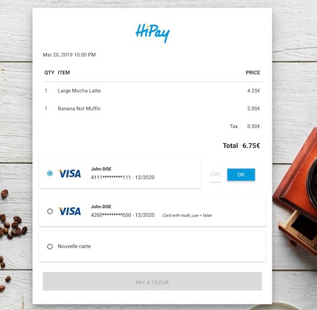
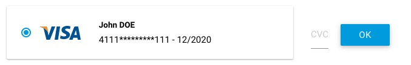
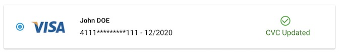
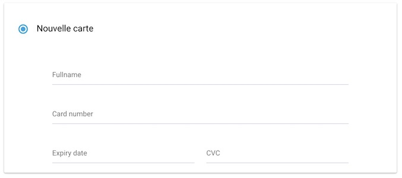
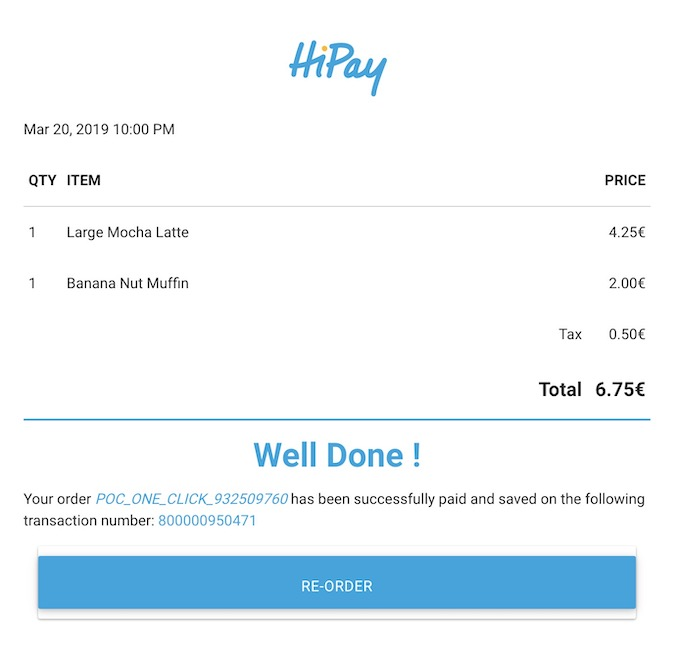

# One-click payment + CVC

The purpose of this documentation is to explain the implementation of the *one-click* feature with HiPay SDKs by giving the possibility to force the CVC of a card or add a new one in your payment page.

> The 1-Click is the technique allowing customers to make purchases with payment information already registered to complete their purchase faster.

In this demonstration, we use a front-end written in HTML/CSS with Javascript (jQuery) and backend server written in PHP. All examples written in this document are for reference only, you should not implement them in production.



## Front-end

The screenshot is a payment page of an order of two items for a total amount of €6.75. The user has to choose one of their first two saved cards or to add a new card. The first two cards were previously tokenized during a payment of the same customer.

To use these credit cards, it is mandatory to provide the CVC.

### Tokenization of bank cards

When we have tokenized cards, the ```multi_use``` parameter was sent with the ```true``` value, so this card could be reused for a future payment. Card tokens are written directly into HTML tags of the page.

### Displaying bank cards

Each card is composed of an ```input``` radio button that includes token in its attributes. The associated credit card logo is displayed with the name of the cardholder and the masked PAN with its expiry date.

The first registered card 4111********111 can only be used if the user enters the CVC associated with their card, the payment button is disabled if the CVC is not filled.






This HTML code below corresponds to the above screenshot. A hidden _div_ markup named ```status-cvc-container``` contains a check image with its _span_ markup to indicated the cvc is updated.  

The _div_ markup named ```check-cvc-container``` is displayed by default when the users click one the card. It contains an *input* to entered the CVC and an ```OK``` button.

The ```PAY``` button is disabled until the user provides the CVC of the card. If the user sends its CVC by clicking the ```OK``` button, the payment information ```token``` and ```payment_product``` are sent to your server with AJAX call when the ```PAY``` button is clicked. After that, ```check-cvc-container``` is hidden and ```status-cvc-container``` is displayed.

### New card

The customer has the option to add a new card if needed. This forms in the exampled is generated with the *Hostedfields* feature presents in the HiPay JS SDK.




### Implementation

*HTML code*
```html
<div class="payment">
    <div class="card-container" id="card-container-1">
        <div class="bank-card">
            <input class="radio-card" type="radio" name="card" value="card1" id="card1" onclick="manageCardForm(0)"
                data-token-card1="8dd9cf661de7a36c779746ebc35bf3a9" checked>
            <label class="card-label" for="card1">
                <div class="newLabel">
                    
                    <div class="card-info">
                        <span class="cardholder">John DOE</span>
                        <span class="card-number">4111*********111 - 12/2020</span>
                    </div>
                    <div class="status-cvc-container" style="display:none">
                        <i class="material-icons green-text">check_circle_outline</i>
                        <span class="cvc-updated-label">CVC Updated</span>
                    </div>
                </div>
            </label>
        </div>
        <div class="check-cvc-container" style="display:none">
            <div class="input-cvc">
                <input class="check-cvc" id="cvc-input-1" type="text" placeholder="CVC" maxlength="3">
            </div>
            <button class="btn" type="button" name="button" id="ok-button-1" disabled><span>OK</span></button>
        </div>
      </div>

      <div class="bank-card-new-container">
          <div class="bank-card-new">
              <input class="radio-card with-gap" type="radio" name="card" value="new-card" id="newCard"
                  onclick="manageCardForm(3)">
              <label class="card-label" for="newCard">
                  <div class="newLabel">
                      Nouvelle carte
                  </div>
              </label>
          </div>
          <div id="new-card-form"></div>
      </div>
</div>
```

To use HiPay Javascript SDK, you have to create an HiPay object named _hipayInstance_ in this example. Then you have to create _card_ instance joined by the ```selector``` parameter to the ```new-card-form``` div with ```template```set to auto.

*JavaScript code*
```javascript
hipayInstance = HiPay({
    username: CREDENTIALS_PUBLIC_USERNAME,
    password: CREDENTIALS_PUBLIC_PASSWORD,
    environment: "production",
    lang: "en"
  });

  var config = {
    selector: 'new-card-form',
    template: 'auto',
  };

  cardInstance = hipayInstance.create('card', config);
});
```

Then, we add a click event on the ```OK``` button. We retrieve card token and its cvc entered by the user. We use the ```updateToken``` function provided by HiPay SDK to update the new cvc with the associated token. At the callback success, we set true value in an item in session storage. With the value stored in Session Storage, the user does not have to update his token even he refresh the tab. The Token can be not updated in the HTML page because it remains the same even after the update. After that, Do not forget to display the ```status-cvc-container``` div markup and hide the ```check-cvc-container``` div markup.

You can add to the user an error status to prevent

```javascript
document.getElementById("ok-button-1").addEventListener("click", function() {
  var card1 = document.getElementById("card1");
  var token = card1.getAttribute("data-token-card1");
  var cvc = document.getElementById('cvc-input-1').value;

  var params = {
    request_id: 0,
    card_token: token,
    card_expiry_month: "11",
    card_expiry_year: "2022",
    card_holder: "John Doe",
    cvc: cvc,
  };

  hipayInstance.updateToken(params).then(
    function(response) {
      sessionStorage.setItem("card_cvc_updated", true);
    },
    function(error) {
      // Display a error status
      console.log(error);
    }
  );
});
```

You can add a keyup event on the CVC input to force users entered 3 (VISA / Mastercard) or 4 (AMEX) digits for the validating. For that, we add a Regex and a maximum length retrieved from its ```maxlength``` attribute of the input to enabled or disabled the ```OK``` button.

```javascript
$("#cvc-input-1").keyup(function() {
  var cvc = $("#cvc-input-1").val();
  var maxLength = $("#cvc-input-1").attr("maxlength");
  var okButtonEnabled = (cvc.length == maxLength && /^\d+$/.test(cvc));
  $("#ok-button-1").prop("disabled", !okButtonEnabled);
})
```

### Send payment data to the server

In the first step, we have created the front-end checkout with our two cards and the forced CVC. Now, for sending payment data, we use AJAX call when the user clicked on the ```pay``` button.

```Javascript
$("#checkout-button").click(function() {
  //Get the selected card
  var cardSelected = document.querySelector('input[name="card"]:checked').value;

  //Display a progress bar
  $("#hipay-progress").show();
  //Disabled the pay button when processing
  $("#checkout-button").disabled = true;

  var paymentData = {};
  if (cardSelected === 'card1') {
    var token = $("card1").getAttribute("data-token-card1");
    paymentData = {"token": token, "payment_product": "visa"};
  }
  //... Other cards


  //Send payment data in JSON format to your server with an AJAX call
  $.ajax({
    url : "https://your-backend-url/,
    type : 'POST',
    data: JSON.stringify(paymentData),
    contentType: "application/json; charset=utf-8",
    dataType : 'json',
    success : function(result){
      //Hide the progress bar
      $("#hipay-progress").hide();
      //Save the transaction response (transaction_number, order_id and foward_url)
      sessionStorage.setItem("response_order", JSON.stringify(result));
      //Load the forward url
      window.location = result.forward_url;
    }
  });
}
```

## Back-end

This provided code is used in the back-end server. In this example code, we create a HiPay transaction with all required data. We send the request order with the PHP HiPay SDK, and we create a JSON response sent to the front-end.

```php
  $logins = [
    "login" => $credentials['private']['login'],
    "password" => $credentials['private']['password'],
  ];

  $data = [
    "orderid"=>"POC_ONE_CLICK_".rand(),
    "operation"=>"Sale",
    "eci"=>7,
    "multi_use"=>1,
    "accept_url"=>$FRONDEND_URL."/?type=accept",
    "decline_url"=>$FRONDEND_URL."/?type=error",
    "cancel_url"=>$FRONDEND_URL."/?type=error",
    "language"=>"fr_FR",
    "email"=>"demo@example.com",
    "custom_data"=>"{\"item 1\":\"Large Mocha Latte\", \"item 2\":\"Banana Nut Muffin\"}",
    "time_limit_to_pay"=>90
    // ...
  ];

  try {
    //Get JSON data from front-end
    $receivedData = json_decode(file_get_contents('php://input'),true);

    //Set reponse code  at 200
    http_response_code(200);

    $config = new \HiPay\Fullservice\HTTP\Configuration\Configuration($logins['login'], $logins['password']);
    $clientProvider = new \HiPay\Fullservice\HTTP\SimpleHTTPClient($config);
    $gatewayClient = new \HiPay\Fullservice\Gateway\Client\GatewayClient($clientProvider);

    //Instantiate order request
    $orderRequest = new \HiPay\Fullservice\Gateway\Request\Order\OrderRequest();
    $orderRequest->orderid = $data["orderid"];
    $orderRequest->operation = $data["operation"];
    $orderRequest->description = $data["description"];
    $orderRequest->long_description = $data["long_description"];
    $orderRequest->accept_url = $data["accept_url"];
    $orderRequest->decline_url = $data["decline_url"];
    $orderRequest->pending_url = $data["pending_url"];
    $orderRequest->exception_url = $data["exception_url"];
    $orderRequest->cancel_url = $data["cancel_url"];
    $orderRequest->notify_url = $data["notify_url"];
    $orderRequest->language = $data["language"];
    $orderRequest->cdata1 = $data["cdata1"];
    $orderRequest->custom_data = $data["custom_data"];
    $orderRequest->payment_product = $receivedData['payment_product'];


    $orderRequest->paymentMethod = new \HiPay\Fullservice\Gateway\Request\PaymentMethod\CardTokenPaymentMethod();
    $orderRequest->paymentMethod->eci = $receivedData["eci"];
    $orderRequest->paymentMethod->authentication_indicator = $data["authentication_indicator"];
    $orderRequest->paymentMethod->cardtoken = $receivedData['token'];

    $orderRequest->customerBillingInfo = new \HiPay\Fullservice\Gateway\Request\Info\CustomerBillingInfoRequest();
    $orderRequest->customerBillingInfo->email = $data["email"];
    $orderRequest->customerBillingInfo->phone = $data["phone"];
    $orderRequest->customerBillingInfo->birthdate = $data["birthdate"];
    $orderRequest->customerBillingInfo->gender = $data["gender"];
    $orderRequest->customerBillingInfo->firstname = $data["firstname"];
    $orderRequest->customerBillingInfo->lastname = $data["lastname"];
    $orderRequest->customerBillingInfo->country = $data["country"];
    $orderRequest->customerBillingInfo->recipientinfo = $data["recipientinfo"];
    $orderRequest->customerBillingInfo->streetaddress = $data["streetaddress"];
    $orderRequest->customerBillingInfo->streetaddress2 = $data["streetaddress2"];
    $orderRequest->customerBillingInfo->city = $data["city"];
    $orderRequest->customerBillingInfo->state = $data["state"];
    $orderRequest->customerBillingInfo->zipcode = $data["zipcode"];

    //Send the request order
    $transaction = $gatewayClient->requestNewOrder($orderRequest);

    $response = [
      "transaction_number" => $transaction->getTransactionReference(),
      "order_id" => $transaction->getOrder()->getId(),
      "forward_url" => (!$transaction->getReason() ? $data['accept_url'] : $data['cancel_url']),
    ];

    // This response is send to the front-end at the success of AJAX call
    echo json_encode($response);

  } catch (\Exception $e) {
    $response = [
      "error_message" => $e->getMessage(),
    ];

    // This response is send to the front-end at the failure of AJAX call
    echo json_encode($response);
  }
```


## Transaction status

The server sent the response the forward URL of the transaction in the AJAX call, with the transaction number and the order ID. The ```windows.location``` function will redirect the customer to the final page. If we have a success page, the url will be ```https://FRONDEND_URL/?type=accept``` and ```https://FRONDEND_URL/?type=accept``` if failure.


