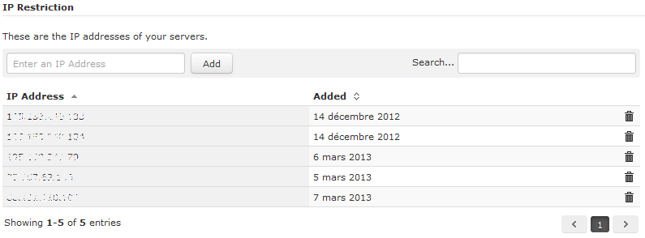

# Platform configuration

## Allow your servers' IP addresses

When a request is sent to the HiPay Enterprise servers, the IP address or IP address range from where the connection was made is
verified. If it matches with the IP address supplied by the merchant at a previous stage, the request will be processed. In case of missing or incorrect information, the server will respond with an appropriate error message, indicating the error in the request.

To do this, you must log in to your HiPay Enterprise back office (https://merchant.hipay-tpp.com), click on the "*Integration*" tab,
then on "*Security Settings*" and enter your IP address(es) in the "*IP Restriction*" section.

	<i class="fa fa-warning"></i>
	When changing your IP address(es), make sure that all the new IP addresses are configured for your account. If not, your server requests will be rejected.

##Choose a passphrase

It is strongly recommended that you use a signature mechanism to verify the contents of a request or redirection made to your servers. This will prevent customers from tampering with the data in the data exchanges between your servers and our payment system.

A unique signature is generated each time HiPay uses a merchant URL, notification or redirection.

First of all, you need to set a secret passphrase in your HiPay Enterprise back office under “*Integration -&gt; Security Settings -&gt; Secret Passphrase*”.

## Configure redirection URLs

To use the HiPay Enterprise module, you need to configure the redirection URLs in your HiPay Enterprise back office under
“*Integration -&gt; Redirect Pages*”.

-   Accept Page: `http://www.{your-domain.com}/index.php/hipay/cc/accept/`
-   Decline Page: `http://www.{your-domain.com}/index.php/hipay/cc/decline/`
-   Pending Page: `http://www.{your-domain.com}/index.php/hipay/cc/pending/`
-   Cancel Page: `http://www.{your-domain.com}/index.php/hipay/cc/cancel/`
-   Exception Page: `Empty`

Also check the "Custom" box in "*Feedback Parameters*" and apply changes.

Click on the "*Integration*" tab, then on "*Notifications*".

-   Notification URL: http://www.{your-domain.com}/index.php/hipay/notify/index
-   Request method: HTTP POST
-   I want to be notified for the following transaction statuses: ALL

Don’t forget to change {your-domain.com} by your own domain and specify the store code if you have enabled it on your Magento configuration.
