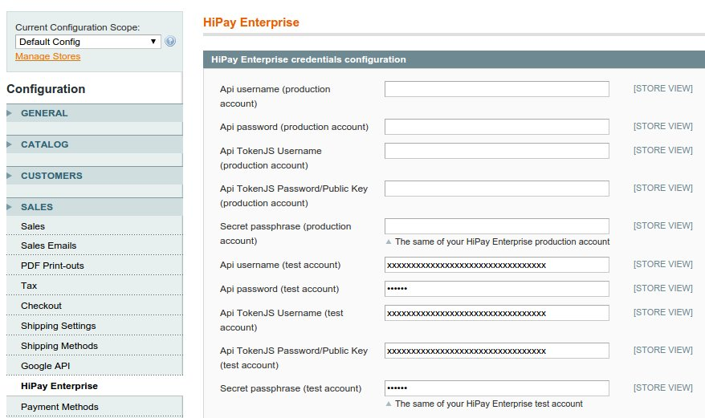
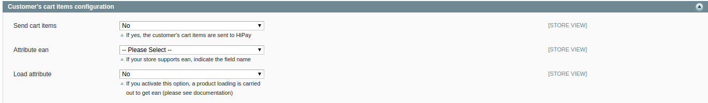
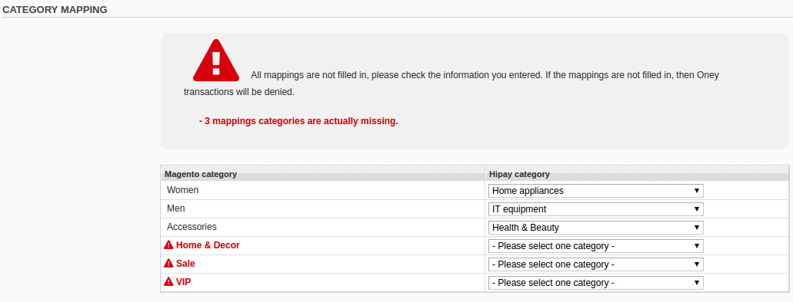
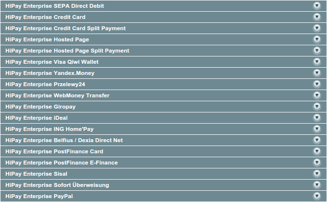

# Module configuration

## Technical configuration

Please increase the `max_inputs_vars` in the `php.ini` of your server.
An acceptable value is 5000.

        max_inputs_vars=5000

By default, this value is set to 1000 and is too low to support the saving of the HiPay module configuration.

## General configuration

To configure your HiPay Enterprise API credentials, you must click on "*HiPay Enterprise*" in the Magento configuration section (System > Configuration > Sales). If you have administrative rights but are not allowed to access the configuration of the payment method, please log out and log back in.

You can find your HiPay Enterprise API credentials in your HiPay Enterprise back office, under `Integration > Security Settings > Api credentials`.

Once you have them, put them in the module configuration with your `Passphrase`. (Please refer to section 2.2).

When using the Multi-site or Multi-store feature: you can use different HiPay credentials and payment methods for each Store View using the `Current Configuration Scope` select box. Uncheck the `Use Website` checkbox and specify the desired value.

#### Additional parameters

|  Name    | Description|
|----------|:-------------:|
|  Device fingerprint    | Defines if a fingerprint is sent with the transaction ("YES" by default)
|  Use order currency for transaction*    | Defines the currency used for the order. By default, orders are always processed with the base currency of the store.

If you activate `Use order currency for transaction`, your payment method must be configured in `Sale` mode.
If you want to use this feature in `Authorize` mode and do `manual captures` in your back office when invoicing orders,
you must develop your own `invoicing` and make an override of `Mage_Sales_Model_Order_Invoice` and `register` method.

If you keep the default Magento process, the transaction authorization will be processed in the currency chosen by the customer, and
the capture upon invoicing in the *base currency* of the store.

### Customer's cart items configuration

This section addresses customer's cart items sending to the HiPay Enterprise back office during the transaction.

Enabling this option applies to all enabled payment methods on your site.
The information of the customer's basket, containing the method of delivery, the discounts and each product with the quantity,
as well as the SKU and the tax, is sent with the transaction.

For some payment methods, sending this information is mandatory. This option is therefore ignored if the transactions
are made with this payment method. The customer's line items will be sent whether the option is activated or not.
The payment methods in question are **Klarna Invoice** and **Oney Facily Pay**.

Oney's Fraud system requires additional configuration for shipping method and product categories.
The configuration is explained in the following paragraph.

Please note that this feature is still in beta version. For questions relating to installation and configuration, please don’t hesitate to visit our [Support Center](https://support.hipay.com/hc/en-us) or [submit a request] (https://support.hipay.com/hc/en-us/requests/new) to our Support team.

|  Name    | Description|
|----------|:-------------:|
|  Send cart items   | Activates  customer's cart items sending or not ("NO" by default)
|  Attribute ean   |  EAN is not a Magento attribute by default: you must define your custom attribute if you want to send it in the basket
|  Load attribute*  |  Because EAN is not a default attribute, product loading is necessary to get the value. You can avoid loading by adding the attribute to the order and quote.

Please assume that  **"Adjustment Fee"** or **"Adjustment Refund"** are not supported with baskets for refunds.

Product loading is carried into HiPay's helper, which is **Data.php**, when information about the product is retrieved. If you want to avoid this loading, which is not fast, please add your EAN attribute in the **Quote** and **Order** model.

There are several ways to do so. For example, you can:

  1. Add your attribute in the "order" and "quote" tables.
  2. Save your attribute in the listening observer `sales_quote_save_before`.
  3. Upgrade your `config.xml` to transfer the attribute to the "Order" with:

            <fieldsets>
                <sales_convert_quote>
                    <attribute_ean>
                        <to_order>*</to_order>
                    </attribute_ean>
              </sales_convert_quote>
            </fieldsets>

You can test and see the code used in the `Data.php`.

            // If the store supports EAN (please set the attribute in hipay config)
            if (Mage::getStoreConfig('hipay/hipay_basket/attribute_ean', Mage::app()->getStore())) {
                $attribute = Mage::getStoreConfig('hipay/hipay_basket/attribute_ean', Mage::app()->getStore());

                if (Mage::getStoreConfig('hipay/hipay_basket/load_product_ean', Mage::app()->getStore())) {
                    $resource = Mage::getSingleton('catalog/product')->getResource();
                    $ean = $resource->getAttributeRawValue($product->getProductId(), $attribute,
                        Mage::app()->getStore());
                } else {
                    // The custom attribute has to be present in quote and order
                    $ean = $product->getData($attribute);
                }
            }

#### Categories and shipping methods mapping

To enable sending relevant information about delivery methods and product categories, mapping
is required between your data and HiPay's data.

##### Categories mapping

Only the top level categories are displayed and must be mapped. As long as you have not mapped a category, a warning
icon is displayed and prompts you to do the mapping. If the mapping is not done, then the transaction will be refused
by Oney. It is therefore important to check your mapping regularly when adding or modifying a category.

##### Shipping methods mapping

A list of all delivery methods activated on the site is displayed.
This mapping is necessary to indicate a match between your delivery methods and the delivery methods defined by HiPay.
For each customer's order, depending on the chosen configuration, this information is sent as a supplement to the customer's basket.

For each mapping, you have to fill out the following information:

   *   `Preparation delay`: Estimated day time for order preparation
   *   `Delivery delay`: Estimated day time for delivery

From this information, an estimated delivery day is calculated and sent with the transaction.
Non-working days are not taken into account in this calculation.

As with the mapping of categories, **it is important that all payment methods be mapped**. Therefore, it is important
to see your list if you change the configuration of your payment methods.

## Payment methods configuration

To configure your HiPay Enterprise payment methods, click on `Payment Methods` in the Magento configuration section (System > Configuration).

You will then see a list of payment methods with all the HiPay Enterprise integration possibilities.

### HiPay Enterprise Credit Card API
(only available for credit card and debit card payment methods)

With the HiPay Enterprise Credit Card API integration (direct API integration), customers fill in their bank information directly on
the merchants’ website. The module calls the HiPay Enterprise API to validate the transaction and the merchant’s website displays the transaction `confirmation` / `refused` / `pending` message.

If this integration mode is selected, you are required to be compliant with the PCI Data Security Standard. For more information, please go to [PCI-DSS Compliance & validation guide](https://support.hipay.com/hc/en-us/articles/115001582249-PCI-DSS-Compliance-and-Validation-Guide).

### HiPay Enterprise Credit Card Split Payment
(only available for credit card and debit card payment methods)

This integration can be used to process recurring payments and split order payments through APIs. It is a variant of the HiPay Enterprise Credit Card API integration. Therefore, you are also required to be compliant with the PCI Data Security Standard.

Prior to activating this integration, at least one recurring profile must be created (Please refer to section 5.6 Split payment method).

### HiPay Enterprise Credit Card Hosted Page
(only available for credit card and debit card payment methods)

To process payments, cardholders are redirected to a secured payment page hosted by HiPay.

After payment validation, customers are redirected to the merchant's website, which displays a transaction confirmation / error / pending message.

### iFrame

You can activate the iFrame mode on your HiPay Enterprise Hosted Page if you want cardholders to fill in their payment card information on a secured payment page hosted by HiPay and displayed in an iFrame inside the merchants’ payment page.

Your website must run with the `HTTPS` protocol to use an iFrame hosted page.

This page (hosted & iFrame) can be customized with the merchants’ CSS stylesheet to fit their website look and feel.

### HiPay Enterprise Credit Card Hosted Fields
(only available for credit card and debit card payment methods)

With the HiPay Enterprise Credit Card API Hosted Fields (direct API integration), customers complete their banking information directly on the merchant's site but the form fields are hosted by HiPay.
The module calls the HiPay Enterprise API to validate the transaction and the merchant’s website displays the transaction `confirmation` / `refused` / `pending` message.

You can configure the following parameters specific to the HiPay Enterprise Credit Card Hosted Fields payment method:

|  Name    |
|----------|
|  color    |
|  fontFamily |
| fontSize | 
| fontWeight |
| placeholder Color|
| caretColor |
| iconColor |

Those parameters allows you to override default CSS properties in hosted form fields.

To override the [default template](#front-end-payment-examples-hipay-enterprise-credit-card-hosted-fields), please refer to the magento 1 documentation ([doc.](https://devdocs.magento.com/guides/m1x/magefordev/mage-for-dev-4.html)) and the HiPay SDK JS documentation ([doc.](https://developer.hipay.com/doc/hipay-enterprise-sdk-js_3/#hipay-enterprise-javascript-sdk)). 

### HiPay Enterprise Hosted Page Split Payment
(only available for credit card and debit card payment methods)

This integration can be used to process recurring payments and split order payments using a hosted page.

Prior to activating this integration, at least one recurring profile must be created (Please refer to section* 5.6 Split payment method).

### Other HiPay Enterprise payment methods

If you want to offer on your website other payment methods than credit card or debit card, you can choose them directly from the list of payment methods, indicated as follows: “*HiPay Enterprise {payment method}*” (e.g.: *HiPay Enterprise Sofort Überweisung, HiPay Enterprise Sisal, etc.*).

### Configuration parameters

|  Name    | Description|
|----------|:-------------:|
|  Enabled    | Allows the activation of the module
|  Title| Title displayed on the front-end for the payment method
|Payment Profile | Profile allowed if split payment is used. *Please refer to section* **5.6** *Split payment method*.
|Order status when payment accepted|                Status to be assigned to the order
|Order status when payment refused|                 Status to be assigned to the order
|Order status when payment cancelled by customer|   Status to be assigned to the order
|HiPay status to validate order| HiPay status for a Magento transaction to be validated
|Redirect page pending status| If the transaction result is pending, the customer can be redirected to a pending, success or failure page.
|Payment Action| Sets the payment mode: *Authorization + Capture* (*Sale*) or*: Authorization Only*. Please refer to [requestNewOrder](https://developer.hipay.com/doc-api/enterprise/gateway/#!/payments/requestNewOrder). Must be set to `Sale` for split payment method.
|Credit Card Types|                                 Card types allowed on the payment form
|Display card owner|                                Enables/disables the cardholder input field on the payment form
|Credit Card Verification|                          Enables/disables Magento credit card verification
|Css Url| URL for merchant style sheet for iFrame or Hosted page operating modes. Important, **HTTPS** protocol is required. Please refer to [generateHostedPaymentPage](https://developer.hipay.com/doc-api/enterprise/gateway/#!/payments/generateHostedPaymentPage)
|Page payment template|For iFrame and Hosted page operating modes, you can choose your basic template to show: **Basic:** Basic responsive design. **Basic-js:** Advanced responsive design.
|Display hosted page in iFrame|                     Activates iFrame mode on hosted page. *Please refer to chapter 4.2.*
|iFrame Height|                                     If iFrame operating mode is chosen, you can select your iFrame height to fit with your CSS.
|iFrame Width|                                      If iFrame operating mode is chosen, you can select your iFrame width to fit with your CSS.
|Wrapper iFrame Style|                              If iFrame operating mode is chosen, you can customize the wrapper around the iFrame with your CSS.
|iFrame Style|                                      If iFrame operating mode is chosen, you can select your iFrame integration style to fit with your CSS.
|Display card selector|                             Enables/disables the payment method selector on iFrame and Hosted pages.
|Enable 3D Secure|                                  Allows the activation of 3-D Secure if available on the card being used.
|Rules 3D Secure|                                   If you enabled “*3D Secure with specific rules”*, set up rules to trigger 3-D Secure only when you really need it with order, customer or product attributes.
|Use Oneclick|                                      Allows the use of Oneclick payment (only for credit cards)
|Rules Oneclick|                                    If Oneclick is used, configure the rules to activate Oneclick
|Add product to cart|                               Reloads the cart when payment is cancelled or refused
|Cancel pending order|                              Cancels pending orders over 30 minutes (by default)
|Delay before cancel order|                         Adjustment of cancelling period
|Send fraud payment email|                          Alerts the client if a transaction has been challenged and requires approval
|Payment from applicable countries|                 Restricted access by country
|Payment from specific countries|                   List of allowed countries
|Minimum Order Total|                               Minimum amount to display the payment method
|Maximum Order Total|                               Maximum amount to display the payment method
|Sort Order|                                        Sorts the payment method order in the front-end
|Enable debug log|                                  Logs requests and server responses on the "var/log/payment\_hipay\_cc.log" file
|Enable test mode|                                  If Test mode is enabled, the module will use the HiPay Enterprise test platform.

