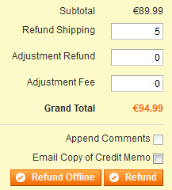
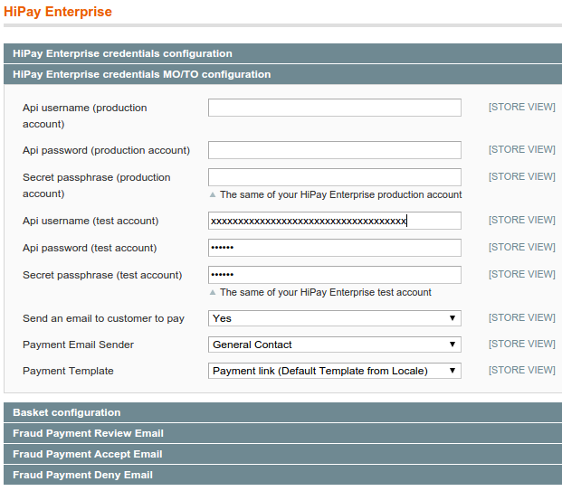
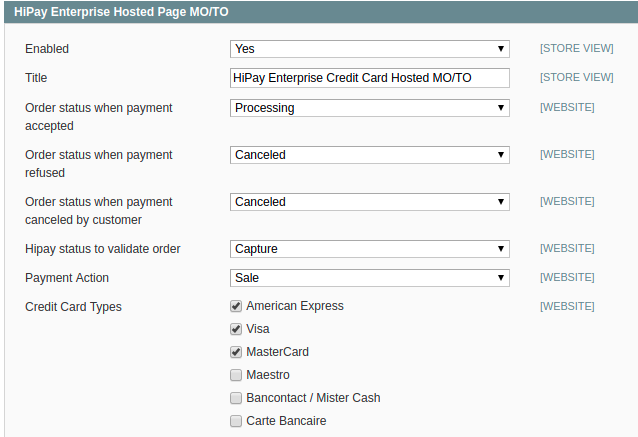
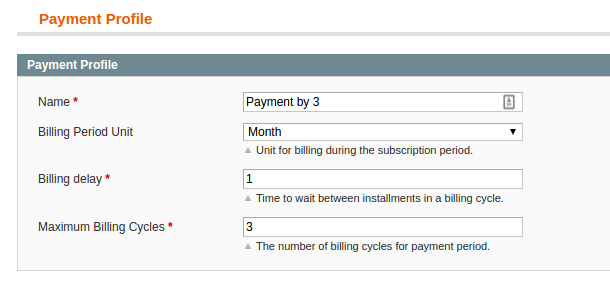
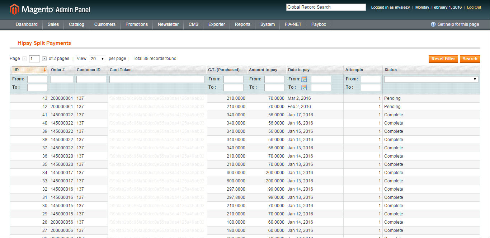

# Payment configuration

## “Sale” mode

When making a purchase with the `sale` mode, the capture is automatically requested right after the authorization. *Please refer to our [requestNewOrder](/doc-api/enterprise/gateway/#!/payments/requestNewOrder) API*.

If the payment fails, the customer is redirected to the error page and the status is defined as configured in the module configuration.

If the payment is successful, the customer is redirected to the success page. The invoice is then created if the configuration allows it and the status is defined as follows:

-   `capture_waiting`
-   `processing`

## “Authorization” mode

When making a purchase with the `Authorization` mode, the transaction will be on `waiting capture`. *Please refer to our [requestNewOrder](/doc-api/enterprise/gateway/#!/payments/requestNewOrder) API*.

The customer is not charged directly: you have 7 days to "capture" the transaction and charge the customer. Otherwise, the order will be cancelled.

If the payment fails, the customer is redirected to the error page and the status is defined as configured in the module configuration.

If the payment is successful, the customer is redirected to the success page. At this step, the order status is `Waiting for capture`. Once you’re ready to capture the transaction:

-   If the configuration does not allow the creation of the invoice, you must create it from the order overview. Click on
    `Capture online`: this will send the capture information to the HiPay Enterprise server. If successful, the invoice is created.
    The payment is then captured and you can create your shipment.
-   If the configuration allows the creation of the invoice, click on the invoice and on the `capture` button. This will send the capture information to the HiPay Enterprise server. If successful, the invoice status changes to `Paid`.

You can also do the `capture` directly in your HiPay Enterprise back office. The invoice will then be automatically created in your Magento back office.

## Refund

HiPay Enterprise allows online refunds. For this purpose, simply create a `credit memo` on the invoice (not from the order).

You have two options: `Refund Offline` (not relevant in our case) or `Refund`.

Choose the amount and click on `Refund`. If successful, the credit memo is created and the refund is validated.

	<i class="fa fa-warning"></i>
	For notification to work as expected, please refer to this <a href="#platform-configuration-customized-notifications">section</a>

## One-click (only available for credit card payment methods)

If the one-click option is activated, it enables your system to create an `alias` of the credit card. That way, after their first transaction, customers can use a saved credit card without having to fill in all the payment data again.

This option is only available if customers have created an account on your site.

## MO/TO payment (please contact HiPay to create a MO/TO account)

Here are the instructions to follow when merchants need to create a new order and pay it using the customer's financial information given over the phone.

### Configuration

- Under `System > Configuration > HiPay Entreprise`, fill in specific credentials for MO/TO transactions in the "HiPay Enterprise credentials MO/TO" section. If they are not specified, standard credentials will be used.

- You can also configure the following settings.

|  Name    | Description|
|----------|:-------------:|
|  Send an email to customer for paying    |  If "YES", an email with a payment link is sent to the customer for hosted payment. If "NO", the payment has to be done by the administrator in the back office.
|  Payment Email Sender   | Chooses the sender of the email with the payment link.
|  Payment Template   | Chooses the email template.

- Under `System > Configuration > Payment Methods`, make sure that the `HiPay Enterprise Hosted MO/TO` payment method is enabled. 

### MO/TO payment for hosted methods

- Create a new order in your Magento back office.
    1.  Go to `Sales > Create New Order`.
    2.  Add your products, account information, billing address,
        shipping address, payment method, shipping method, etc.
    3.  Submit your order.
    4.  An email is sent to the customer with a link for paying the order.
    5.  The customer clicks on the link in the email and is redirected to the hosted payment form.
    6.  The customer pays and is redirected to your Magento front-end (success or error page).
    7.  The status of the order is changed to `processing`.

## Split payment method

### Payment profile

Prior to activating a split payment method, you must create one or more
payment profiles under: `Sales > HiPay > Split Payment Profiles > Add payment profile`.

A payment profile defines the billing cycle of an order, for example:

### Configuration parameters

|Name|                     Description
|----------|:-------------:|
|Name|                     Name of the payment method displayed on the front-end
|Billing Period Unit|      Unit of time for billing during the subscription period
|Billing Delay|             Number of billing periods that make up one billing cycle
|Maximum Billing Cycles |   Number of billing cycles for the payment period

Please note: when configuring your payment method, you must select `Sale` as your `Payment Action`.

### Split payments scheduling (Cron)

A daily cron may be setup to launch the `hipay_pay_split_payment` method.

### Split payment management

An installment plan will be created for each new split payment when the first payment is successful. You can follow the status and the due date of each payment under: `Sales > HiPay > Split payments`.

Split payment statuses:

-   `Complete` payments have been processed and no further action is needed.
-   `Pending` payments are not processed yet: you can change the date or other parameters.
-   `Failed` payments: you will receive an email when a split payment has failed and an action is required. You can retry the payment by switching the status to "Pending".

### Split payment retry

You can change the due date or force payment immediately for pending or failed split payments:

