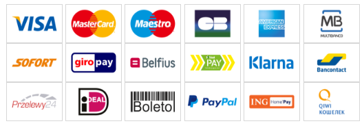

# Module features

* 3-D Secure enabling/disabling
* One-click option configuration with custom rules
* Management of multiple cards per customer for one-click payment
* iFrame integration, hosted page and custom card API
* Mail management for transactions pending fraud validation ("challenged")
* Manual and automatic capture
* Partial capture and refund
* Payment in x installments without fees
* Custom data management (easily send and view your data in your HiPay Enterprise back office)
* Use order currency for transaction if your shop is multi-currency

The module supports the following payment methods:

 * **VISA, MasterCard, American Express, Bancontact, Maestro**

**France**

 * **Oney Facily Pay**

**Europe**

 * **iDEAL**
 * **ING Home'Pay**
 * **PayPal**
 * **SEPA Direct Debit**

**Switzerland**

 * **PostFinance Card**
 * **PostFinance E-finance**

**Belgium**

  * **Belfius Direct Net**

**Italy**

  * **SisalPay**

**Germany**

 * **Giropay**
 * **Klarna Sofortüberweisung**

**Brazil and Mexico**

 * **Itaú**
 * **Bradesco**
 * **Banco do Brasil**
 * **Santander HomeBanking**
 * **Caixa**
 * **OXXO**
 * **BBVA Bancomer**
 * **Banamex**
 * **Santander Cash**

**Russia**

 * **Yandex.Money**

 **Poland**
 * **Przelewy24**

 

