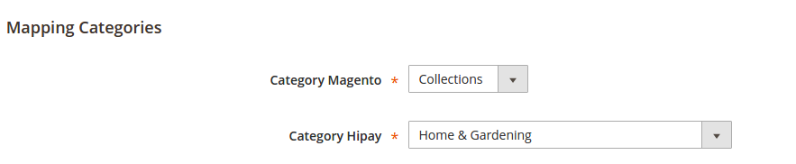
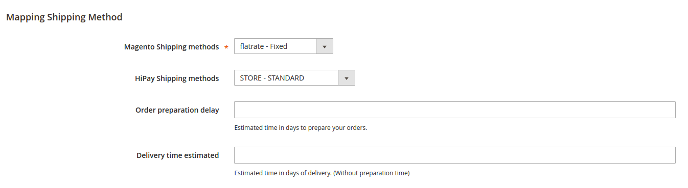

# Module configuration

Before using the HiPay Enterprise module for Magento 2, the following settings are required and must be configured:

1. Credentials configuration,
2. Anti-fraud emails configuration.

In your Magento Admin Panel, select:  
```nohighlight
Stores => Configuration => Sales [HiPay Enterprise]
```

Then, you need to enter your credentials, provided by HiPay.


## Credentials

### HiPay Enterprise credentials configuration  
HiPay Enterprise API credentials are required to use the HiPay Enterprise module for Magento 2.

|Field name|Description|
|-----|-----|
|Api username (production account)|Retrieve it from your HiPay Enterprise back office (https://merchant.hipay-tpp.com) in "Integration" => "Security Settings" |
|Api password (production account)|Retrieve it from your HiPay Enterprise back office (https://merchant.hipay-tpp.com) in "Integration" => "Security Settings" |
|Secret passphrase (production account)|Enter the same value as in your HiPay Enterprise back office (https://merchant.hipay-tpp.com) in "Integration" => "Security Settings" |
|Api username (test account)|Retrieve it from your HiPay Enterprise back office (https://merchant.hipay-tpp.com) in "Integration" => "Security Settings" |
|Api password (test account)|Retrieve it from your HiPay Enterprise back office (https://merchant.hipay-tpp.com) in "Integration" => "Security Settings" |
|Secret passphrase (test account)|Enter the same value as in your HiPay Enterprise back office (https://merchant.hipay-tpp.com) in "Integration" => "Security Settings" |


### HiPay Enterprise credentials for Direct Post configuration

Generated in your HiPay Enterprise back office ("Integration" => "Security Settings" => "Api credentials" => "Credentials accessibility": Public), these newly created HiPay Enterprise API credentials are required to use the HiPay Enterprise module for Magento 2.

|Field name|Description|
|-----|-----|
|Api username (production account)|Retrieve it from your HiPay Enterprise back office (https://merchant.hipay-tpp.com) in "Integration" => "Security Settings" |
|Api password (production account)|Retrieve it from your HiPay Enterprise back office (https://merchant.hipay-tpp.com) in "Integration" => "Security Settings" |
|Api username (test account)|Retrieve it from your HiPay Enterprise back office (https://merchant.hipay-tpp.com) in "Integration" => "Security Settings" |
|Api password (test account)|Retrieve it from your HiPay Enterprise back office (https://merchant.hipay-tpp.com) in "Integration" => "Security Settings" |


### HiPay Enterprise credentials for MO/TO configuration  
MO/TO API credentials are optional.  
They are required only if you need to pay an order created in your Magento Admin Panel.

|Field name|Description|
|-----|-----|
|Api username (production account)|Retrieve it from your HiPay Enterprise back office (https://merchant.hipay-tpp.com) in "Integration" => "Security Settings" |
|Api password (production account)|Retrieve it from your HiPay Enterprise back office (https://merchant.hipay-tpp.com) in "Integration" => "Security Settings" |
|Secret passphrase (production account)|Enter the same value as in your HiPay Enterprise back office (https://merchant.hipay-tpp.com) in "Integration" => "Security Settings" |
|Api username (test account)|Retrieve it from your HiPay Enterprise back office (https://merchant.hipay-tpp.com) in "Integration" => "Security Settings" |
|Api password (test account)|Retrieve it from your HiPay Enterprise back office (https://merchant.hipay-tpp.com) in "Integration" => "Security Settings" |
|Secret passphrase (test account)|Enter the same value as in your HiPay Enterprise back office (https://merchant.hipay-tpp.com) in "Integration" => "Security Settings" |


## Email templates

Based on the screening results of HiPay Sentinel, our advanced anti-fraud solution, emails can be sent to end customers.
There are 3 email templates:  

*  **Fraudulent**: This email is sent to the customer if the payment is fraudulent.
*  **Accepted**: This email is sent to the customer if the payment is approved by the merchant.
*  **Denied**: This email is sent to the customer if the payment is denied by the merchant.

They all have the same configuration:

|Field name|Description|
|-----|-----|
|Enabled|Enables/Disables sending|
|Payment Fraud Email Sender|Sets the email sender|
|Payment Fraud Template|Sets the email template. You can **customize it** in your Magento 2 Admin Panel. To do so, go to *"Marketing" => "Communications" [Email Templates]*. Click on *"Add New Template"*, then upload the HiPay email template you want and modify it.|
|Send Payment Fraud Email Copy To|Email addresses you want to add in copy|
|Send Payment Fraud Email Copy Method|Selects the email copy method (Cc or Bcc)|


### Other configurations

|  Field name    | Description|
|----------|:-------------:|
|  Device fingerprint    | Defines if a fingerprint is sent with the transaction ("YES" by default)
| Url of HiPay's JavaScript  |Technical parameter not to be modified
| Send cart  | Activates  customer's cart items sending or not ("NO" by default)
| EAN attribute | EAN is not a Magento attribute by default: you must define your custom attribute if you want to send it in the cart

### Customer's cart items configuration

This section addresses customer's cart items sending to the HiPay Enterprise back office during the transaction.

Enabling this option applies to all enabled payment methods on your site.
The information of the customer's basket, containing the method of delivery, the discounts and each product with the quantity,
as well as the SKU and the tax, is sent with the transaction.

For some payment methods, sending this information is mandatory. This option is therefore ignored if the transactions
are made with this payment method. The customer's line items will be sent whether the option is activated or not.
The payment methods in question are **Klarna Invoice** and **Oney Facily Pay**.

Oney's Fraud system requires additional configuration for shipping method and product categories.
The configuration is explained in the following paragraph.

Please note that this feature is still in beta version. For questions relating to installation and configuration, please don’t hesitate to visit our Support Center ([*https://support.hipay.com/hc/en-us*](https://support.hipay.com/hc/en-us)) or submit a request ([*https://support.hipay.com/hc/en-us/requests/new*](https://support.hipay.com/hc/en-us/requests/new)) to our Support team.

Please assume that  **"Adjustment Fee"** or **"Adjustment Refund"** are not supported with baskets for refunds.

#### Categories and shipping methods mapping

To enable sending relevant information about delivery methods and product categories, mapping
is required between your data and HiPay's data.

##### Categories mapping

Go to the setup screen `HiPay Enterprise` => `Mapping Categories`.

Only the top level categories are displayed and must be mapped. If the mapping is not done, then the transaction will be refused
by Oney. It is therefore important to check your mapping regularly when adding or modifying a category.



##### Shipping methods mapping

Go to the setup screen `HiPay Enterprise` => `Mapping Shipping method`.

A list of all the delivery methods activated on the site is displayed.
This mapping is necessary to indicate a match between your delivery methods and the delivery methods defined by HiPay.
For each customer's order, depending on the chosen configuration, this information is sent as a supplement to the customer's basket.

For each mapping, you have to fill out the following information:

   *   "Preparation delay": Estimated day time for order preparation
   *   "Delivery delay": Estimated day time for delivery

From this information, an estimated delivery day is calculated and sent with the transaction.
Non-working days are not taken into account in this calculation.



As with the mapping of categories, **it is important that all payment methods be mapped**. Therefore, it is important
to see your list if you change the configuration of your payment methods.

# PSD2 and Strong Customer Authentication

Given the strong growth of the e-commerce in Europe, the Payment Services Directive (PSD2) redefines the security standards for online payments aiming to increase the security during the payment process, while fighting more actively against fraud attempts. For more details on the regulations, we invite you to read the [documentation provided by Hipay](https://developer.hipay.com/psd2-and-strong-customer-authentication-3-d-secure-2-compliance-and-guidance/).

As of September 14, 2019, the issuer will decide if a payment is processed depending on the analysis of more than 150 data collected during the purchasing process. Thanks to our Magento 2 module we handle most of the data without you having to develop anything. You can see all the new parameters on [our explorer API](https://developer.hipay.com/doc-api/enterprise/gateway/).

## Adding or overriding PSD2 data

The accuracy of the information sent is key for making sure that your customers have a frictionless payment process. That’s why we provide you the possibility to add or override all the information related to the DSP2, using a [Plugin Interceptor](https://devdocs.magento.com/guides/v2.3/extension-dev-guide/plugins.html) on the "HiPay\FullserviceMagento\Model\Request\Order" class which can intercept the "mapRequest" method.
 
You can either implement the plugin in your own modules or use the one that we provide. You can find this additional module on our [github repository](https://github.com/hipay/hipay-fullservice-sdk-magento2-data). 
 
You can install this module in a classic way, then directly modify the file “ThreeDSPlugin.php” and the method “afterMapRequest” to add your information.
 
Be careful ! If there is an update of the data module, remember to save your data so that it is not overwritten.

Finally, although we do our best to retieve all relevant data for you, we are not capable of getting the following data as it depends on the modules installed on your CMS or your workflow. 

### Merchant risk statement

| Field |  | Comment |
| --- | --- | --- |
| **delivery_time_frame** |  | The field is managed but only for virtual products. <br/>We send “1 = Electronic delivery” if it is downloadable or  virtual product.<br/><br/>Depending on your carrier and delivery methods, you can refine this data. <br/><br/>Possible values: <br/><br/>1 = Electronic delivery<br/>2 = Same day shipping<br/>3 = Overnight shipping<br/>4 = Two-day or more shipping |
| **shipping_indicator** |  | This fields is managed but you can refine the value for dematerialized products.<br/><br/>If the basket contains only virtual products, please provide:<br/><br/>5 = Digital goods<br/>6 = Travel and event tickets, no shipping<br/>7 = Other (gaming, digital services without shipping, e-media subscription) |
| **pre_order_date** |  | **If you provide the possibility of pre-ordering.**<br/><br/>Retrieve the product availability date. | 
| **gift_card** |  | **If you sell gift card products** |
|  | **amount** | Collect the amount of gift card type gift cards purchased. |
|  | **count** | Collect the count of gift card type gift cards purchased. |
|  | **currency** | Collect the currency of gift card type gift cards purchased. |

If you want to see all the parameters you are able to override, please refer to the [SDK PHP Reference](https://developer.hipay.com/doc/hipay-enterprise-sdk-php/#psd2-and-strong-customer-authentication).
