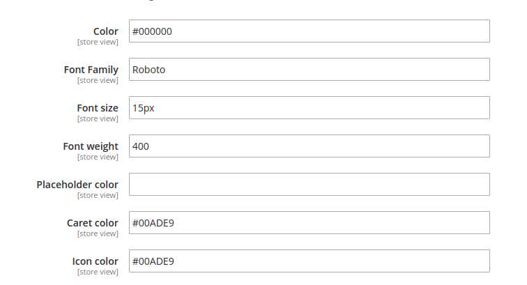
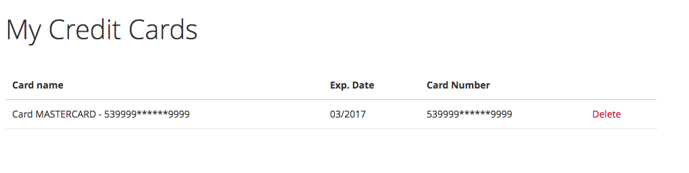

# Payment methods configuration

In your Magento Admin Portal, select:  
```nohighlight
“Stores” => “Configuration” => “Sales” [Payment Methods]
```

You can then see all the HiPay Enterprise payment methods.


Before describing the configuration fields for each payment method, please note the difference between the *HOSTED* and *API* modes.

## Definitions

### HOSTED mode

A *HOSTED* payment method will redirect your customers to a hosted payment page with a payment form or will display it in an iFrame (according to the configuration).  
For this type of payment method, PCI compliance is not required.

### API mode

An *API* payment method will embed a payment form directly on your website.  
For this type of payment method, your website needs to be PCI compliant.

### HOSTED FIELDS mode

A *Hosted Fields* payment method will embed a payment form directly on your website but the form fields are hosted by HiPay.  
For this type of payment method, PCI compliance is not required.

More information about [Hosted Fields](https://hipay.com/en/hosted-fields-2).

## General configuration

All payment methods have a basic configuration like the native Magento 2 payment methods configuration or the general HiPay Enterprise configuration.

|Field name|Description|
|-----|----|
|Enabled|Enables/disables the payment method|
|Title|Desired name of the payment method as displayed during checkout|
|Payment Action|Authorization or Sale. See more configuration details below.|
|New Order Status|Order status to set when the order is created before payment. *Pending* by default.|
|Order status when payment accepted|Order status to set when the transaction is successful. *Processing* by default.|
|Order status when payment refused|Order status to set when the transaction fails. *On Hold* by default.|
|Order status when payment cancelled|Order status to set when the transaction is canceled by the user. *Canceled* by default.|
|HiPay status to validate order|By default, all orders are validated/invoiced upon notification when the *Capture* status  (118) is sent from the HiPay Enterprise platform (around 10 min after capture is requested). You can change this pattern by selecting “Capture Requested”. In this case, the order is validated/invoiced directly upon the *Capture Requested* (117) status.|
|Cancel pending order|Cancels orders pending because the customer did not validate the payment. For more information, please refer to the [Cron configuration and task information](#cron-configuration-and-task-information) section.|
|Payment products|Allowed payment products. E.g.: Visa, Mastercard, SisalPay...|
|Use 3D Secure|Enables/disables 3-D Secure. See more configuration details below.|
|Rules 3D Secure|Configures custom rules to activate or not the 3-D Secure mode|
|Use Oneclick|Enables/disables One-click. See more configuration details below.|
|Rules Oneclick|Configures rules to activate or not the One-click mode|
|Payment from Applicable Countries|Limit allowed countries|
|Payment from Specific Countries|Select allowed countries|
|Minimum Order Total| Minimum order total amount to activate the payment method|
|Maximum Order Total| Maximum order total amount to activate the payment method|
|Sort Order|Configures the order of payment methods, as displayed during checkout|
|Debug|Enables/disables the debug mode (which logs queries)|
|Environment|Stage or Production. In Stage mode, the test API endpoint and your test credentials are used.|


## HOSTED mode configuration

HOSTED configuration specific fields

|Field name|Description|
|-----|----|
|Display card selector|Allows to display the card selector on a hosted page|
|Custom CSS url|Hosted pages can be customized with a CSS URL. Important: the HTTPS protocol is required.|
|Template type|Hosted page template|
|Display hosted page in iFrame|By default, a hosted payment method redirects your customers to a hosted payment page, but in iFrame mode, this hosted page is displayed in an iFrame directly on your website.|
|iFrame Width|Width of the iFrame (if the iFrame mode is enabled)|
|iFrame Height|Height of the iFrame (if the iFrame mode is enabled)|
|iFrame Style|*Style* attribute’s value of the iFrame (if the iFrame mode is enabled)|
|Wrapper iFrame Style|*Style* attribute’s value of the iFrame wrapper (if the iFrame mode is enabled)|


## API mode configuration

API configuration specific field

|Field name|Description|
|-----|----|
|Display card owner|Displays form field for card owner’s full name|


## Hosted Fields mode configuration

Hosted Fields configuration specific fields

|  Field name   |
|----------|
|  color    |
|  fontFamily |
| fontSize | 
| fontWeight |
| placeholder Color|
| caretColor |
| iconColor |



Those parameters allow you to override default CSS properties in hosted form fields.

To override the default template, please refer to the Magento 2 documentation ([doc.](https://devdocs.magento.com/guides/v2.3/frontend-dev-guide/templates/template-override.html)) and the HiPay Enterprise JavaScript SDK reference ([doc.](/doc/hipay-enterprise-sdk-js_3/#hipay-enterprise-javascript-sdk)).


# More configuration details

## 3-D Secure activation

You can choose between 5 options:  

1. **Disabled** (to bypass 3-D Secure authentication)
2. **Try to enable for all transactions** 
3. **Try to enable for configured 3ds rules**
4. **Force for configured 3ds rules** 
5. **Force for all transactions** 


Rules configuration follows the same process as Magento 2 price rules.


## “Sale” mode (direct capture)

When making a purchase with the “Sale” mode, the capture is automatically requested right after authorization. Please refer to [Response Content Type – Parameters – operation](https://developer.hipay.com/doc-api/enterprise/gateway/#/payments/requestNewOrder).

If the payment fails, the customer is redirected to an error page and the status is defined as “_CANCELED_”.

If the payment is successful, the customer is redirected to the success page and the status is defined as “_CAPTURE REQUESTED_”.

## “Authorization” mode

When making a purchase with the “Authorization” mode, the transaction status will be “_AUTHORIZED_” until you ask for the capture. Please refer to  [Response Content Type – Parameters – operation](https://developer.hipay.com/doc-api/enterprise/gateway/#/payments/requestNewOrder).

Customers are not charged directly: you have 7 days to “capture” the order and charge the customer. Otherwise, the order is cancelled.

If the authorization fails, the customer is redirected to an error page and the status is defined as “_CANCELED_”.

If the authorization is successful, the customer is redirected to the success page and the status is defined as “_AUTHORIZED_”.

To capture the transaction, please refer to the [Manual capture and refund](#manual-capture-and-refund) section.

## One-click (only available for credit card payment methods)

If the One-click option is enabled, your system will create an “alias” for the credit card. Customers will thus be able to use a saved credit card for their second transaction and won’t need to fill in all the payment data again.

Customers can delete their saved credit cards from their account.  


