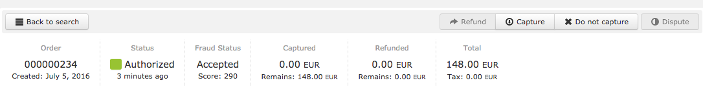
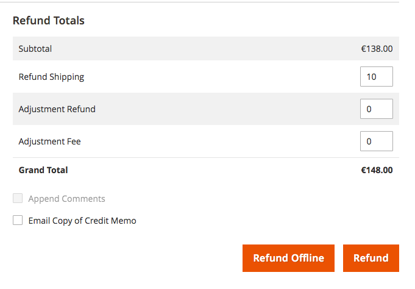

# Manual capture and refund

## Capture

To capture a transaction in your Magento Admin Panel, select "_Sales_" -> "_Orders_" -> "_View_" to see the details of the order and choose to submit an "invoice".  
On the "_New Invoice_" page, select "_Capture online_" and save your invoice.  
Please note: If you select a custom item quantity, you can do a partial capture.

You can also do the “capture” directly in your HiPay Enterprise back office. The order will then be automatically updated in your Magento Admin Panel.  
Please note: It only works for total captures (not partial).

## Refund

Some HiPay Enterprise payment methods allow for a refund. To do so, in your Magento Admin Panel, select "_Sales_" -> "_Orders_" -> "_View_" to see the details of the order, then choose an invoice to refund and click on "_Credit Memos_".  
On the "_Credit Memos_" page, select "_Refund_" and save your credit memo.  
Please note: If you select a custom item quantity, you can do a partial refund.

You can also do the "refund" directly in your HiPay Enterprise back office. The order will then be automatically updated in your Magento Admin Panel.  
Please note: It only works for total refunds (not partial).

	<i class="fa fa-warning"></i>
	For notifications to work as expected, please refer to this <a href="#platform-configuration-customized-notifications">section</a>

.
