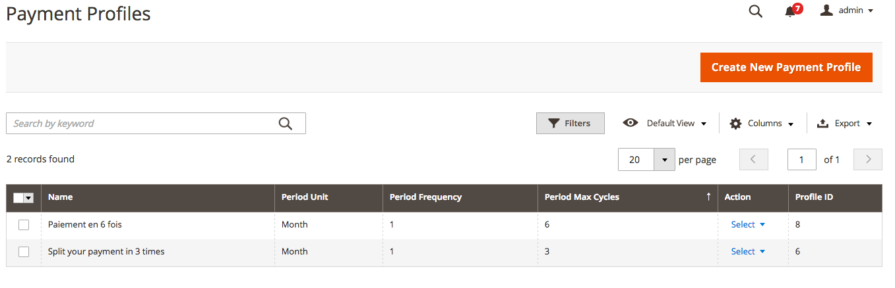
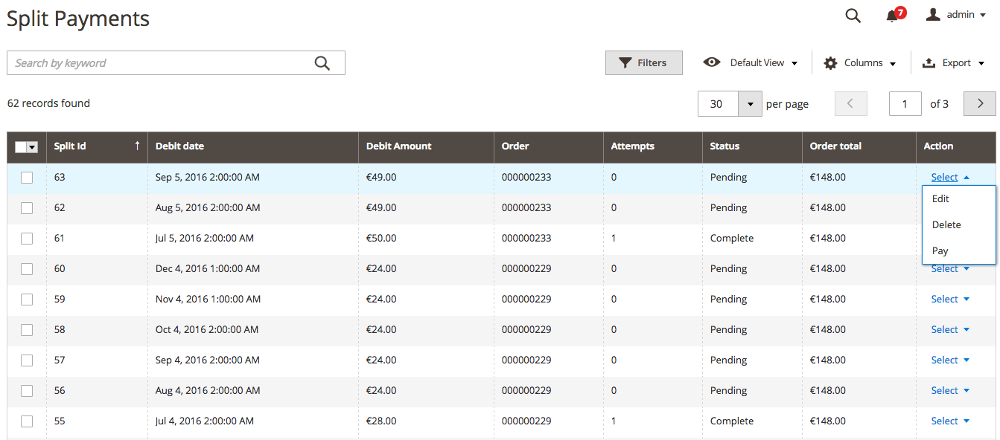

# Split payments

## How it works

When an order is created with a HiPay Enterprise split payment method, x installments are created (x depending on the selected payment profile).

A split order is validated when the payment is captured.
Upon payment capture, x installments are generated for this order.
The order is fully invoiced (but not fully captured in the HiPay Enterprise platform) and you can get ready for shipment.

The first installment is always debited on the payment date in Capture mode or when you capture manually in Authorization mode.

Then, with a Cron task (please see the [Cron configuration and task information](#cron-configuration-and-task-information) section), each installment is debited on its respective payment date.

## Split payment methods

The HiPay Enterprise module for Magento 2 includes two payment methods for split payments:

* HiPay Enterprise Hosted Page Split Payment,
* HiPay Enterprise Credit Card Split Payment,

based on the **HOSTED** or **API** mode.  

Before using them, you need to create payment profiles.

## Payment profiles

A payment profile defines how the payment is split.

In your Magento Admin Panel, select `HiPay Enterprise` => `Payment Profiles`.

Click on *“Create New Payment Profile”*.

Fill in the form:

* *Name*: Public name for your payment profile
* *Period Unit*: Unit for billing during the subscription period
* *Period Frequency*: Number of billing periods that make up one billing cycle
* *Period Max Cycles*: Number of billing cycles for the payment period

For example, if you want to split the amount in 3 installments with 1 billing per month:
* Period Unit: `month`
* Period Frequency: `1`
* Period Max Cycles: `3`

Don’t forget to save the information.

### Split payment method configuration

Once you have at least one payment profile, you can configure a split payment method.

For general configuration, please refer to [Payment methods configuration](#payment-methods-configuration).

Specific configuration:

|Field name|Description|
|-----|----|
|Split Payment Profile|Enables to select active split payment profiles, which will be displayed during checkout so that customers can choose one of them.|

### Split payment overview

A split payment overview is available in your Magento Admin Panel in `HiPay Enterprise => Split Payment`.

For each installment, you can edit, delete or pay it immediately.  
You can also change the payment date or the amount to pay.

**Be careful: if you are not sure what to do, please submit a request ([*https://support.hipay.com/hc/en-us/requests/new*](https://support.hipay.com/hc/en-us/requests/new)) to our Support team.**

