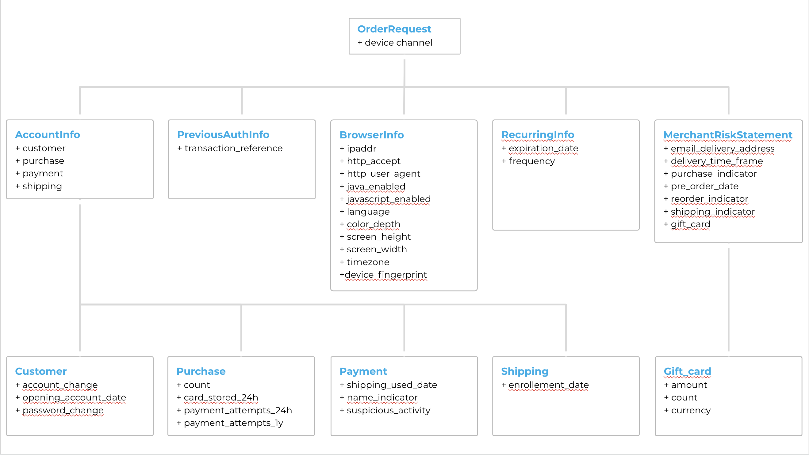

# How to use

## How to make a request

You need to instantiate 4 objects to make a request:  

- A configuration object which implements [ConfigurationInterface](https://github.com/hipay/hipay-fullservice-sdk-php/blob/master/lib/HiPay/Fullservice/HTTP/Configuration/ConfigurationInterface.php)
- A client provider inherited from abstract class [\HiPay\Fullservice\HTTP\ClientProvider](https://github.com/hipay/hipay-fullservice-sdk-php/blob/master/lib/HiPay/Fullservice/HTTP/ClientProvider.php)
- A [Gateway](https://github.com/hipay/hipay-fullservice-sdk-php/blob/master/lib/HiPay/Fullservice/Gateway/Client/GatewayClient.php) client
- An [order request](https://github.com/hipay/hipay-fullservice-sdk-php/blob/master/lib/HiPay/Fullservice/Gateway/Request/Order/OrderRequest.php)

The sdk allows you to call the different Hipay APIs that allow you to perform a transaction.

You can therefore interact with our different APIS : **/order**, **/hpayment** and **/maintenance**.
Whatever the request, you must instantiate a client gateway in the following way.

```php
//Create a configuration object
// By default Configuration object is configured in Stage mode (Configuration::API_ENV_STAGE)
$config = new \HiPay\Fullservice\HTTP\Configuration\Configuration("username","password");

//Instantiate client provider with configuration object
$clientProvider = new \HiPay\Fullservice\HTTP\SimpleHTTPClient($config);

//Create your gateway client
$gatewayClient = new \HiPay\Fullservice\Gateway\Client\GatewayClient($clientProvider);
```

To switch to Production mode, please init the configuration with:  **Configuration::API_ENV_PRODUCTION**

#### Request New Order API (POST Order) 

In this case, the payment page is hosted on your website, allowing you to have a unified and fully customized workflow. Please refer to the Request New Order API (POST Order) below for more information.
Please note that if you want to execute transactions with credit or debit card payment products, you will need to tokenize card numbers beforehand by using the HiPay Enterprise Tokenization API.

To have the function of each attribute, please refer to the technical documentation of each API.

Instantiate Order request: 
```php
$orderRequest = new \HiPay\Fullservice\Gateway\Request\Order\OrderRequest();
$orderRequest->orderid = "ORDER #123456";
$orderRequest->operation = "Sale";
$orderRequest->payment_product = "visa"
$orderRequest->description = "ref_85"
$orderRequest->firstname = "Jane"
$orderRequest->lastname = "Doe"
$orderRequest->email = "jane.doe@unknow.com"
$orderRequest->currency = "EUR"
$orderRequest->amount = "21.60"
$orderRequest->shipping = "0.00"
$orderRequest->tax = "3.6"
$orderRequest->cid = null
$orderRequest->ipaddr = "172.20.0.1"
$orderRequest->accept_url = "http:/www.my-shop.fr/checkout/accept"
$orderRequest->decline_url = "http:/www.my-shop.fr/checkout/decline"
$orderRequest->pending_url = "http:/www.my-shop.fr/checkout/pending"
$orderRequest->exception_url = "http:/www.my-shop.fr/checkout/exeception"
$orderRequest->cancel_url = "http:/www.my-shop.fr/checkout/cancel"
$orderRequest->http_accept = "*/*"
$orderRequest->http_user_agent = "Mozilla/5.0 (Macintosh; Intel Mac OS X 10_14_2) AppleWebKit/537.36 (KHTML, like Gecko) Chrome/72.0.3626.121 Safari/537.36"
$orderRequest->language = "en_US"
$orderRequest->custom_data = "{"shipping_description":"Flat rate","payment_code":"visa","display_iframe":0}"
$orderRequest->authentication_indicator = 0
```

There are several complementary objects to complete the information required by the API order:
   - CustomerShippingInfoRequest: Order related to the shipping information.  
   - CustomerBillingInfoRequest: Order related to the billing information.
   - CardTokenPaymentMethod: Data related to payment with token system.

##### CardTokenPaymentMethod

This parameter is specific to credit and debit card payment products.
This is the token obtained from the HiPay Enterprise Secure Vault API when tokenizing a credit or debit card. To generate a token, please refer to the HiPay Enterprise Tokenization API documentation

```php   
$paymentMethod = new HiPay\Fullservice\Gateway\Request\PaymentMethod\CardTokenPaymentMethod();   
$paymentMethod->cardtoken = "61f92d7a135db52dbd583b2aad208e73978196392357f674bacf39f549042f14";
$paymentMethod->eci = 7;
$paymentMethod->authentication_indicator = 0;

$orderRequest->paymentMethod = $paymentMethod;
```

##### CustomerShippingInfoRequest and CustomerBillingInfoRequest

These two objects are related to the delivery and billing addresses.
You can find the same type of information on both objects.

```php   
$customerShippingInfo = new HiPay\Fullservice\Gateway\Request\Info\CustomerShippingInfoRequest}
$customerShippingInfo->shipto_firstname = "Jane"
$customerShippingInfo->shipto_lastname = "Doe"
$customerShippingInfo->shipto_streetaddress = "56 avenue de la paix"
$customerShippingInfo->shipto_streetaddress2 = ""
$customerShippingInfo->shipto_city = "Paris"
$customerShippingInfo->shipto_state = ""
$customerShippingInfo->shipto_zipcode = "75000"
$customerShippingInfo->shipto_country = "FR"
$customerShippingInfo->shipto_phone = "0130811322"
$customerShippingInfo->shipto_msisdn = "0600000000"
$customerShippingInfo->shipto_gender = "M" 

$orderRequest->customerShippingInfo = $customerShippingInfo;
```

Once everything is completed you can start the transaction.

```php
//Make a request and return \HiPay\Fullservice\Gateway\Model\Transaction.php object
$transaction = $gatewayClient->requestNewOrder($orderRequest);
```

At the return of the API, the transaction can have one of the following status:
- completed
- pending
- declined
- error

You must therefore perform a different treatment according to each status, and redirect the customer to the corresponding page of your website.

```php
    $forwardUrl = $transaction->getForwardUrl();
    switch ($transaction->getState()) {
            case TransactionState::COMPLETED:
            case TransactionState::PENDING:
                $redirectUrl = [YOUR_URL_FOR_PENDING_PAYMENT]
                break;
            case TransactionState::FORWARDING:
                $redirectUrl = $forwardUrl;
                break;
            case TransactionState::DECLINED:
                $reason = $response->getReason();
                $this->logErrors('There was an error requesting new transaction: ' . $reason['message']);
                throw new Payment_Exception('Sorry, your payment has been declined. Please try again with an other means of payment.');
            case TransactionState::ERROR:
                $redirectUrl = [YOUR_URL_FOR_ERROR_PAYMENT];
                $reason = $response->getReason();
                $this->logErrors('There was an error requesting new transaction: ' . $reason['message']);
                throw new Payment_Exception('An error occured, process has been cancelled.')
            default:
                throw new Payment_Exception('An error occured, process has been cancelled.')
        }

        return $redirectUrl;
```

#### Generate Hosted Payment Page (POST /hpayment) 

HiPay Enterprise hosts your payment page on a secured site. With this option you can benefit from a single point of contact, adaptable payment pages, and the PCI-DSS standard. You can therefore outsource heavy security requirements that are related to payment acceptance.  

Unlike the API order, you must not perform a tokenization.
Some parameters need to be added but the webservice relies on the same type of operation.

You must redirect the consumer to the URL forward provided in the webservice response.


Instantiate HostedPaymentPageRequest
```php
$hpaymentRequest = new \HiPay\Fullservice\Gateway\Request\Order\HostedPaymentPageRequest();
$hpaymentRequest->orderid = "ORDER #123456";
$hpaymentRequest->operation = "Sale";
$hpaymentRequest->description = "ref_85"
$hpaymentRequest->firstname = "Jane"
$hpaymentRequest->lastname = "Doe"
$hpaymentRequest->email = "jane.doe@unknow.com"
$hpaymentRequest->currency = "EUR"
$hpaymentRequest->amount = "21.60"
$hpaymentRequest->shipping = "0.00"
$hpaymentRequest->tax = "3.6"
$hpaymentRequest->cid = null
$hpaymentRequest->ipaddr = "172.20.0.1"
$hpaymentRequest->accept_url = "http:/www.my-shop.fr/checkout/accept"
$hpaymentRequest->decline_url = "http:/www.my-shop.fr/checkout/decline"
$hpaymentRequest->pending_url = "http:/www.my-shop.fr/checkout/pending"
$hpaymentRequest->exception_url = "http:/www.my-shop.fr/checkout/exeception"
$hpaymentRequest->cancel_url = "http:/www.my-shop.fr/checkout/cancel"
$hpaymentRequest->http_accept = "*/*"
$hpaymentRequest->http_user_agent = "Mozilla/5.0 (Macintosh; Intel Mac OS X 10_14_2) AppleWebKit/537.36 (KHTML, like Gecko) Chrome/72.0.3626.121 Safari/537.36"
$hpaymentRequest->language = "en_US"
$hpaymentRequest->authentication_indicator = 0
```

In addition to these parameters, you can enter specific information related to the hpayment. To know:
```php
$hpaymentRequest->payment_product_list = "visa,mastercard,cb,maestro,american-express"
$hpaymentRequest->payment_product_category_list = ""
$hpaymentRequest->css = ""
$hpaymentRequest->template = "basic-js"
$hpaymentRequest->display_selector = "1"
$hpaymentRequest->time_limit_to_pay = 3000
$hpaymentRequest->multi_use = 0
```

Once everything is completed you can start the transaction.

```php
//Make a request and return \HiPay\Fullservice\Gateway\Model\Transaction.php object
$transaction = $gatewayClient->requestHostedPaymentPage($hpaymentRequest);
$forwardUrl = $transaction->getForwardUrl();
```

And then process a redirection to this payment page generated by Hipay.

#### Process a maintenance operation with api **/maintenance**:

It performs a maintenance operation on a given transaction.
Different operations are possible: 
- capture
- refund
- cancel
- acceptChallenge
- denyChallenge

An example to process a capture on a transaction:
```php

    $maintenanceRequest = new \HiPay\Fullservice\Gateway\Request\Maintenance\MaintenanceRequest();
    $maintenanceRequest->amount =  "21.60"
    $maintenanceRequest->operation = "capture";
    $maintenanceRequest->operation_id = "capture_1";
    $maintenanceRequest->basket = "{}";
    
    $transaction = $gatewayClient->requestMaintenanceOperation(
        "capture"
        "1000000000090909",
        "21.60",
        "capture_1",
        $maintenanceRequest
    );
```
The object **maintenanceRequest** is not necessary if you don't perform any operation with a basket.

## How to make a signature verification

In order to inform you of events related to your payment system, such as a new transaction or a 3-D Secure transaction, the HiPay Enterprise platform can send a server-to-server notification to your application.

It is strongly recommended to use a signature mechanism to verify the contents of a request or redirection made to your servers. This prevents customers from tampering with the data in the data exchanges between your servers and our payment system.

A unique signature is sent each time HiPay contacts any seller’s URL, notification or redirection.

The PHP SDK provides a method to verify the signature.
To use it you just have to pass the passphrase and hash algorithm set up in your account.

```php
$isValidSignature = Signature::isValidHttpSignature($passphrase, $hashAlgorithm);
```
The content of the request comes from either the raw post data or the url parameters if it is a redirection.

# PSD2 and Strong Customer Authentication

Given the strong growth of the e-commerce in Europe, the Payment Services Directive (PSD2) redefines the security standards for online payments aiming to increase the security during the payment process, while fighting more actively against fraud attempts. For more details on the regulations, we invite you to read the [documentation provided by Hipay](https://developer.hipay.com/psd2-and-strong-customer-authentication-3-d-secure-2-compliance-and-guidance/).

As of September 14, 2019, the issuer will decide if a payment is processed depending on the analysis of more than 150 data collected during the purchasing process. You can see all the new parameters on [our explorer API](https://developer.hipay.com/doc-api/enterprise/gateway/).

Our PHP SDK allows you to feed all the information related to the PSD2.
You will find all properties on the OrderRequest class and all classes in the **HiPay\Fullservice\Gateway\Model\Request\ThreeDSTwo** package.

**The following classes are available:** 
\HiPay\Fullservice\Gateway\Model\Request\ThreeDSTwo\PreviousAuthInfo, \HiPay\Fullservice\Gateway\Model\Request\ThreeDSTwo\MerchantRiskStatement, \HiPay\Fullservice\Gateway\Model\Request\ThreeDSTwo\AccountInfo and \HiPay\Fullservice\Gateway\Model\Request\ThreeDSTwo\RecurringInfo
 


You can easily feed the information, all the information is automatically converted into the correct format to hipay payment API.
 
Here is an example with the feed information for PSD2.

```php
use \HiPay\Fullservice\Gateway\Model\Request\ThreeDSTwo\AccountInfo\Customer as CustomerInfo;
use \HiPay\Fullservice\Gateway\Model\Request\ThreeDSTwo\AccountInfo\Purchase as PurchaseInfo;
use \HiPay\Fullservice\Gateway\Model\Request\ThreeDSTwo\AccountInfo\Payment as PaymentInfo;
use \HiPay\Fullservice\Gateway\Model\Request\ThreeDSTwo\AccountInfo\Shipping as ShippingInfo;

$orderRequest = new \HiPay\Fullservice\Gateway\Request\Order\OrderRequest();
$orderRequest->orderid = "ORDER #123456";
$orderRequest->operation = "Sale";
$orderRequest->payment_product = "visa"

// Set Device Channel
$orderRequest->device_channel = DeviceChannel::BROWSER;

///////////////////////////////////////////////////////
//////////                ACCOUNT INFO       //////////
///////////////////////////////////////////////////////
$accountInfo = new HiPay\Fullservice\Gateway\Model\Request\ThreeDSTwo\AccountInfo();

// Customer info
$customerInfo = new CustomerInfo();
$customerInfo->account_change = 20190814;
$customerInfo->opening_account_date = 20190814;

$accountInfo->customer = $customerInfo;

// Purchase info
$purchaseInfo = new PurchaseInfo();
$purchaseInfo->count = 1;
$purchaseInfo->card_stored_24h = 1;
$purchaseInfo->payment_attempts_24h = 1;
$purchaseInfo->payment_attempts_1y = 1;
$accountInfo->purchase = $purchaseInfo;

// Payment info
$paymentInfo = new PaymentInfo();
$paymentInfo->enrollment_date = 20190814;
$accountInfo->payment = $paymentInfo;

// Shipping info
$shippingInfo = new ShippingInfo();
$shippingInfo->name_indicator = NameIndicator::IDENTICAL;
$accountInfo->shipping = $shippingInfo;

///////////////////////////////////////////////////////
//////////                BROWSER INFO       //////////
///////////////////////////////////////////////////////

$browserInfo = new \HiPay\Fullservice\Gateway\Model\Request\ThreeDSTwo\BrowserInfo();
$browserInfo->ipaddr = 127.0.0.1
$browserInfo->http_accept = isset($_SERVER['HTTP_ACCEPT']) ? $_SERVER['HTTP_ACCEPT'] : null;

$browserInfo->javascript_enabled = true;
$browserInfo->java_enabled = true;
$browserInfo->language = “fr”
$browserInfo->color_depth = 32;
$browserInfo->screen_height = 1900;
$browserInfo->screen_width = 1280;
$browserInfo->timezone = -120;
$browserInfo->http_user_agent = $orderRequest->browser_info = $browserInfo;

///////////////////////////////////////////////////////
//////////                PREVIOUS INFO      //////////
///////////////////////////////////////////////////////

$previousAuthInfo = new \HiPay\Fullservice\Gateway\Model\Request\ThreeDSTwo\PreviousAuthInfo();

$previousAuthInfo->transaction_reference = “192993384884”
$orderRequest->previous_auth_info = $previousAuthInfo;

///////////////////////////////////////////////////////
//////////    MERCHANT RISK INFO      //////////
///////////////////////////////////////////////////////
$merchantRiskStatement = new \HiPay\Fullservice\Gateway\Model\Request\ThreeDSTwo\MerchantRiskStatement();

$merchantRiskStatement->email_delivery_address = “john . doe@hipay . com”;
$merchantRiskStatement->delivery_time_frame = HiPay\Fullservice\Enum\ThreeDSTwo\DeliveryTimeFrame
::ELECTRONIC_DELIVERY;

$merchantRiskStatement->purchase_indicator = HiPay\Fullservice\Enum\ThreeDSTwo\PurchaseIndicator::MERCHANDISE_AVAILABLE;

$merchantRiskStatement->reorder_indicator = \HiPay\Fullservice\Enum\ThreeDSTwo\ReorderIndicator
::FIRST_TIME_ORDERED;

$merchantRiskStatement->shipping_indicator = HiPay\Fullservice\Enum\ThreeDSTwo\ShippingIndicator
::DIGITAL_GOODS;

$orderRequest->merchant_risk_statement = $merchantRiskStatement;
```
