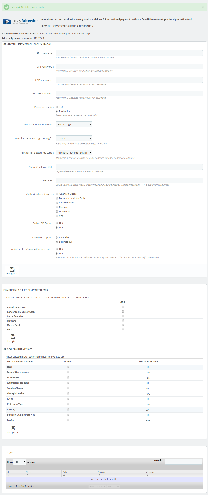

# Module configuration

## Access to configuration

To configure your HiPay Enterprise module, click on "_Modules -> Modules_” in your PrestaShop back office, then on "_Configure_":

## Configuration of your HiPay Enterprise account 

**Notification URL:** 

Here you can see the notification URL you configured in your HiPay Enterprise back office. Please refer to [[Platform configuration]].

**IP address of your server:**

Here you can see the IP address of your server, which must be authorized in your HiPay Enterprise back office. Please refer to [[Platform configuration]].

You can find your HiPay Enterprise API credentials in your HiPay Enterprise back office (https://merchant.hipay-tpp.com), under "_Integration -> Security Settings -> Api credentials_".

## Configuration parameters

| Name               | Description |
|:------------|:------------|
| API Username                      | Your HiPay Enterprise production account API username      |
| API Password                      | Your HiPay Enterprise production account API password     |
| Test API Username                 | Your HiPay Enterprise test account API username     |
| Test API Password                 | Your HiPay Enterprise test account API password     |
| Switch to mode                    | **Test:** If enabled, the module will use the HiPay Enterprise test credentials. |
|                                   | **Production:** If enabled, the module will use the HiPay Enterprise production credentials.     |
| Operating mode                    | **Hosted page:** To process the payment, cardholders are redirected to a secure payment page hosted by HiPay. This page can be personalized with the merchants' CSS style sheet to fit their website look and feel.     |
|                                   | **iFrame:** To process the payment, cardholders fill in their payment card information on a secure payment page hosted by HiPay and displayed in an iFrame on the merchants’ payment page.|
|                                   | **API:** To process the payment, cardholders fill in their payment card information directly on the merchants’ website, and the module calls the HiPay Enterprise API to validate the transaction. If this integration mode is selected, you must be PCI DSS compliant. For more information, please check "_https://www.pcisecuritystandards.org_".|
| iFrame width                      | If the iFrame operating mode is chosen, you can select your iFrame width to fit with your CSS.|
| iFrame height                     | If the iFrame operating mode is chosen, you can select your iFrame height to fit with your CSS.|
| Hosted page template              | For iFrame and Hosted page operating modes, you can choose your basic template to show:|
|                                   | **Basic:** Basic responsive design |
|                                   | **Basic-js:** Advanced responsive design |
| Display card selector             | Enable/disable the payment method selector in iFrame and Hosted page operating modes.|
| Challenge status URL              | If the transaction result is pending, the customer can be redirected to a customized page.|
| URL CSS                           | URL to the merchants’ style sheet for iFrame or Hosted page operating modes. Please note: the HTTPS protocol is required. Please refer to the HiPayTPP-GatewayAPI documentation, chapter 3.3 "Initialize a hosted payment page" (CSS).|
| Authorized credit cards           | Credit card types allowed on the payment form|
| Activate 3D Secure                | Allows the activation of 3-D Secure if available on the card being used.|
| 3D Secure minimum amount          | If 3-D Secure is activated, you can choose the minimum amount to ask for 3-D Secure authentication.|
| Switch to capture                 | Set the payment mode:    |
|                                   | **Automatic:** Authorization + Capture = Sale |
|                                   | **Manual:** Authorization Only. Please refer to the HiPayTPP-GatewayAPI documentation, chapter 3.1 "Request a New Order" (operation).|
| Allow memorization of card tokens | Allows the use of one-click payment (only for credit cards). |

## Authorized currencies by credit card

If you have configured multiple currencies in your PrestaShop back office and HiPay Enterprise account, you can choose for which currencies you want to offer credit card payment methods.

If no selection is made, all selected cards in your module configuration (section 4.1) will be displayed for all currencies.

To activate more currencies in your HiPay Enterprise account, please contact your HiPay account manager.

## Local payment methods

If you have configured multiple local payment methods in your HiPay Enterprise account, you can activate them here.

>
> **Please note!**
> 
> Local payment methods will only be showed if your customer makes a purchase in the available currency for each payment method.
>
