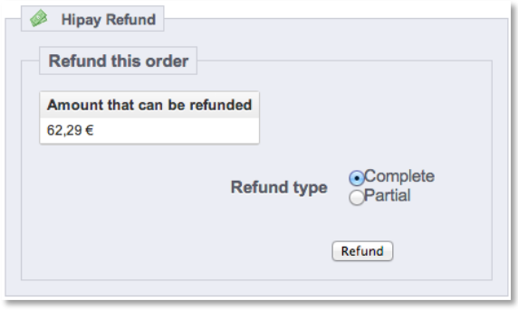

# Payment configuration

## "Automatic" mode (direct capture)

When making a purchase with the "automatic" mode, the capture is automatically requested right after authorization. Please refer to the HiPayTPP-GatewayAPI documentation, chapter 3.1 "Request a New Order" (operation).

If the payment fails, the customer is redirected to an error page and the status is defined as "_HIPAY - DENIED_".

If successful, the customer is redirected to the success page and the status is defined as "_PAYMENT ACCEPTED_".

## "Manual" mode

When making a purchase with the "manual" mode, the transaction status will be "_HIPAY - AUTHORIZED_" until you ask for the capture. Please refer to the HiPayTPP-GatewayAPI documentation, chapter 3.1 "Request a New Order" (operation).

The customer is not charged directly: you have 7 days to "capture" this order and charge the customer. Otherwise, the order is cancelled.

If the authorization fails, the customer is redirected to an error page and the status is defined as "_HIPAY - DENIED_".

If the authorization is successful, the customer is redirected to the success page and the status is defined as "_HIPAY – AUTHORIZED_".

To capture the transaction, go to "_Back Office -> Sales ->View order_" to see the details of the order and choose to make a "complete" or "partial" capture.

You can also do the “capture” directly in your HiPay Fullservice back office. The order will be updated automatically in your PrestaShop back office.

## Refund

Some HiPay Fullservice payment methods allow for a refund. To do it, go to "_Back Office -> Sales ->View order_" to see the details of the order and choose to make a "complete" or "partial" refund.  

You can also do the "refund" directly in your HiPay Fullservice back office. The order will be updated automatically in your PrestaShop back office.

## One-Click (only available for credit card payment methods)

If the One-Click option is enabled, your system will create an "alias" for the credit card. Customers will thus be able to use a saved credit card for their second transaction and won't need to fill in all the payment data again.