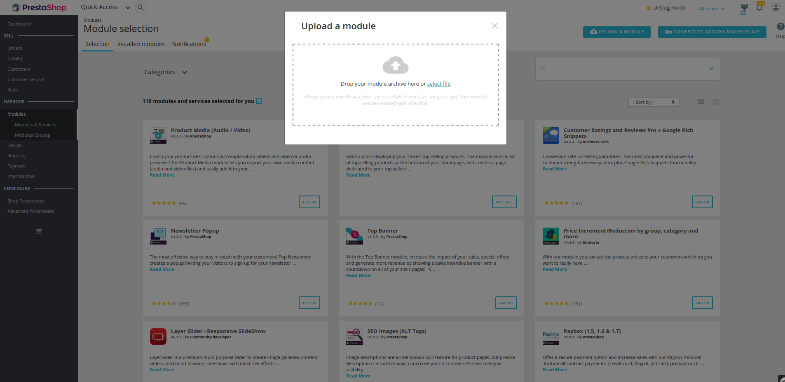
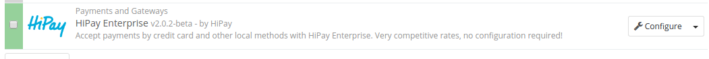

# PrestaShop module management

## Module management in the back office

### Get the installation package

#### Recommended solution

Download the ZIP package "package-ready-for-prestashop/hipay-enterprise-2.X.X.zip_" available in the **hipay/hipay-enterprise-sdk-prestashop** project.

#### Alternative solution

Download the latest release in the release section: **https://github.com/hipay/hipay-enterprise-sdk-prestashop/releases**.

1. Open your ZIP package and extract the project on your desktop.
2. Execute "_build-package.sh_" with a version number in the "./build-package.sh" parameter.
4. Voilà! "_hipay-enterprise.zip_" is now in the folder.

### Upload the module via PrestaShop module management

To install it in your PrestaShop administrator back office, click on "_Modules -> Modules & Services -> Upload a module_".

Choose the package and click on "_Upload this module_".

### Upload the module via FTP (SFTP)

You must have a file transfer software like "_FileZilla_" for example.

1. Open your software and connect to your FTP (SFTP).
2. Go to the root of your PrestaShop project.
3. Transfer the "_hipay_enterprise_" source module in the "_/modules/_" folder.
4. Add write permissions recursively to the folder "hipay_enterprise" (766).

## Install the module in the PrestaShop back office 

With **PrestaShop 1.7.X**, the module is automatically installed after being uploaded via the back office.

With **PrestaShop 1.6.X**, you have to manually launch the module installation.

1. Go to "_Modules -> Modules_". 
2. Search for the "_HiPay Enterprise_" module.
3. Select the new HiPay Enterprise v2.X.X module.
3. Click on “Install” in the module description.

When the installation request is executed, a window appears. It's simply a PrestaShop verification warning for the module. Click on "Proceed with the installation":

