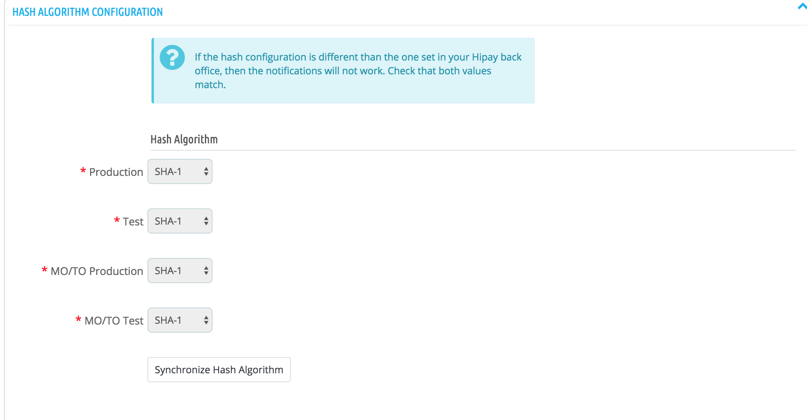

# Module configuration

## Access to configuration

**PrestaShop 1.6**

To configure your HiPay Enterprise module, click on "_Modules -> Modules_” in your PrestaShop back office. Then search for the module and
click on "_Configure_":

**PrestaShop 1.7**

To configure your HiPay Enterprise module, click on "_Modules -> Modules_” in your PrestaShop back office, then on "_Installed modules_":

## Preamble

The new configuration interface of the module is divided into seven tabs:

- **Module settings**: Configure API IDs to use the HiPay Gateway. You can also configure whether the module is in production or test mode. 
- **Payment methods**: Configure the payment methods to be activated and how payments must be processed: page hosted by HiPay or form on your checkout page.
- **Fraud**: Configure recipients' email addresses for "challenged" payment notifications.
- **Category mapping**: Match the HiPay product categories with yours (this is useful to send information about the customer's basket during the transaction)
- **Carrier mapping**: Match your delivery methods with HiPay's (this is useful to send information about the customer's basket during the transaction)
- **FAQ**: Find answers to frequently asked questions on how to use the module
- **Logs**: Get technical and functional logs

## Module settings

You must first fill in this information after the module has been installed.
This screen allows you to configure the API IDs required to run the HiPay services.

This screen is comprised of three elements:

#### Gateway configuration

This setting is very important: it allows to define whether payments will be executed on the HiPay test or production platform.
By default, the module is in TEST mode.
In test mode, payments are therefore not actually executed.

We strongly advise you to perform tests before launching your site in production mode.

#### Production configuration

Use this interface to specify the credentials linked to your HiPay account.
**These identifiers are used if your module is configured in production mode.**

Generated in your [HiPay Enterprise back office](https://merchant.hipay-tpp.com) (go to "Integration” => “Security Settings” => “Api credentials” => “Credentials accessibility”), these API credentials are required to use the HiPay Enterprise module.

For more information about credentials generation, please refer to the section on [Credentials](#prerequisites-and-recommendations-credentials).

**Account (Private)**

Private credentials are used to process payments on the HiPay API. These identifiers are mandatory.

| Name               | Description |
|:------------|:------------|
| Username                      | Your HiPay Enterprise production account API username      |
| Password                      | Your HiPay Enterprise production account API password     |
| Secret passphrase               | Your HiPay Enterprise secret passphrase   |

**Tokenization (Public)**

Public credentials are used as part of the JavaScript tokenization. These identifiers are to be specified only if you can use the module in API mode and if your infrastructure is PCI compliant.

| Name               | Description |
|:------------|:------------|
| Username                      | Your HiPay Enterprise production account API username      |
| Password                      | Your HiPay Enterprise production account API password    |

**MO/TO account credentials**

If defined, these identifiers will be used when making payments via the back office.

| Name               | Description |
|:------------|:------------|
| Username                      | Your HiPay Enterprise production account API username      |
| Password                      | Your HiPay Enterprise production account API password     |
| Secret passphrase               | Your HiPay Enterprise secret passphrase     |

#### Sandbox configuration

The interface is similar to the production configuration.

**These identifiers are used if your module is configured in test mode.**

#### Hash Algorithm

The **hash algorithm** is used when checking the signature.
You can configure it in your back office Hipay the algorithm of your choice.

This interface makes it easy to synchronize the configuration made on your back office HiPay.

Configurations are retrieved from your identifiers in "Production configuration" and "Sandbox configuration"

#### Technical configuration (Proxy settings)

When your server is behind a proxy, you must populate the information so that the modules can communicate with the HiPay Gateway.
Retrieve this information from your host and fill in the following information: Host, Port, Username and password.

# PSD2 and Strong Customer Authentication

Given the strong growth of the e-commerce in Europe, the Payment Services Directive (PSD2) redefines the security standards for online payments aiming to increase the security during the payment process, while fighting more actively against fraud attempts. For more details on the regulations, we invite you to read the [documentation provided by Hipay](https://developer.hipay.com/psd2-and-strong-customer-authentication-3-d-secure-2-compliance-and-guidance/).

As of September 14, 2019, the issuer will decide if a payment is processed depending on the analysis of more than 150 data collected during the purchasing process. Thanks to our Prestashop 1.6.x / 1.7.x module we handle most of the data without you having to develop anything. You can see all the new parameters on [our explorer API](https://developer.hipay.com/doc-api/enterprise/gateway/).

## Adding or overriding PSD2 data

The accuracy of the information sent is key for making sure that your customers have a frictionless payment process. That’s why we provide you the possibility to add or override all the information related to the DSP2.

We trigger the event “actionHipayApiRequest” that can be listened to using [another module](https://devdocs.prestashop.com/1.7/modules/).

It is called with two parameters: the request sent to the HiPay API and the current cart ordered by the customer.
 
You can either implement the observer in your own modules or use the one that we provide. You can find this additional module on our [github repository](https://github.com/hipay/hipay-enterprise-sdk-prestashop-data). 
 
You can install this module in a classic way, then directly modify the file “hipay_enterprise_data.php” and the method “hookActionHipayApiRequest” to add your information.
 
Be careful ! If there is an update of the data module, remember to save your data so that it is not overwritten.

Finally, although we do our best to retrieve all relevant data for you, we are not capable of getting the following data as it depends on the modules installed on your CMS or your workflow. 

### Merchant risk statement

| Field |  | Comment |
| --- | --- | --- |
| **delivery_time_frame** |  | The field is managed but only for virtual products.  We send “1 = Electronic delivery” if it is downloadable or  virtual product.  Depending on your carrier and delivery methods, you can refine this data.   Possible values:   1 = Electronic delivery 2 = Same day shipping 3 = Overnight shipping 4 = Two-day or more shipping |
| **shipping_indicator** |  | This fields is managed but you can refine the value for dematerialized products.  If the basket contains only virtual products, please provide:  5 = Digital goods 6 = Travel and event tickets, no shipping 7 = Other (gaming, digital services without shipping, e-media subscription) |
| **gift_card** |  | **If you sell gift card products** |
|  | **amount** | Collect the amount of gift card type gift cards purchased. |
|  | **count** | Collect the count of gift card type gift cards purchased. |
|  | **currency** | Collect the currency of gift card type gift cards purchased. |

If you want to see all the parameters you are able to override, please refer to the [SDK PHP Reference](https://developer.hipay.com/doc/hipay-enterprise-sdk-php/#psd2-and-strong-customer-authentication).
