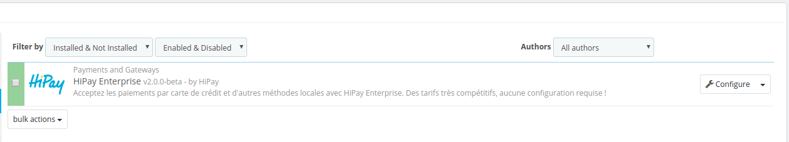
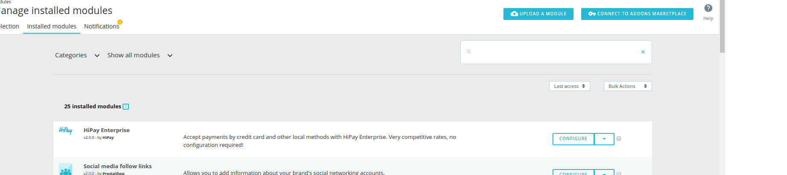
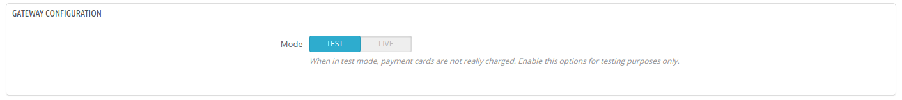
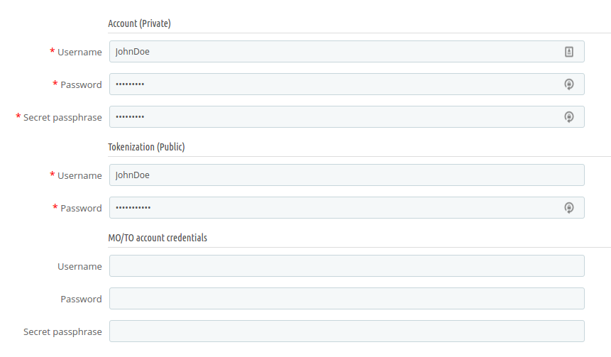

# Module configuration

## Access to configuration

**PrestaShop 1.6**

To configure your HiPay Enterprise module, click on "_Modules -> Modules_” in your PrestaShop back office. Then search for the module and
click on "_Configure_":

**PrestaShop 1.7**

To configure your HiPay Enterprise module, click on "_Modules -> Modules_” in your PrestaShop back office, then on "_Installed modules_":

## Preamble

The new configuration interface of the module is divided into seven tabs:

- **Module settings**: Configure API IDs to use the HiPay Gateway. You can also configure whether the module is in production or test mode. 
- **Payment methods**: Configure the payment methods to be activated and how payments must be processed: page hosted by HiPay or form on your checkout page.
- **Fraud**: Configure recipients' email addresses for "challenged" payment notifications.
- **Category mapping**: Match the HiPay product categories with yours (this is useful to send information about the customer's basket during the transaction)
- **Carrier mapping**: Match your delivery methods with HiPay's (this is useful to send information about the customer's basket during the transaction)
- **FAQ**: Find answers to frequently asked questions on how to use the module
- **Logs**: Get technical and functional logs

## Module settings

You must first fill in this information after the module has been installed.
This screen allows you to configure the API IDs required to run the HiPay services.

This screen is comprised of three elements:

#### Gateway configuration

This setting is very important: it allows to define whether payments will be executed on the HiPay test or production platform.
By default, the module is in TEST mode.
In test mode, payments are therefore not actually executed.

We strongly advise you to perform tests before launching your site in production mode.

#### Production configuration

Use this interface to specify the credentials linked to your HiPay account.
**These identifiers are used if your module is configured in production mode.**

Generated in your [HiPay Enterprise back office] (https://merchant.hipay-tpp.com) (go to "Integration” => “Security Settings” => “Api credentials” => “Credentials accessibility”), these API credentials are required to use the HiPay Enterprise module.

For more information about credentials generation, please refer to the section on [Credentials](#Credentials).

**Account (Private)**

Private credentials are used to process payments on the HiPay API. These identifiers are mandatory.

| Name               | Description |
|:------------|:------------|
| Username                      | Your HiPay Enterprise production account API username      |
| Password                      | Your HiPay Enterprise production account API password     |
| Secret passphrase               | Your HiPay Enterprise secret passphrase   |

**Tokenization (Public)**

Public credentials are used as part of the JavaScript tokenization. These identifiers are to be specified only if you can use the module in API mode and if your infrastructure is PCI compliant.

| Name               | Description |
|:------------|:------------|
| Username                      | Your HiPay Enterprise production account API username      |
| Password                      | Your HiPay Enterprise production account API password    |

**MO/TO account credentials**

If defined, these identifiers will be used when making payments via the back office.

| Name               | Description |
|:------------|:------------|
| Username                      | Your HiPay Enterprise production account API username      |
| Password                      | Your HiPay Enterprise production account API password     |
| Secret passphrase               | Your HiPay Enterprise secret passphrase     |

#### Sandbox configuration

The interface is similar to the production configuration.

**These identifiers are used if your module is configured in test mode.**

#### Technical configuration (Proxy settings)

When your server is behind a proxy, you must populate the information so that the modules can communicate with the HiPay Gateway.
Retrieve this information from your host and fill in the following information: Host, Port, Username and password.
