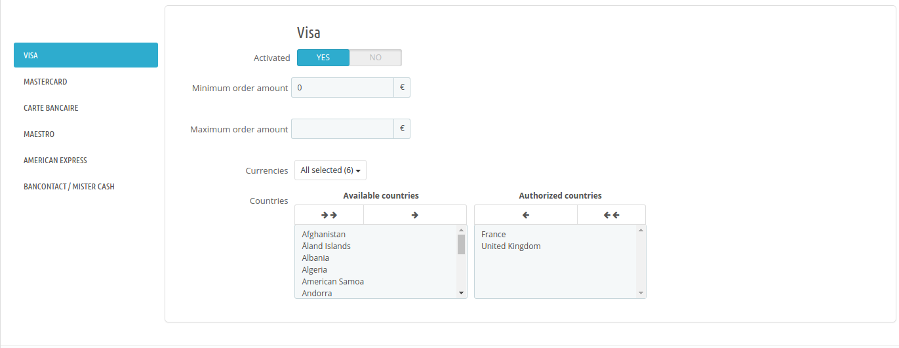

## Payment methods

After configuring the necessary information, this interface allows you to set the payment methods that will be available to your customers.

### Global settings

This general configuration will be applied whatever the payment methods being used.

   | Name               | Description | Value |
 |:------------|:------------|:-----|
 | Operating mode                       | Defines if the payment form is displayed on the merchant's site or on a HiPay payment page. | - **API**: Customers will fill in their bank information directly on the merchant's site.   - **Hosted**: Customers are redirected to a secured payment page hosted by HiPay.    - **Hosted Fields**: The customer completes his banking information directly on the merchant's site but the form fields are hosted by HiPay. This mode is only valid for credit cards. More about [Hosted fields](https://hipay.com/fr/hosted-fields).|
 | Capture                              |Defines if payments should be captured manually or automatically. Manual capture will be possible either on the order page of the PrestaShop back office or on the HiPay Enterprise back office. Please refer to the section on [Capture mode](#module-configuration-captures-capture-mode).  | - **Manual**: All transactions will be captured manually either from your HiPay Enterprise back office or from your PrestaShop back office.   - **Automatic**: All transactions will be captured automatically.
 | Use One-click                         | If the One-click option is enabled, customers will be able to use a saved credit card for their second transaction and won’t need to fill in all the payment data again. |"Yes"/"No"|
 |  Customer's cart sending             | The customer's basket will be sent during the transaction. If this option is canceled, you will be able to make captures and refunds for the item.|"Yes"/"No"|
 |  Keep cart when payment fails        | Defines if the client's basket must be reloaded when an error occurs during payment. |"Yes"/"No"|
 | Logs information                           | Activates debug logs.  ||
 |  Activate 3-D Secure | Enables and configures 3DS rules. | You can choose between 5 options:   - **Disabled** (to bypass 3-D Secure authentication)   - **Try to enable for all transactions**   - **Try to enable for configured 3ds rules**   - **Force for configured 3ds rules**   - **Force for all transactions**|
|  Send url Notification | If so, then the url used by HiPay to send the notifications is directly filled in the order transaction. | "Yes"/"No" |

#### Hosted page

When you choose the "**_Hosted page_**" option as operating mode, you have access to additional settings.

   | Name               | Description | Value |
 |:------------|:------------|:-----|
 | Display hosted page      | Defines if the hosted page is displayed in an iFrame or with a redirect. | -"redirect"   -"Iframe"
 | Display card selector    | Shows card selector on the hosted page.| "Yes"/"No"
 | CSS URL                  | URL of your CSS (cascading style sheet) to customize your hosted page or iFrame | Https URL

#### Hosted Fields

When you choose the "**_Hosted Fields_**" option as operating mode, you have access to additional settings.

|  Name    |
|----------|
|  color    |
|  fontFamily |
| fontSize | 
| fontWeight |
| placeholder Color|
| caretColor |
| iconColor |

Those parameters allows you to override default CSS properties in hosted form fields.

To override the default template, please refer to the PrestaShop documentation ([doc.](https://devdocs.prestashop.com/1.7/themes/reference/overriding-modules/)) and the HiPay SDK JS documentation ([doc.](/doc/hipay-enterprise-sdk-js_3/#hipay-enterprise-javascript-sdk)).

### Credit card

This section allows you to configure payment cards.
By default, all card types are enabled and set to default.
For each type of card, you can then define a different configuration.

   | Name               | Description | Value |
 |:------------|:------------|:-----|
 | Activated                     | Allows or not customers to use this type of card.   |"Yes" / "No"   If the card type is not activated, customers will have a warning message upon payment, inviting them to use another type of card.
 | Minimum order amount          | Indicates a minimum threshold for the type of card available for payment.| Amount with default currency   If the amount is not reached, customers will have a warning message upon payment, inviting them to use another type of card.|
 | Maximum order amount    | Indicates a maximum threshold for the type of card available for payment.| Amount with default currency   If the amount is not reached, customers will have a warning message upon payment, inviting them to use another type of card. |
 |  Currencies             | Currencies for which the card type will be activated. These are the installed and active currencies on your shop | Selection of one or more currencies|
 |  Countries        |Countries for which the card type will be activated   |Selection of one or more countries|

### Local payments

Local payments include all payments other than bank cards.
Through this interface, you can activate payment methods like Oney Facily Pay, PayPal, SEPA Direct Debit, etc.

Configuration is done as for credit cards, except for certain local payments: "currencies" and "countries" cannot be modified.

You can also define the following elements for each payment method:

   | Name               | Description | Value |
 |:------------|:------------|:-----|
| Display name                     |  Name displayed on the PrestaShop checkout page | String  |
| Front positioning                 |  Allows you to display payment methods. | Number |

