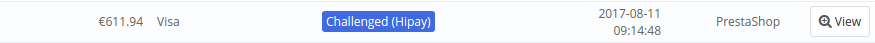
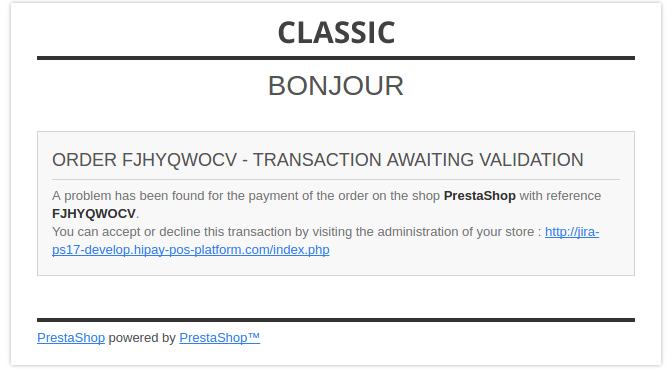

## Fraud screening

Based on the screening results of HiPay’s Fraud Protection Service, when a transaction
is suspected of being fraudulent, it is in "_challenged_" status. In your PrestaShop back office,
the order is flagged as follows:

An email is sent to the site administrator to warn him/her that a transaction has been
"challenged" and that the transaction must be accepted or denied.
The customer is also informed that the payment is pending.

With this interface, you can add recipients for the email notification about the "challenged" transaction.

   | Name               | Description | Value |
 |:------------|:------------|:-----|
| Copy to                    |  Email addresses you want to add in copy|Valid email address |
| Copy method               | Selected email copy method | - Bcc: The recipient will be in blind copy of the email   - Separate email: two messages are sent

### Accepting or denying transactions

There are two ways to accept or deny a payment: either from your HiPay Enterprise back office, or from your PrestaShop back office.
On the order in question, in the "HIPAY ACTIONS" section, you will find two buttons: to accept or deny the payment.
Upon accepting or denying a payment, an email notification is sent to the customer.

