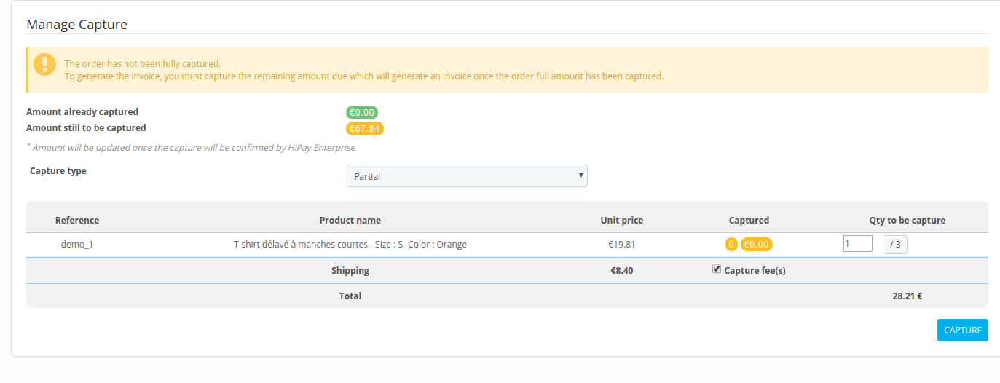
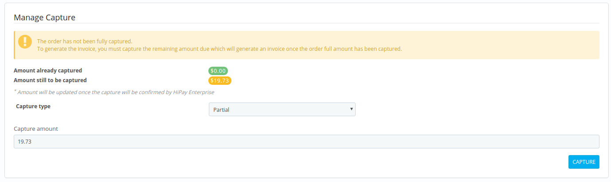
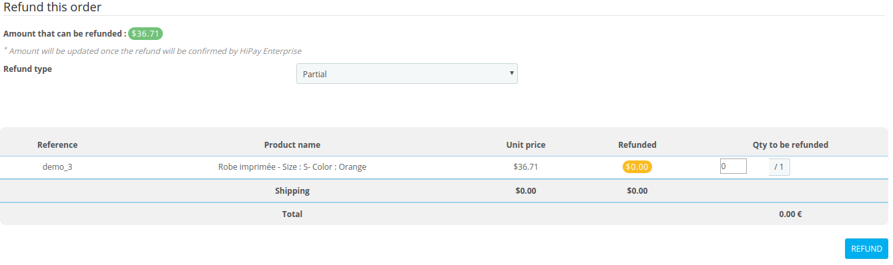
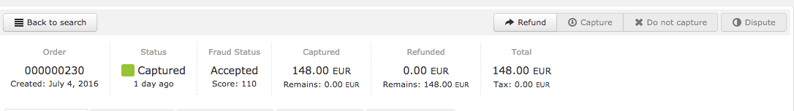
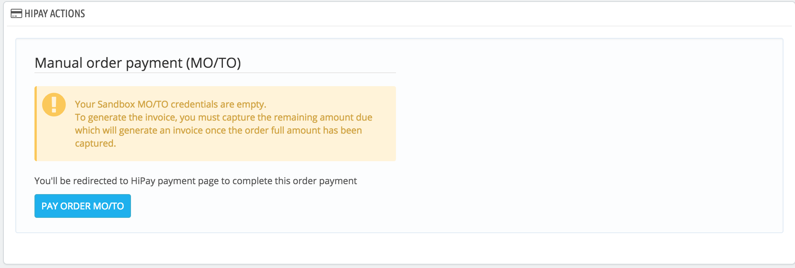

## Captures

### "Capture" mode

When making a purchase in "capture" mode, the capture is automatically requested right after authorization. For more information about requesting a new order (operation), please refer to our [Developer Portal] (https://developer.hipay.com/doc-api/enterprise/gateway/#!/payments/requestNewOrder).

   - If the payment fails, the customer is redirected to an error page and the status is defined as "_CANCELED_".
   - If the payment is successful, the customer is redirected to the success page and the status is defined as "_CAPTURE REQUESTED_".

### "Automatic" mode

When making a purchase in "automatic" mode, the transaction status will be "_AUTHORIZED_" until you ask for the capture. For more information about requesting a new order (operation), please refer to our [Developer Portal] (https://developer.hipay.com/doc-api/enterprise/gateway/#!/payments/requestNewOrder).
Customers are not charged directly: you have 7 days to "capture" the order and charge the customer. Otherwise, the order is canceled.

  - If the authorization fails, the customer is redirected to an error page and the status is defined as "_CANCELED_".
  - If the authorization is successful, the customer is redirected to the success page and the status is defined as "_AUTHORIZED_".

### Manual captures and refunds

### Captures

To capture a transaction in your PrestaShop back office, select "_Orders_" -> "_Orders_" and select any order.
The order status should be "Payment authorized".

In "HIPAY ACTIONS", in the "Manage Capture" section, you can make captures.

Captures may be either complete or partial.

**Complete captures**:
The total amount of the transaction is captured.

**Partial captures**:
When you select "Capture type": "Partial", the products in the customer's basket are displayed with the unit prices and the number of products that can be captured.
You can capture delivery charges and applicable discounts, and choose the number of products to capture.
The amount is updated based on the number of selected items.

Once the first capture is done, the order status changes to "Payment accepted". The remaining amount to be captured and the amount already captured are updated.

You can also do the “capture” directly in your HiPay Enterprise back office. The order will be automatically updated in your PrestaShop back office.
Please note: it only works for total captures (not partial).

If the customer basket is not sent with the transaction, then the partial capture will be executed with a free amount.

### Refunds

To refund a transaction in your PrestaShop back office, select "_Orders_" -> "_Orders_" and select any order.
The order status should be "**Payment accepted**".
In "HIPAY ACTIONS", in the "Manage Capture" section, you can make refunds.
Refunds may be either complete or partial.

**Complete refunds**:

The total amount of the transaction is refunded.

**Partial refunds**:

When you select "Refund type": "Partial", the products in the customer's basket are displayed with the unit prices and the number of products that can be refunded.
You can refund delivery charges and applicable discounts, and choose the number of products to refund.
The amount is updated based on the number of selected items.

You can also make a "refund" directly in your HiPay Enterprise back office. The order will be automatically updated in your PrestaShop back office.

If the customer basket is not sent with the transaction, then the refund capture will be executed with a free amount.

You can also do the "refund" directly in your HiPay Enterprise back office. The order will be automatically updated in your Magento Admin Panel.
NOTE: It only works for total refunds (not partial).

	<i class="fa fa-times-circle"></i>
If you make a partial capture or refund from your HiPay Enterprise back office, it will not be possible to make a capture or refund from your PrestaShop back office.

## MO/TO Payment ( Mail Order/Telephone Order )

To make an order for your customers in a MO/TO process and thus use the correct ECI and the identifiers you have entered in the module configuration you will need:

- In the Summary tab of the order before confirming the order,
enter the value of **Payment** with *"Hipay Enterprise"* and the value of **Order Status** to *"Waiting for payment MO/TO"* and confirm the order with the button "Create the order"

- Refresh the order and access the *"Hipay Action"* tab and confirm the order with the **"Pay Order MO/TO"** button. You will be redirected to a payment page or you will be able to fill in the information provided by your customers.

	<i class="fa fa-times-circle"></i>
 If you use the button "Send an email to the customer with the link to process the payment", will not be considered MO/TO.

	
