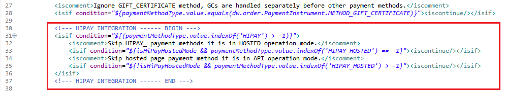
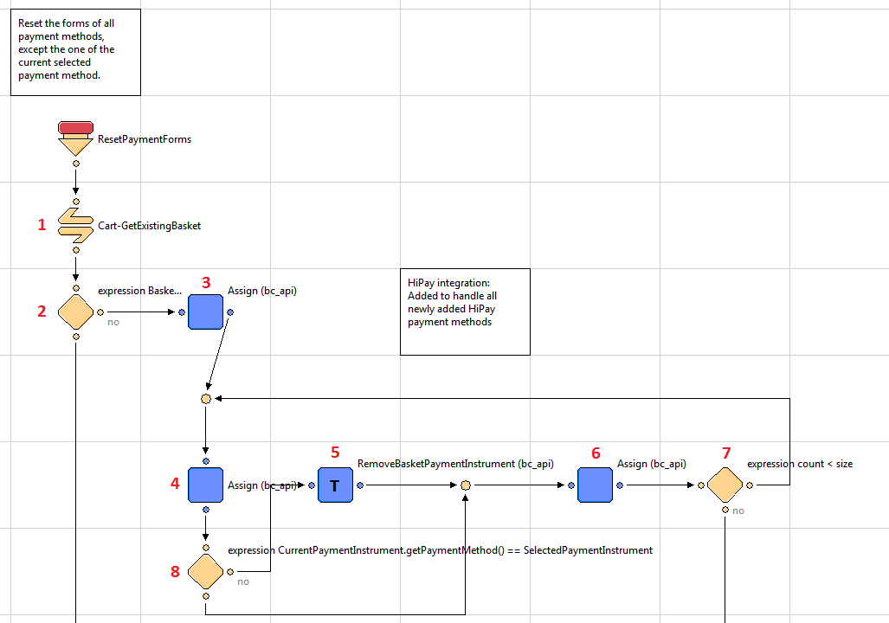
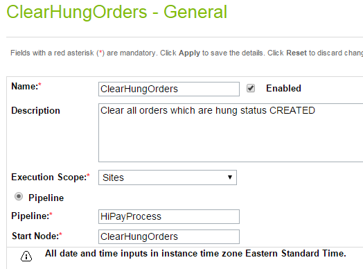
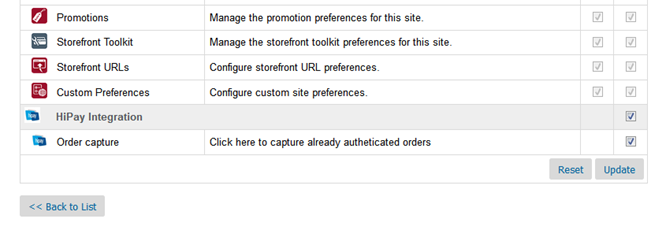
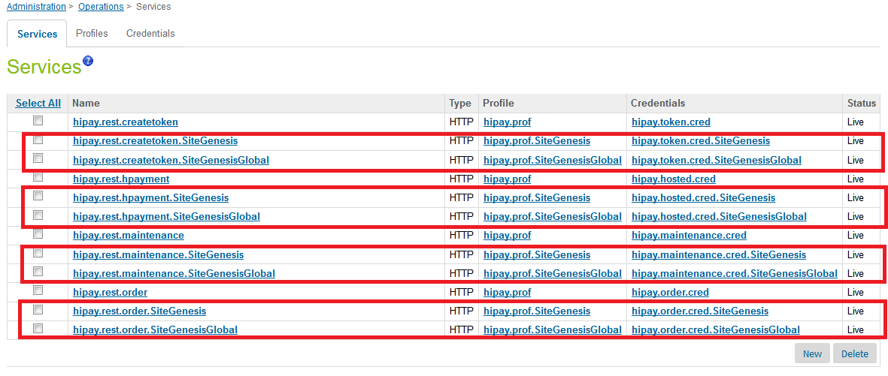
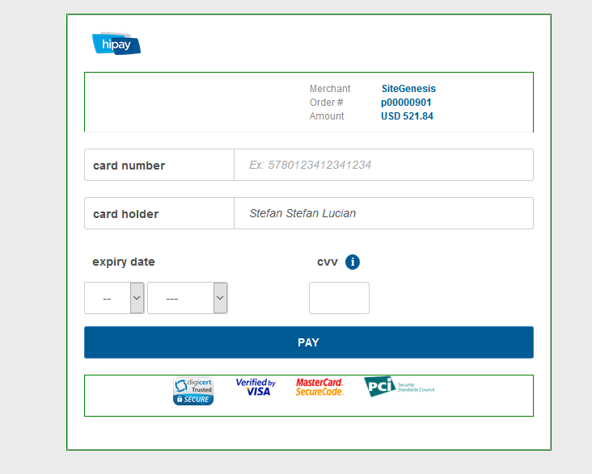

#HiPay Enterprise Cartridge for Salesforce Commerce Cloud

#General information

Salesforce Commerce Cloud was formerly known as Demandware. The HiPay cartridge, available on the Salesforce Commerce Cloud (SCC) LINK Marketplace,
allows merchants to offer HiPay Enterprise as a payment solution on
their Salesforce Commerce Cloud storefronts.

The cartridge provides several options for entering payment information
(credit card or debit card information) during the checkout process:

-   through a hosted page, external to the Salesforce Commerce Cloud platform,
-   or directly on merchants’ Salesforce Commerce Cloud storefronts, through API module calls.

Additionally, a full range of other payment methods are supported.

To enable a Salesforce Commerce Cloud store to use HiPay’s payment services, the
developer has to install the cartridge and integrate it to the online
store following the instructions provided in this document.For the integration to work properly, merchants should first contact
HiPay and fill in an account request on
[*https://hipay.com/*](https://hipay.com/).

HiPay can provide merchants with both test and production accounts. The configuration described in this document should be done in both
Salesforce Commerce Cloud Business Manager and HiPay’s back office.

The integration package contains the following elements:

-   a cartridge called `int_hipay` – which is the core integration cartridge
-   a cartridge called `bm_hipay` – which is an extension for the cartridge within Salesforce Commerce Cloud Business Manager
-   a `site-template` folder with metadata
-   this document.

The integration is based on the SiteGenesis demo store provided by
Salesforce Commerce Cloud. The cartridge is compatible with SiteGenesis 16.7 and might require
updates and reviews for future versions and releases of SiteGenesis.

#Component overview

##Functional overview

This section describes the functionalities of the HiPay cartridge to
merchants who will integrate it in their Salesforce Commerce Cloud environment.

###Frontend and Business Manager (BM) functionalities

**Business Manager extension for HiPay**

The features of the HiPay cartridge can be configured from Business
Manager. On the BM page, merchants can set up the connection to HiPay. To create
it, they have to enter their credentials.

**Hosted pages**

The cartridge supports the hosted-payment-page-approach of entering
payment information directly on pages that are hosted and provided by
HiPay. During checkout, merchants’ customers will therefore be
redirected to the HiPay hosted payment pages, usually when they are
asked to enter payment details. On these pages, customers can select the
payment method of their choice (the offering depends on the merchant’s
selection). Hosted payment pages can be styled to reflect the merchant’s
storefront look-and-feel.

**iFrame integration**

The cartridge enables merchants to use the HiPay payment solution via an
iFrame integrated in their own Salesforce Commerce Cloud implementation.

**Multiple payment methods**

The cartridge allows customers to check out with a wide variety of
payment methods.

**Direct payment API**

The cartridge offers customers the possibility to fill in payment
information directly on the websites of merchants, who have to be
PCI-DSS compliant. Transactions will be validated through the module
called HiPay Enterprise API.

The cartridge provides several options for entering payment information
(credit card or debit card information) during the checkout process:
through a hosted page, external to the Salesforce Commerce Cloud platform, or directly
on the merchants’ Salesforce Commerce Cloud storefront, through API module calls.

Additionally, a full range of other payment methods are supported.

###Security features and functionalities

**3-D Secure**

The cartridge supports 3-D Secure rules and activation if the card being
used has been enrolled. The 3-D Secure authentication process will
redirect merchants’ customers to a special page hosted by the issuing
card company. The cartridge enables the redirection to that page.

After the authentication process, the cartridge ensures that the result
is transferred back to Salesforce Commerce Cloud so that the right message is displayed
on the frontend and that the order status is set accordingly. Merchants can configure specific rules for the use of 3-D Secure. These
rules can be edited or deleted in the configuration parameter “rules 3d
secure”.

**Device fingerprint**

The cartridge supports device fingerprint information by sourcing the
dynamically generated JavaScript from HiPay Enterprise. The JavaScript
determines the available information and creates or generates a
so-called black box. To use this functionality, custom configurations
are needed. These custom configurations are not part of the development
as they require individual implementation for each customer.

**Signature verification**

A signature verification mechanism is available for checking the content
of requests and redirections between merchants’ sites and HiPay’s pages.
In the first place, merchants have to set a secret password or phrase in
HiPay’s back office. The secret password or phrase will be used to
generate a unique string that will be hashed with an SHA algorithm.

**Automatic cancellation**

Pending orders are automatically cancelled if not completed within 30
minutes.

###Payment configuration

The cartridge supports the “Authorization” and “Direct capture” modes.

**Authorization**

Merchants’ customers are not charged automatically or directly after the
order is placed. Merchants have a defined amount of time to capture the
money from their customers. This can be configured manually from
Business Manager &gt; HiPay Integration &gt; Order capture. Please note
that partial or full captures can be done. Order Cleanup Time can be
configured from the Hung Order Cleanup Time configuration option.

If transactions fail, customers are redirected to an error page. If
transactions are successful, they are redirected to a success page. The
authorization can be used within 7 days; otherwise, it expires.

**Direct capture**

The capture is automatically requested after the authorization. If the
capture is not successful, merchants’ customers are redirected to an
error page. If the capture is successful, they are redirected to a
success page.

##Use cases

**Short description of the HiPay payment system**

HiPay can generally receive payments in two ways: 

1. via the HiPay Professional Payment API (PCI-DSS compliance needed). A result is returned right away. This can only be used for credit cards.

2. via the "redirect model", through which a form containing certain
fields is posted to HiPay and the customer is redirected to the HiPay
Hosted Payment Page (HPP).

After completing the payment, the customer is redirected to the store’s
resultURL, which can be configured and contains the result of the
payment (successful or declined).

The redirect model can also be implemented in an iFrame solution, where
merchants’ customers are redirected to the HiPay pages, in a frame that
is inserted in the merchants’ page. This  approach gives customers the
feeling that they do not leave the merchants’ site.

Compared to the API, the redirect model offers much more payment methods
as well as other functionalities. 

Payment results should be sent asynchronously to a “notification URL” on
the merchant (SCC) site. Payments can change status over time
(Authorized, Refunded, Cancelled…) on HiPay’s side; statuses are
automatically updated on Salesforce Commerce Cloud’s side by sending these
notifications. HiPay Enterprise sends notifications to Salesforce Commerce Cloud for
each event that occurred/transaction that changed. In order to handle
all the notifications, notes are added to the order.

In both cases, the “two-phase ordering” approach is used, through which
the order is first created but only “placed” after a payment has been
authorized (which is now standard practice in SiteGenesis). If the
payment cannot be authorized, the order fails. 

**Use cases**

Registered and unregistered customers will be able to follow the
standard SiteGenesis flow with the following changes: 

HiPay redirect (hosted payment pages, iFrame integration and multiple
payment methods) and HiPay Professional Payment API will be the only payment
options.

**If HiPay redirect is enabled: **

-   no entering of credit card details on the checkout page is possible
    when the customer selects this payment method (as this is done on
    the HiPay hosted payment pages)
-   possibility to choose one of the predefined payment methods on the
    checkout page with further redirection to HiPay hosted payment
    pages, if Directory Lookup is enabled and the customer has selected
    HiPay’s payment method
-   a redirect to the HiPay hosted payment pages after clicking the
    “SUBMIT ORDER” button on the Order Confirmation page
-   a return to the SCC Order Summary page after successful payment
    authorization 
-   a return to the SCC Order Confirmation page, if the customer
    cancelled the payment on the HiPay hosted payment pages
-   a return to the SCC Order Confirmation page with an error message
    displayed, if the payment was refused 

**If HiPay API payments are enabled: **
-   credit card details are entered and stored in merchants’ SCC store
-   for the other payment methods, merchants can still redirect
    customers to the HiPay hosted payment pages, but can disable credit
    cards via the configuration of their skin
**Examples of test scenarios**

-   All test scenarios involve successful and declined payments.
-   Test scenarios should be done with every available payment method.
-   The used currency should be EUR; only credit cards are enabled
    for USD.
-   If for a payment method on a hosted page, there is an emulation
    page, the system should be tested for all options (e.g.: Cancel,
    Exception, Decline).
-   When making a payment, a Salesforce Commerce Cloud Order object changes its status
    as follows:
    -   **CREATED** – the iFrame or Hosted page has been shown; the basket
        has been cleared; the order may stay in this status if the
        process did not complete properly (bug) or if the user abandons
        the iFrame or the Hosted page and does not complete
        the payment.

    -   **NEW** – the order in the iFrame or Hosted page has been accepted
        – the order has changed its status.

    -   **OPEN** – the order has been viewed in SCC Business Manager after
        being in status NEW.

    -   **FAILED** – all cases of Cancel and Decline.


**UC – 1**                                                                                                                                                  
This use case describes the main steps in which a registered/guest customer successfully creates an order as well as the order with the HiPay Hosted Page.   
  
**HiPay Hosted Page**

- Go to Merchant Tools &gt; Site Preferences &gt; Custom Preferences &gt; HiPay Settings.
- For HiPay Operation Mode, select hosted (Hosted Page) and click on **Apply**.

	1.  A registered customer navigates on the site, adds an item to the cart and proceeds to the cart page.
	2.  The customer clicks on the **Checkout** button and fills in the required shipping information.
	3.  The customer clicks on the **Continue** button, fills in the required billing information and selects **HiPay Hosted** as the payment method.
	4.  The customer clicks on the **Continue** button, proceeds to the **Payment** page and clicks on the **Place order** button.
	5.  A HiPay hosted page is opened and the customer enters the card details.
	6.  After successful payment, the customer is redirected to the Summary page and the order confirmation message is successfully loaded.
	7.  The customer can verify the Order Summary information.
	8.  The merchant can verify the Order status in SCC BM.
	9.  The merchant can verify the information in the HiPay Enterprise account.
                                                                                                                                                               
**Please note that a similar flow can be done for guest checkout.**

**UC – 2**   
This use case describes the main steps in which a registered/guest customer successfully creates an order as well as the order with the HiPay Hosted Page with 3-D Secure.

**HiPay Hosted Page with 3-D Secure**
                                                                                                                                                       
-   Go to Merchant Tools &gt; Site Preferences &gt; Custom Preferences &gt; HiPay Settings.
-   For HiPay Operation Mode, select **hosted** (Hosted Page) and click on **Apply**.
-   For 3-D Secure, select **1 (3-D Secure authentication if available)** and click on **Apply**.
                                                                                                          
	1.  A registered customer navigates on the site, adds an item to the cart and proceeds to the cart page.
	2.  The customer clicks on the **Checkout** button and fills in the required shipping information.
	3.  The customer clicks on the **Continue** button, fills in the required billing information and selects **HiPay Hosted** as the payment method.
	4.  The customer clicks on the **Continue** button, proceeds to the **Payment** page and clicks on the **Place order** button.
	5.  A HiPay hosted page is opened and the customer enters the 3-D Secure card details.
	6.  The customer is redirected to their bank’s site and enters the 3-D Secure code.
	7.  After successful identification, the customer clicks on **Back to Payment**.
	8.  After successful payment, the customer is redirected to the Summary page and the order confirmation message is successfully loaded.
	9.  The customer can verify the Order Summary information.
	10. The merchant can verify the Order status in SCC BM.
	11. The merchant can verify the information in the HiPay Enterprise account.
                                                                                                                                                                               
**Please note that a similar flow can be done for guest checkout.**
    

**UC – 3**                                                                                                                                                       
This use case describes the main steps in which a registered/guest customer successfully creates an order as well as the order with the HiPay API Integration.

**HiPay API Integration**
                                                                                                                                                                   
-   Go to Merchant Tools &gt; Site Preferences &gt; Custom Preferences &gt; HiPay Settings.
-   For HiPay Operation Mode, select **api** (API) and click on **Apply**.
                                                                                                                                                                   	1.  A registered customer navigates on the site, adds an item to the cart and proceeds to the cart page.
	2.  The customer clicks on the **Checkout** button and fills in the required shipping information.
	3.  The customer clicks on the **Continue** button, fills in the required billing information and selects **iDEAL** as the payment method.
	4.  The customer selects the desired issuing bank and clicks on the **Place order** button.
	5.  The customer is redirected to the iDEAL vendor’s site.
	6.  The customer enters the payment details.
	7.  After successful payment, the customer is redirected to the Summary page and the order confirmation message is successfully loaded.
	8.  The customer can verify the Order Summary information.
	9.  The merchant can verify the Order status in SCC BM – on the Order screen, open the Payment tab to verify the payment information.
	10. The merchant can verify the information in the HiPay Enterprise account.

**Please note that a similar flow can be done for guest checkout.**
  
##Limitations and constraints

-   Merchants need a configured HiPay account.
-   Merchants can style the hosted pages to match the look-and-feel of their store.

The following features are out of scope:

-   Cancel support
-   Refund support
-   One-click payment (credit card only).

##Compatibility

The HiPay integration cartridge is compatible with Salesforce Commerce Cloud version
16.7 or higher.

##Payment data privacy

If only the redirect method is used, all payment data are entered on the
HiPay hosted pages by the customer and no credit card data will be
stored in Salesforce Commerce Cloud (except the brand of the card being used).

Examples:

- HiPay Product Name: `hosted`

- HiPay Payment Product List:
`bcmc,cb,maestro,mastercard,visa,american-express`

- HiPay Payment Category List: `credit-card,debit-card`

- HiPay Product Name: `dexia-directnet`

- HiPay Payment Product List: `dexia-directnet`

HiPay Payment Category List: `realtime-banking`

#Implementation guide

##Integration efforts

The following steps are needed to complete the integration:

-   Install the cartridges.
-   Change and import “site-template.zip” (system objects).
-   Make the required code changes.
-   Configure your merchant’s HiPay account in HiPay’s back office.
-   Configure HiPay’s parameters in Salesforce Commerce Cloud.
-   Test.

##Setup

###Installation

Install the `int_hipay`, `bm_hipay` and `app_hipay` cartridges from
the distributive zip-archive in a standard way using Salesforce Commerce Cloud
UX-studio.

###Metadata import

The `site-template.zip` archive is in the installation package, which
contains metadata files. Please review the archive, make the necessary
modifications and import it through BM **Administration &gt; Site
Development &gt; Site Import & Export** section.

The only required modification is to rename the root folder of the
archive to the ID of your site.

For multi-site integration, you also have to clone the SiteGenesis
folder and rename it with the ID of your site. After site import, you
will also need to check the ClearHungOrder schedule and Site assignment
section (please see section *5.2.4 Schedules*).

Please note that the `site`_template` folder also contains the
`pin-price-lists.xml` with the pricebook. If you don’t need it, just
remove this file and the `pricebook` folder before archiving the
`site_template` folder.

Before importing the `site-template.zip`, check and save the cartridge
paths of your site and Business Manager as they will be modified. That
way, you will be able to configure them manually if something goes
wrong. Also, check the fields that will be updated after importing the
“site-template.zip” and make sure that there won’t be any conflict with
the existing fields.

##Configuration

-   Add `int_hipay` to the cartridge site path: `int_hipay:app_storefront_pipelines:app_storefront_core`
-   Add `bm_hipay to the cartridge BM path: `bm_hipay`
-   Go to BM **Administration &gt; Site Development &gt; Site Import & Export** and import `site_template` (make a zip file).
-   Custom site preferences (HiPay Settings): Go to **Merchant Tools &gt; Site Preferences &gt; Custom Preferences &gt; HiPay Settings**:

	-   **HiPay Operation Mode –** Defines which operation payment mode to
    use – these are HOSTED/IFRAME/API. When selecting the API mode, the
    HIPAY\_HOSTED payment method will be hidden from the checkout page.
    If HOSTED or IFRAME is selected, all API payment methods are hidden
    from the checkout page.

	-   **Enable Tokenization Test Mode –** Test Mode: if enabled, the
    module will use the HiPay Enterprise test platform.

	-   **3-D Secure –** Allows the activation of 3-D Secure if the card has
    been enrolled.

	-   **3-D Secure Threshold Rule** **–** If the Order total amount is
    higher than the specified sum, 3-D Secure will then be forced. If 0
    is specified, the rule is disabled.

	-   **HiPay API Signature Passphrase –** API Signature passphrase
    configured in HiPay’s back office, used to verify the requests made
    to SCC.

	-   **Payment Action –** Please refer to *HiPay TPP – Payment Gateway
    API* documentation, chapter 3.1 *Request a New Order (Order
    Parameters – operation).*

	-   **iFrame Height –** If the iFrame operating mode is chosen, you can
    select your iFrame height to fit with your CSS.

	-   **iFrame Width –** If the iFrame operating mode is chosen, you can
    select your iFrame width to fit with your CSS.

	-   **HiPay CSS content –** HiPay’s content with custom CSS to style the
    Hosted/iFrame pages. The content is displayed directly on the hosted
    page and any CSS should be wrapped with
    `<style></style>` tags.

	-   **Display card selector –** Enables/disables the payment method
    selector on iFrame and hosted pages.

	-   **Hung Order Cleanup Time** – Number of minutes after which all
    orders hung in status `CREATED` and left unprocessed for payment
    are cleared.


-   Service configuration:

Go to **Administration &gt; Operations &gt; Services &gt; hipay.{type}.cred Details**.

Update User ID and password for hipay credentials: hipay.hosted.cred, hipay.maintenance.cred, hipay.order.cred, hipay.token.cred.

User ID and password from HiPay’s dashboard integration can be used.

- URL:
[*https://stage-secure-gateway.hipay-tpp.com*](https://stage-secure-gateway.hipay-tpp.com)
- User: enter username (e.g.: \*\*\*\*\*\*\*\*.api.hipay-tpp.com)
- Password: enter your password

For multiple HiPay accounts configuration, please read section ***5.2.3
Services –** **Configurations for the HiPay multi-account feature***.

-   HiPay’s payment methods can be enabled/disabled from the **Payment
    methods** section. There are two methods – **HiPay Hosted** and
    **HiPay**, for the hosted solution and the integrated
    API respectively.

-   HiPay’s predefined log category

Go to **Administration &gt; Operations &gt; Custom Log Settings**.

HiPay’s log category is called “HIPAY”. It can be added or removed from the **Info** and **Debug** configuration.


##Custom code


For all custom code changes, an example is included in int\_hipay; each
of them is also described in the current section.

1.	`app_storefront_core/cartridge/templates/default/checkout/billing/creditcardjson.isml`            

See the int_hipay/cartridge/templates/default/checkout/billing/creditcardjson_sample.isml for an example

Add:

`uuid:pdict.SelectedCreditCrd.UUID`

After:

`expirationYear:pdict.SelectedCreditCard.creditCardExpirationYear`


2.	`app_storefront_core/cartridge/templates/default/checkout/billing/paymentmethods.isml`

See the int_hipay/cartridge/templates/default/checkout/billing/paymentmethods_sample.isml for an example

Add:

``` html
<!--- HIPAY INTEGRATION ------ BEGIN --->
<link rel="stylesheet" href="${URLUtils.staticURL('/css/hipay.css')}" />
<isinclude template="checkout/components/devicefingerprint"/>
<isscript>
   var HiPayConfig = require('int_hipay/cartridge/scripts/lib/hipay/HiPayConfig.ds').HiPayConfig;
   var isHiPayHostedMode = false;
   if(HiPayConfig.hipayOperationMode == HiPayConfig.OPERATION.HOSTED || HiPayConfig.hipayOperationMode == HiPayConfig.OPERATION.IFRAME) {
      isHiPayHostedMode = true;
   }
</isscript>
<!--- HIPAY INTEGRATION ------ END --->
```

After:

``` xml
<legend>
   ${Resource.msg('billing.paymentheader','checkout',null)}
   <div class="dialog-required"> <span class="required-indicator">&#8226; <em>${Resource.msg('global.requiredfield','locale',null)}</em></span>
</div>
</legend>

```


Add:

``` html
<!--- HIPAY INTEGRATION ------ BEGIN --->
<isif condition="${(paymentMethodType.value.indexOf('HIPAY') > -1)}"> 
   <iscomment>Skip HIPAY_ payment methods if is in HOSTED operation mode.</iscomment>
   <isif condition="${isHiPayHostedMode && paymentMethodType.value.indexOf('HIPAY_HOSTED') == -1}">
<iscontinue/>
</isif>
   <iscomment>Skip hosted page payment method if is in API operation mode.</iscomment>
   <isif condition="${!isHiPayHostedMode && paymentMethodType.value.indexOf('HIPAY_HOSTED') > - 1}"> <iscontinue/></isif>
</isif>
<!--- HIPAY INTEGRATION ------ END --->

```

After:

``` xml
<isif condition="${paymentMethodType.value.equals(dw.order.PaymentInstrument.METHOD_GIFT_CERTIFICATE)}"><iscontinue/></isif>
```



Add:

``` html
<label for="is-${radioID}">
<isprint value="${Resource.msg(paymentMethodType.label,'forms',null)}"/> <isscript> 
var paymentMethod = dw.order.PaymentMgr.getPaymentMethod(paymentMethodType.value); 
var hipayProductName = paymentMethod.custom.hipayProductName; if(!empty(hipayProductName)) { hipayProductName = hipayProductName.toLowerCase(); } </isscript> 
<isif condition="${!empty(hipayProductName)}"> <i class="payment-product-sprite-${hipayProductName}"></i> 
</isif> 
</label> 
```

After:

`<isset name="radioID" value="${paymentMethodType.value}" scope="page"/>`


Remove lines of code between the following lines

From:

```xml
<iscomment>
	Credit card block
</iscomment>
```


To:
```xml
<iscomment>
	Bill me later
</iscomment>
```

Remove:

`${Resource.msg('billing.custompaymentmethod','checkout',null)}`


Add:

```html
<!--- HIPAY INTEGRATION ------ BEGIN --->
<iscomment>
   HIPAY Credit card
   ------------------------------------------------------------------------------------------------
</iscomment>
<div class="payment-method <isif condition="${(empty(pdict.selectedPaymentID) || pdict.selectedPaymentID=='HIPAY_CREDIT_CARD') && isHiPayHostedMode == false }">payment-method-expanded</isif>" data-method="HIPAY_CREDIT_CARD">
   <iscomment>display select box with stored credit cards if customer is authenticated</iscomment>
   <isif condition="${pdict.CurrentCustomer.authenticated && !empty(pdict.ApplicableCreditCards)}">
      <div class="form-row">
         <label class="label">${Resource.msg('billing.selectcreditcard','checkout',null)}</label>
         <select name="${pdict.CurrentForms.billing.paymentMethods.creditCardList.htmlName}" id="creditCardList" class="input-select">
            <option value="" selected="selected">${Resource.msg('billing.creditcardlistselect','checkout',null)}</option>
            <isloop items="${pdict.ApplicableCreditCards}" var="creditCardInstr">
               <option value="${creditCardInstr.UUID}">(<isprint value="${creditCardInstr.creditCardType}"/>) <isprint value="${creditCardInstr.maskedCreditCardNumber}"/> - ${Resource.msg('billing.creditcardlistexp','checkout',null)} <isprint value="${creditCardInstr.creditCardExpirationMonth}" formatter="00" />.<isprint value="${creditCardInstr.creditCardExpirationYear}" formatter="0000" /></option>
            </isloop>
         </select>
      </div>
      <div class="form-row form-row-button">
         <button id="credit-card-select-go" name="${pdict.CurrentForms.billing.creditCardSelect.htmlName}" type="submit" value="Go" class="simple-submit">Select</button>
      </div>
      <iscomment>
         <isloop items="${pdict.ApplicableCreditCards}" var="creditCardInstr">
            <a href="${URLUtils.https('COBilling-UpdateCreditCardSelection', 'creditCardUUID', creditCardInstr.UUID)}">
               (<isprint value="${creditCardInstr.creditCardType}"/>)
               <isprint value="${creditCardInstr.maskedCreditCardNumber}"/>
               - ${Resource.msg('billing.creditcardlistexp','checkout',null)}
               <isprint value="${creditCardInstr.creditCardExpirationMonth}" formatter="00" />
               .<isprint value="${creditCardInstr.creditCardExpirationYear}" formatter="0000" />
            </a>
         </isloop>
      </iscomment>
   </isif>
   <isset name="selectedCreditCardType" value="${ pdict.CurrentForms.billing.paymentMethods.creditCard.type.selectedOptionObject ? pdict.CurrentForms.billing.paymentMethods.creditCard.type.selectedOptionObject.cardType : null}" scope="page" />
   <div class="owner-wrap">
      <div class="owner-split  ${selectedCreditCardType != 'Amex' ? 'hide' : ''}"> 
         <isinputfield formfield="${pdict.CurrentForms.billing.paymentMethods.creditCard.ownerfirst}" type="input" attribute1="autocomplete" value1="off" xhtmlclass="owner"/>
         <isinputfield formfield="${pdict.CurrentForms.billing.paymentMethods.creditCard.ownerlast}" type="input" attribute1="autocomplete" value1="off" xhtmlclass="owner"/>
      </div>
      <div class="owner-single  ${selectedCreditCardType == 'Amex' ? 'hide' : ''}">
         <isinputfield formfield="${pdict.CurrentForms.billing.paymentMethods.creditCard.owner}" type="input" attribute1="autocomplete" value1="off" xhtmlclass="owner"/>
      </div>
   </div>
   <isinputfield formfield="${pdict.CurrentForms.billing.paymentMethods.creditCard.type}" type="select"/>
   <isinputfield formfield="${pdict.CurrentForms.billing.paymentMethods.creditCard.number}" type="input" attribute1="autocomplete" value1="off"/>
   <div class="form-label-text"><span class="required-indicator">${Resource.msg('billing.requiredindicator','checkout',null)}</span>${Resource.msg('billing.creditcardlistexpdate', 'checkout', null)}</div>
   <isinputfield formfield="${pdict.CurrentForms.billing.paymentMethods.creditCard.month}" type="select" rowclass="month"/>
   <isinputfield formfield="${pdict.CurrentForms.billing.paymentMethods.creditCard.year}" type="select"  rowclass="year"/>
   <div class="cvn-wrap ${selectedCreditCardType === 'BancontactMisterCash' ? 'hide' : ''}">
      <isinputfield formfield="${pdict.CurrentForms.billing.paymentMethods.creditCard.cvn}" type="input" rowclass="cvn" attribute1="autocomplete" value1="off" helpcid="checkout-security-code" helplabel="${Resource.msg('billing.linkcvn', 'checkout', null)}"/>
   </div>
   <!--- HIPAY INTEGRATION ------ COMMENTED Add when One-Click payments are implemented 
   <isif condition="${pdict.CurrentCustomer.authenticated}">
      <isinputfield formfield="${pdict.CurrentForms.billing.paymentMethods.creditCard.saveCard}" type="checkbox" rowclass="label-inline form-indent save-card"/>
   </isif>
   --->
</div>

<iscomment>Belfius Direct Net</iscomment>
<div class="payment-method <isif condition="${!empty(pdict.selectedPaymentID) && pdict.selectedPaymentID=='HIPAY_DEXIA_DIRECTNET'}">payment-method-expanded</isif>" data-method="HIPAY_DEXIA_DIRECTNET">
   <!--- No form is applied --->
</div>

<iscomment>Giropay</iscomment>
<div class="payment-method <isif condition="${!empty(pdict.selectedPaymentID) && pdict.selectedPaymentID=='HIPAY_GIROPAY'}">payment-method-expanded</isif>" data-method="HIPAY_GIROPAY">
   <isinputfield formfield="${pdict.CurrentForms.billing.paymentMethods.hipaymethods.username}" type="input" />
   <isinputfield formfield="${pdict.CurrentForms.billing.paymentMethods.hipaymethods.password}" type="input" />
</div>

<iscomment>Hosted Pages</iscomment>
<div class="payment-method <isif condition="${!empty(pdict.selectedPaymentID) && pdict.selectedPaymentID=='HIPAY_HOSTED'}">payment-method-expanded</isif>" data-method="HIPAY_HOSTED">
   <!--- No form is applied --->        
</div>

<iscomment>iDEAL</iscomment>
<div class="payment-method <isif condition="${!empty(pdict.selectedPaymentID) && pdict.selectedPaymentID=='HIPAY_IDEAL'}">payment-method-expanded</isif>" data-method="HIPAY_IDEAL">
   <isinputfield formfield="${pdict.CurrentForms.billing.paymentMethods.hipaymethods.issuer_bank_id}" type="select" />
</div>

<iscomment>ING HomePay</iscomment>
<div class="payment-method <isif condition="${!empty(pdict.selectedPaymentID) && pdict.selectedPaymentID=='HIPAY_ING_HOMEPAY'}">payment-method-expanded</isif>" data-method="HIPAY_ING_HOMEPAY">
   <!--- No form is applied --->
</div>

<iscomment>Klarna</iscomment>
<div class="payment-method <isif condition="${!empty(pdict.selectedPaymentID) && pdict.selectedPaymentID=='HIPAY_KLARNA'}">payment-method-expanded</isif>" data-method="HIPAY_KLARNA">
   <isinputfield formfield="${pdict.CurrentForms.billing.paymentMethods.hipaymethods.username}" type="input" />
   <isinputfield formfield="${pdict.CurrentForms.billing.paymentMethods.hipaymethods.password}" type="input" />
</div>

<iscomment>Przelewy24</iscomment>
<div class="payment-method <isif condition="${!empty(pdict.selectedPaymentID) && pdict.selectedPaymentID=='HIPAY_PRZELEWY24'}">payment-method-expanded</isif>" data-method="HIPAY_PRZELEWY24">
   <!--- No form is applied --->
</div>

<iscomment>QIWI Wallet</iscomment>
<div class="payment-method <isif condition="${!empty(pdict.selectedPaymentID) && pdict.selectedPaymentID=='HIPAY_QIWI_WALLET'}">payment-method-expanded</isif>" data-method="HIPAY_QIWI_WALLET">
   <!--- No form is applied --->
</div>

<iscomment>Sisal</iscomment>
<div class="payment-method <isif condition="${!empty(pdict.selectedPaymentID) && pdict.selectedPaymentID=='HIPAY_SISAL'}">payment-method-expanded</isif>" data-method="HIPAY_SISAL">
   <!--- No form is applied --->
</div>

<iscomment>Sofort Uberweisung</iscomment>
<div class="payment-method <isif condition="${!empty(pdict.selectedPaymentID) && pdict.selectedPaymentID=='HIPAY_SOFORT_UBERWEISUNG'}">payment-method-expanded</isif>" data-method="HIPAY_SOFORT_UBERWEISUNG">
   <!--- No form is applied --->              
</div>

<iscomment>WebMoney Transfer</iscomment>
<div class="payment-method <isif condition="${!empty(pdict.selectedPaymentID) && pdict.selectedPaymentID=='HIPAY_WEBMONEY_TRANSFER'}">payment-method-expanded</isif>" data-method="HIPAY_WEBMONEY_TRANSFER">
   <!--- No form is applied --->
</div>

<iscomment>Yandex Money</iscomment>
<div class="payment-method <isif condition="${!empty(pdict.selectedPaymentID) && pdict.selectedPaymentID=='HIPAY_YANDEX'}">payment-method-expanded</isif>" data-method="HIPAY_YANDEX">
   <isinputfield formfield="${pdict.CurrentForms.billing.paymentMethods.hipaymethods.username}" type="input" />
   <isinputfield formfield="${pdict.CurrentForms.billing.paymentMethods.hipaymethods.password}" type="input" />
</div>

<iscomment>PayPal</iscomment>
<div class="payment-method <isif condition="${!empty(pdict.selectedPaymentID) && pdict.selectedPaymentID=='PayPal'}">payment-method-expanded</isif>" data-method="PayPal">
   <!--- No form is applied --->
</div>
<!--- HIPAY INTEGRATION ------ END --->
```

After:

```html
<div class="payment-method <isif condition="${!empty(pdict.selectedPaymentID) && pdict.selectedPaymentID=='PayPal'}">payment-method-expanded</isif>" data-method="Custom">
   <!--- Your custom payment method implementation goes here. --->
</div>
```


3.  **Create a devicefingerprint.isml file in `app_storefront_core/cartridge/templates/default/checkout/components/devicefingerprint.isml`**

See the int_hipay/cartridge/templates/default/checkout/components/devicefingerprint_sample.isml for an example

```html
<!-- hidden field to store blackbox -->
<input type="hidden" name="${pdict.CurrentForms.billing.paymentMethods.deviceFingerprint.htmlName}" id="ioBB">
<!-- Include HiPay JavaScript fingerprint library -->
<script language="javascript" src="https://secure-gateway.hipay-tpp.com/gateway/toolbox/fingerprint">
</script>
```


4. **`app_storefront_core/cartridge/templates/default/checkout/summary/summary.isml`**

See the int_hipay/cartridge/templates/default/checkout/summary/summary_sample.isml for an example

Change:

```xml
<isif condition="${pdict.PlaceOrderError != null}">
	<div class="error-form">
		${Resource.msg(pdict.PlaceOrderError.code,'checkout',null)}
	</div>
</isif>
```


To:

```xml
<isscript>
var paymentStatus = null;
if ( pdict.CurrentHttpParameterMap.status != null ) {
   paymentStatus = pdict.CurrentHttpParameterMap.status.stringValue;
}
</isscript>
<isif condition="${pdict.PlaceOrderError != null || paymentStatus != null}">
   <isif condition="${paymentStatus === 'cancel'}">
      <div class="error-form">${Resource.msg('hipay.paymant.cancel','hipay',null)}</div>
   <iselseif condition="${paymentStatus === 'decline'}"> 
      <div class="error-form">${Resource.msg('hipay.payment.decline','hipay',null)}</div>
   <iselseif condition="${paymentStatus === 'error'}"> 
      <div class="error-form">${Resource.msg('hipay.payment.error','hipay',null)}</div>
   <iselse>   
      <div class="error-form">${Resource.msg(pdict.PlaceOrderError.code,'checkout',null)}</div>
   </isif>
</isif>

```


5. **app_storefront_core/cartridge/js/pages/checkout/billing.js**

Change: `var $creditCard = $('[data-method="CREDIT_CARD"]');`

To: `var $creditCard = $('[data-method="HIPAY_CREDIT_CARD"]');`


Change:

```js
// default payment method to 'CREDIT_CARD'
updatePaymentMethod((selectedPaymentMethod) ? selectedPaymentMethod : 'CREDIT_CARD');
$selectPaymentMethod.on('click', 'input[type="radio"]', function () {
	updatePaymentMethod($(this).val());
});
```

To:

```js
// select payment method if available
if(selectedPaymentMethod){
   updatePaymentMethod(selectedPaymentMethod);
}
$selectPaymentMethod.on('click', 'label', function () {
   var radio = $(this).parent().find('input[type="radio"]');
   radio.prop('checked', true);
   updatePaymentMethod($(radio).val());
});
```


Add:

```js
// --------- HIPAY INTEGRATION -----------
// hide cvv for Mister Cash
var $creditCard = $('[data-method="HIPAY_CREDIT_CARD"]');
$creditCard.find('select[name$="_type"]').on('change', function () {
   var cvv = $creditCard.find('.cvn-wrap');
   if($(this).val() == "BancontactMisterCash"){
      cvv.hide();
      $creditCard.find('input[name$="_cvn"]').val('000').trigger('change');
   } else {
      $creditCard.find('input[name$="_cvn"]').val('').trigger('change');
      cvv.show();
   }
   
   if($(this).val() == "Amex"){
      $(".owner-single").addClass("hide");
      $(".owner-split").removeClass("hide");
   } else {
      $(".owner-split").addClass("hide");
      $(".owner-single").removeClass("hide");
   }
});

```


Before:

`$('#check-giftcert').on('click', function (e) {`


6. **app_storefront_core/cartridge/forms/default/billing.xml** 

See the int_hipay/cartridge/forms/default/billing_sample.xml for an example

Change: `<field formid="selectedPaymentMethodID" type="string" default-value="CREDIT_CARD"> `

To: `<field formid="selectedPaymentMethodID" type="string" default-value="HIPAY_CREDIT_CARD"> `

Add:

```html
<!-- HiPay fingerprint --> 
<field formid="deviceFingerprint" type="string" />

```

Before:

```html
<!-- list of available credit cards to select from --> 
<list formid="creditCardList"> 
```

Add:

```html
<!-- fields for HiPay custom payment methods selection --> 
<include formid="hipaymethods" name="hipaymethods"/> 
```

After:

```html
<!-- fields for BML selection --> 
<include formid="bml" name="bml"/> 
```


7. **app_storefront_core/cartridge/forms/default/creditcard.xml**

See the int_hipay/cartridge/forms/default/creditcard_sample.xml for an example

Change:

```xml
<field formid="number" label="creditcard.number" type="string" mandatory="true" masked="4" max-length="16" 
description="creditcard.numberexample" binding="creditCardNumber" 
missing-error="creditcard.numbermissingerror" value-error="creditcard.numbervalueerror"/> 
```

To:

```xml
<field formid="number" label="creditcard.number" type="string" mandatory="true" masked="4" max-length="17" description="creditcard.numberexample" binding="creditCardNumber" missing-error="creditcard.numbermissingerror" value-error="creditcard.numbervalueerror"/> 
```


Change:

```xml
<field formid="owner" label="creditcard.ownerlabel" type="string" mandatory="true" max-length="40" binding="creditCardHolder" 
missing-error="creditcard.ownermissingerror"/> 
```

To:

```xml
<field formid="owner" label="creditcard.ownerlabel" type="string" mandatory="false" max-length="40" binding="creditCardHolder" missing-error="creditcard.ownermissingerror"/> 
```


Add:

```xml
<!-- field for credit card owner first name --> 
		<field formid="ownerfirst" label="creditcard.ownerlabel.first" type="string" mandatory="false" max-length="40" missing-error="creditcard.ownermissingerror"/> 
<!-- field for credit card owner last name--> 
		<field formid="ownerlast" label="creditcard.ownerlabel.last" type="string" mandatory="false" max-length="40" missing-error="creditcard.ownermissingerror"/> 
```

Before:

```xml
<!-- field for credit card security code --> 
		<field formid="cvn" label="creditcard.cvnlabel" type="string" mandatory="true" masked="0" missing-error="creditcard.cvnmissingerror" value-error="creditcard.cvnrangeerror"/> 

```


Add:

```xml
<!-- field for UUID of selected card --> 
		<field formid="uuid" label="" type="string" mandatory="false" masked="0" missing-error="" value-error=""/> 
```

Before:

```xml
<!-- optional flags --> 
		<field formid="saveCard" label="creditcard.savecard" type="boolean" mandatory="false" default-value="true" />
```


8. **Create an app_storefront_core/cartridge/forms/default/hipaymethods.xml file** 

See the int_hipay/cartridge/forms/default/hipaymethods_sample.xml for an example

Add the following code to the `hipaymethods.xml file`:

```xml
<?xml version="1.0" encoding="UTF-8"?>
<form xmlns="http://www.demandware.com/xml/form/2008-04-19">
	<field formid="username" 
			label="hipay.label.username" 
			description="resource.5_100characters" 
			type="string" 
			mandatory="true" 
			binding="login" 
			regexp="^[-＼w＼.@_ ]{5,100}$" 
			parse-error="profile.usernameerror"
			value-error="profile.usernametaken" />
			   
		<field formid="password" label="hipay.label.password" description="resource.8_255characters" type="string" mandatory="true" min-length="8" max-length="255"
			   range-error="resource.8_255characters" />
		
		<field formid="issuer_bank_id" label="hipay.label.issuer_bank_id" default="ABNANL2A" type="string" mandatory="true" >		   
			<options>
			<option optionid="" label="resource.select" value=""/>
			<option optionid="ABNANL2A" value="ABNANL2A" label="ABN AMRO"/>
			<option optionid="INGBNL2A" value="INGBNL2A" label="ING"/>
			<option optionid="RABONL2U" value="RABONL2U" label="Rabobank"/>
			<option optionid="SNSBNL2A" value="SNSBNL2A" label="SNS Bank"/>
			<option optionid="ASNBNL21" value="ASNBNL21" label="ASN Bank"/>
			<option optionid="FRBKNL2L" value="FRBKNL2L" label="Friesland Bank"/>
			<option optionid="KNABNL2H" value="KNABNL2H" label="Knab"/>
			<option optionid="RBRBNL21" value="RBRBNL21" label="SNS Regio Bank"/>
			<option optionid="TRIONL2U" value="TRIONL2U" label="Triodos bank"/>
			<option optionid="FVLBNL22" value="FVLBNL22" label="Van Lanschot"/>
			</options>	
		</field>
</form>
```

9. **app_storefront_pipelines/cartridge/pipelines/COBilling.xml**

There is a change in COBilling-ResetPaymentForms due to the fact that
multiple HiPay’s payment methods have been added. This change removes
the existing payment instruments, if any, and only applies the selected
one.

Replace the existing COBilling-ResetPaymentForms with the nodes
described hereafter.




1.  Pipeline: Cart-GetExistingBasket
2.  Decision Key: Basket.getPaymentInstruments().size() == 0
3.  Set the following properties:
   	-  From_0:
        CurrentForms.billing.paymentMethods.selectedPaymentMethodID.value
   -  From_1: 0
   -  From_2: Basket.getPaymentInstruments().size()
   -  From_3: Basket.getPaymentInstruments()
   -  To_0: SelectedPaymentInstrument
   -  To_1: count
   -  To_2: size
   -  To_3: PaymentInstruments
4.  Set the following properties:
    a.  From_0: PaymentInstruments\[count\]
    b.  To_0: CurrentPaymentInstrument
5.  Add a pipelet node with the following values:
    a. PaymentInstrument: null
    b. PaymentInstruments: Basket.getPaymentInstruments(CurrentPaymentInstrument.getPaymentMethod())
6.  Set the following properties:
    a.  From_0: count + 1
    b.  To_0: count
7.  Decision Key: count &lt; size
8.  Decision Key: CurrentPaymentInstrument.getPaymentMethod() == SelectedPaymentInstrument
9.  Decision Key: CurrentForms.billing.paymentMethods.selectedPaymentMethodID.value.equals("PayPal")
10. Decision Key: !CurrentForms.billing.paymentMethods.selectedPaymentMethodID.value.equals(dw.order.PaymentInstrument.METHOD\_CREDIT\_CARD)
11. Decision Key: !CurrentForms.billing.paymentMethods.selectedPaymentMethodID.value.equals(dw.order.PaymentInstrument.METHOD\_BML)
12. FormElement: CurrentForms.billing.paymentMethods.creditCard
13. FormElement: CurrentForms.billing.paymentMethods.bml
14. FormElement: CurrentForms.billing.paymentMethods.creditCard
15. FormElement: CurrentForms.billing.paymentMethods.bml
16. Decision Key: CurrentForms.billing.paymentMethods.bml.ssn.valid
17. Name: error
18. End Node with empty Description and Name values

To split the cardholder’s name for American Express cards to First name
and Last name, the validation logic was changed in
COBilling-ValidateBilling. Replace the existing
COBilling-ValidateBilling with the nodes described below.


1.  Decision Key: CurrentForms.billing.billingAddress.valid
2.  Decision Key: !empty(CurrentHttpParameterMap.noPaymentNeeded.value)
3.  End Node with empty Description and Name values
4.  Decision Key: !(!empty(CurrentForms.billing.paymentMethods.selectedPaymentMethodID.value)&&CurrentForms.billing.paymentMethods.selectedPaymentMethodID.value.equals(dw.order.PaymentInstrument.METHOD\_CREDIT\_CARD))
5.  Decision Key: CurrentForms.billing.paymentMethods.creditCard.type.value == 'Amex'
6.  Decision Key: CurrentForms.billing.paymentMethods.creditCard.owner.value
7.  FormElement: CurrentForms.billing.paymentMethods.creditCard.owner
8.  Decision Key: CurrentForms.billing.paymentMethods.creditCard.ownerfirst.value
9.  FormElement: CurrentForms.billing.paymentMethods.creditCard.ownerfirst
10. Decision Key: CurrentForms.billing.paymentMethods.creditCard.ownerlast.value
11. FormElement: CurrentForms.billing.paymentMethods.creditCard.ownerlast
12. Name: Error
13. Decision Key: CurrentForms.billing.valid
14. Name: Error
15. End node with empty Description and Name values

###3.4.1 Configurations for the HiPay multi-account feature

If you don’t need multiple HiPay accounts for each site, you may skip
this step.

In order to provide the possibility to handle multiple HiPay accounts
for each site, you should add 4 service configurations per site in
hiPayServiceInit.ds:

-   hipay.rest.createtoken.{siteID}
-   hipay.rest.hpayment.{siteID}
-   hipay.rest.maintenance.{siteID}
-   hipay.rest.order.{siteID}

The siteID is the ID of the site for which you wish to add a new HiPay
account. The code example for the new HiPay account is added in
hiPayServiceInit.ds, located in the int\_hipay/cartridge/scripts/init
folder. You need to copy and paste in the same file the default service
code and then change in each service configuration the line where the
name of the service is defined:

Default: `ServiceRegistry.configure("hipay.rest.hpayment", {`

Example: `ServiceRegistry.configure("hipay.rest.hpayment.SiteGenesis", {`

You can find a full example added and commented in hiPayServiceInit.ds.
After extending the code with the new service registry configurations,
you will need to provide new service configurations in BM as well. This
step is described in section ***5.2.3 Services**.*

##External interfaces

None.

##Testing

Please refer to the use cases in section 2.2. If you have any issues, the *HiPay Business IT Services* team will help you to make sure that everything is thoroughly tested and meets all the requirements.

#Operations and maintenance

##Data storage

###Orders

HiPay Enterprise sends notifications for each event that occurred. In order to handle all notifications, notes are added to the order. There should be 1 event for each notification.


###ClearHungOrders job

When using a HiPay hosted page or iFrame, actual payment can be
interrupted if the customer closes the browser, for instance. In such a
situation, orders are left in the “Created” state and no further action
is performed. In order to handle these orders, a ClearHungOrders job has
been created and can be configured to change the order to the “Failed”
state according to the configured timeframe (every 30 minutes, for
example).



##Availability

The HiPay integration cartridges use the following services:


All of them use the following Profile configuration:


The circuit breaker suspends platform calls to a web service if a
certain number of calls fail within a specified time interval. It can be
easily changed for different merchants and a separate profile can be
added for each service.

##Support

In case of problems with the integration, missing features, etc., please
contact HiPay’s Business IT Services at [*http://help.hipay.com*](http://help.hipay.com) or your HiPay’s account manager.

#User guide

##Roles and responsibilities

The store administrator should make sure that the HiPay Merchant account
configuration is correct in HiPay’s back office and should check on a
regular basis the receipt of HiPay’s notifications.

Also, payments received should be checked to see if they contain the
expected data (currencyCode, amount, shopperEmail, etc.).

##Business Manager

###HiPay business module

HiPay Integration business modules have been created and are used to
capture amounts for orders already authorized.

**Configuration**

1.  Go to ***Administration &gt; Organization &gt; Roles & Permissions &gt; Administrator - Business Manager Modules**.*
2.  Select your site context and click on **Apply**.


3.  Tick off the ***HiPay Integration*** module and click on ***Update***.



4.  Go to **Business Manager&gt; Merchant Tools&gt;**: the HiPay module should be displayed.


**Usage**

- Go to ***HiPay Integration &gt; Order capture.***


- Enter a given order ID and click on **Load**.


- Partial or full captures can be requested. If the requested amount is captured, a HiPay notification will be sent to Salesforce Commerce Cloud and the **Captured amount** will be updated too.

**HiPay Site Preferences**

Go to **Merchant Tools &gt; Site Preferences &gt; Custom Preferences &gt; HiPay Settings**.


Please find hereafter the options for the HiPay configuration.

| Property name   |      Possible values    |      Default value     |      Description    |
|----------|:-------------:|:-------------:|:-------------:|
|HiPay Operation Mode |           hosted *(Hosted page)*<br/>iframe (iFrame)<br/>api (API) |  hosted *(Hosted page)* | Defines which operation payment mode to use
|Enable Tokenization Test Mode|   true / false|false|Test Mode: If enabled, the module will use the HiPay Enterprise test platform
|3-D Secure|0 *(Bypass 3-D Secure authentication)*<br/>1 (3-D Secure authentication,<br/>if available)<br/>2 (3-D Secure authentication mandatory)|0 *(Bypass 3-D Secure authentication)*|Allows the activation of 3-D Secure if the card has been enrolled
|HiPay API Signature Passphrase|String|-|API Signature passphrase configured in HiPay’s back office to verify the requests made to SCC
|Payment Action|Sale *(Authorization * *+ Capture)* Authorization (Authorization only)|-|Please refer to *HiPayTPP-GatewayAPI* documentation, chapter 3.1 *Request a New Order (Order Parameters – operation)*
|HiPay CSS content|Text|hipaycss|HiPay’s content with custom CSS
|Display card selector|true / false|false|Enables/disables the payment method selector on iFrame and Hosted pages
|Available payment products|String|bcmc, cb, ideal, maestro, mastercard, przelewy24, sofort|List of payment products separated by a comma (“,”)<br/>(e.g.: visa,mastercard,americanexpress)
|3-D Secure Threshold Rule|Integer|  0 |If the total amount of the order is higher than the specified sum, then 3-D Secure will be forced. If 0 is specified, the rule is disabled.
|iFrame Height|                   Integer |                                  750 |                                                       If the iFrame operating mode is chosen, you can select your iFrame height to fit with your CSS.
|iFrame Width|                    Integer  |                                 950      |                                                  If iFrame operating mode is chosen, you can select your iFrame width to fit with your CSS.
|Hung Order Cleanup Time|         Integer      |                             30          |                                               Number of minutes after which all orders hung in status “CREATED” and left unprocessed for payment are cleared.

###Services

Go to **Administration &gt; Operations &gt; Services**.


There are four services implemented. Each one corresponds to a different
HiPay service, as follows:

-   **hipay.rest.createtoken** – handles credit card tokenization
-   **hipay.rest.hpayment** – handles hosted payment calls
-   **hipay.rest.maintenance** – handles order updates after being placed
-   **hipay.rest.order** – handles order placing

**Configurations for the HiPay multi-account feature**

If you don’t need multiple HiPay accounts for each site, you may skip
this step.

In order to configure sandbox for multiple HiPay accounts, you need to
duplicate previous services with new names:

-   hipay.rest.createtoken.{siteID}
-   hipay.rest.hpayment.{siteID}
-   hipay.rest.maintenance.{siteID}
-   hipay.rest.order.{siteID}

The siteID is the ID of the site for which you wish to add a new HiPay
account. Services without a siteID in their service name should not be
deleted; they will become default services in case a specific service
has not been found in BM. You can use the hipay.prof profile for these
services or create new ones in order to make future customizations for a
specific site.

Besides, you will need to duplicate default credentials:

-   hipay.hosted.cred
-   hipay.maintenance.cred
-   hipay.order.cred
-   hipay.token.cred

Then, you need to update them accordingly.

Here is a mapping example for each service for which credentials should
be assigned:

-   hipay.rest.hpayment.SiteGenesis service - hipay.hosted.cred.SiteGenesis credentials
-   hipay.rest.createtoken.SiteGenesis service - hipay.token.cred.SiteGenesis credentials
-   hipay.rest.order.SiteGenesis service - hipay.order.cred.SiteGenesis credentials
-   hipay.rest.maintenance.SiteGenesis service - hipay.maintenance.cred.SiteGenesis credentials

Please find below an example with Services configured for two different sites and two HiPay accounts.



 


###Schedules

A **ClearHungOrder** has been scheduled. It is used to clear all orders,
initiated with HiPay’s hosted solution and not completed during a
configurable time period.

Go to **Administration &gt; Operations &gt; Job Schedules &gt;
ClearHungOrders – Details**.


###Payment processors

Two payment processors have been added for HiPay – **HIPAY\_HOSTED** and
**HIPAY. **

The HOSTED processor is used for hosted and iFrame integrations only.
The HIPAY processor is used for the HiPay API integration.
They are used for all different types of payment like credit cards,
iDEAL, ING Home’Pay, Giropay, Klarna, etc.

Go to **Merchant Tools &gt; Ordering &gt; Payment Processors**.


###Payment methods

All possible HiPay payment methods have been added to the BM. In order
to work, they should also be activated in HiPay Enterprise.

Go to **Merchant Tools &gt; Ordering &gt; Payment Methods**.


###Logs

The following logs related to the current HiPay implementation are
available:

-   service-HIPAY-REST-\*service\*-blade1-3-appserver-\*date\*.log –
    logs HiPay services specific information
-   error-blade1-3-appserver-\*date\*.log – logs Salesforce Commerce Cloud errors
-   customerror-blade1-3-appserver-\*date\*.log – logs Salesforce Commerce Cloud custom
    errors

All of these can be found in: **Administration &gt; Site Development
&gt; Development Setup**.

Select the logs of your choice and enter your BM credentials, if
needed.

###Notification URL

In the HiPay Enterprise back office, go to **Integration &gt;
Notifications**.

In the Notification URL, the following URL should be added:

[*http://\*domain.name\*/on/demandware.store/Sites-SiteGenesis-Site/default/HiPayNotification-Notify*](http://*domain.name*/on/demandware.store/Sites-SiteGenesis-Site/default/HiPayNotification-Notify)

This URL will be used to handle all HiPay notifications.

###Custom CSS configuration

In order to use a custom CSS for HiPay, a custom site preference should be configured with the desired CSS.

Go to **Merchant Tools &gt; Site Preferences &gt; Custom Preferences**
and select “HiPay Settings”.

In the `HiPay CSS content` field, enter the CSS that is to be in effect
on the payment page and click on “Apply”.

After completing this configuration, you should be able to see the
applied CSS.

The content of this preference is printed via a pipeline called
HiPayResource-Style and its URL

(e.g.:
[*http://\*domain.name\*/on/demandware.store/Sites-\*site.name\*-Site/default/HiPayResource-Style*](http://*domain.name*/on/demandware.store/Sites-*site.name*-Site/default/HiPayResource-Style))
is sent when calling the HiPay web service, which in turn adds this CSS
in the head section of the iFrame or hosted page so it can take effect.

The CSS used must be plain (@include syntax is not supported) and any
&lt;style&gt; tags must be omitted.

##Storefront functionality

The Storefront functionality is fully described in section *2.2 Use
cases*.

###HiPay API payments – Credit cards

When using this method, the storefront functionality will be the same as
the standard one for credit cards in Site Genesis. The card is
authorized online during checkout, directly on the merchant’s website.


###HiPay API payments – Credit cards (with 3-D Secure)

When using this method, customers still select what type of card they
wish to use on the billing page.


After submitting the order from the Summary page, if the card is enrolled by the customer’s bank for 3-D
Secure, they will be directed to the 3-D Secure page.

When payment is complete, the customer is redirected to the Confirmation
page as per the normal flow.

###HiPay redirect

When using the following methods, if the currency is applicable to one
of them, the bank payment option will be displayed (each one of them
only works in specific currencies).


After submitting the order from the Summary page, the customer is
redirected to the third-party website.

After completing the payment with the third party, the customer is
redirected back to the Storefront. If the payment is successful, the
customer is taken to the Confirmation page.

If the payment failed, an error message is displayed on the Summary page
and the customer is asked to select a different payment method.

###HiPay redirect – Credit cards

On the billing page, the customer selects Hosted Credit Cards.


After customers submit an order, they are redirected to a Payment page
hosted and provided by HiPay, featuring the credit card form on which
end-customers can enter the payment details:



After completing the payment with HiPay, the customer is redirected back
to the Storefront.

If the payment is successful, the customer is taken to the Confirmation
page.

###HiPay hosted iFrame

On the billing page, the customer selects Hosted Credit Cards or another
payment method.


After submitting the order from the Summary page, the customer is taken
to a Payment page, where the HiPay credit card form appears inside an
iFrame:


When the payment is complete, the customer is directed to the
Confirmation page, as usual. If the payment is successful, the customer
is taken to the Confirmation page. If the payment failed, an error
message is displayed on the Summary page and the customer is asked to
select a different payment method.
