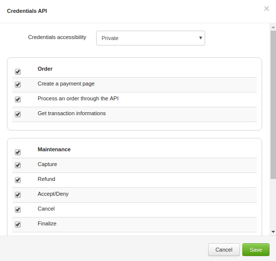
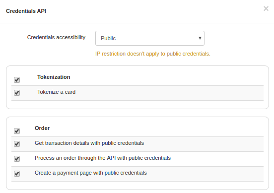

# Prerequisites and recommendations

## Please note

- Your HiPay Enterprise account must be configured before installing your Woocommerce plugin in the [HiPay Enterprise back office][hipay-fullservice-bo].
- To use this plugin, you will need valid HiPay Enterprise credentials: please see below how to get them.

## Credentials

You need to generate *API credentials*  to send requests to the HiPay Enterprise platform. To do so, go to the "Integration" section of your HiPay Enterprise back office, then to "Security Settings".

To be sure that your credentials have the proper accessibility:

- From the "Integration" section of your HiPay Enterprise back office, in "Security Settings", scroll down to "Api credentials".
- Click on the edit icon next to the credentials you want to use.

**Private credentials**

Your credentials must be granted to:

Order

- Create a payment page,
- Process an order through the API,
- Get transaction informations,

Maintenance

- Capture,
- Refund,
- Accept/Deny,
- Cancel,
- Finalize.

**Public credentials**

Your credentials must be granted to:

- Tokenize a card,
- Get transaction details,
- Process an order,
- Create a payment page.

## Acronyms and abbreviations

The following table shows the acronyms and abbreviations used in this guide and their respective full name.

| Acronym or abbreviation  | Full name |
|:------------|:------------|
| BIN     | Bank Identification Number   |
| PAN     | Primary Account Number |
| PCI DSS | Payment Card Industry Data Security Standard |
| REST    | Representational State Transfer |

[hipay-fullservice-bo]: https://merchant.hipay-tpp.com/
