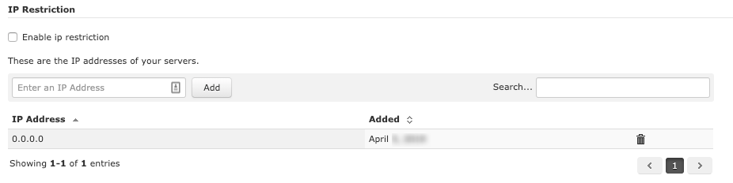

# Platform configuration

## Allow the IP addresses of your servers

When a request is sent to the HiPay Enterprise servers, the IP address or IP address range from where the connection was made is verified. If it matches with the IP address previously provided by the merchant, the request will be processed. In case of missing or incorrect information, the server will respond with an appropriate error message, indicating the error in the request.

To do this, you must log in your HiPay Enterprise back office (https://merchant.hipay-tpp.com), click on the "_Integration_" tab, then on "_Security Settings_" and enter your IP address(es) in the "_IP Restriction_" section.

When changing your IP addresses, make sure that all the new ones are configured for your account. If not, your server requests will be rejected.    

## Configure notification URLs

To use the HiPay Enterprise plugin, you need to configure the notification URLs. 

For this two methods are possible:

### 1. Let the CMS send the notification URL in the transaction (Recommended)

You need to enable the option "_Send url Notification_" in the **HiPay Enterprise Credit Card** payment method 
configuration panel and under the Payment Method tab. 

### 2. Configure the URL in the HiPay Enterprise back office

In your HiPay Enterprise back office, from the "_Integration_" tab, in the "_Notifications_" section.

- Notification URL:    http://www.{your-domain.com}/wc-api/WC_HipayEnterprise
- Request method:      HTTP POST
- I want to be notified for the following transaction statuses: ALL

Don’t forget to replace {your-domain.com} by your own domain.
