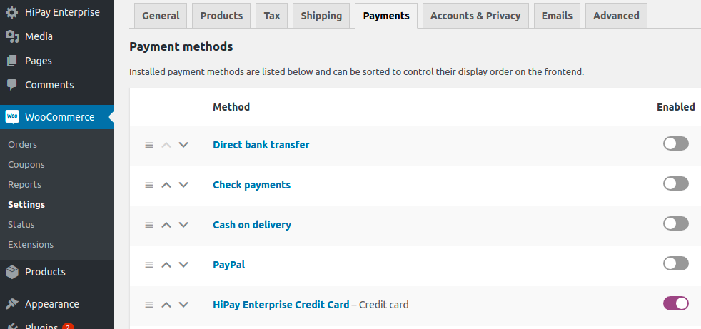
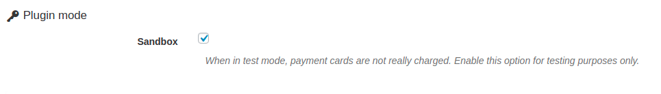

# Global plugin and Credit card configuration

## Access to configuration

To configure your HiPay Enterprise plugin, click on "_WooCommerce -> Settings -> Payments_” in your Wordpress back office. Then click on "_HiPay Enterprise Credit Card_":

You have found the general configuration of the module and the configuration of payment by credit card.
Before accessing the configuration you can now activate the payment method.

## Preamble

The new configuration interface of the plugin is divided into four tabs:

- **Plugin settings**: Configure API IDs to use the HiPay Gateway. You can also configure whether the plugin is in production or test mode. 
- **Payment methods**: Configure the payment methods to be activated and how payments must be processed: Hosted Fields or Hosted page
- **Fraud**: Configure recipients' email addresses for "challenged" payment notifications.
- **FAQ**: Find answers to frequently asked questions on how to use the plugin

## 1. Plugin settings

You must start fill in this information after the plugin has been installed.
This screen allows you to configure the API IDs required to run the HiPay services.

This screen is comprised of three elements:

#### Plugin mode

This setting is very important: it allows to define whether payments will be executed on the HiPay sandbox or production platform.
By default, the plugin is in Sandbox mode.
In sandbox mode, payments are therefore not actually executed.

We strongly advise you to perform tests before launching your site in production mode.

#### Production configuration

Use this interface to specify the credentials linked to your HiPay account.
**These identifiers are used if your plugin is configured in production mode.**

Generated in your [HiPay Enterprise back office](https://merchant.hipay-tpp.com) (go to "Integration” => “Security Settings” => “Api credentials” => “Credentials accessibility”), these API credentials are required to use the HiPay Enterprise plugin.

For more information about credentials generation, please refer to the section on [Credentials](#Credentials).

**Account (Private)**

Private credentials are used to process payments on the HiPay API. These identifiers are mandatory.

| Name               | Description |
|:------------|:------------|
| **Username**                      | Your HiPay Enterprise production account API username      |
| **Password**                      | Your HiPay Enterprise production account API password     |
| **Secret passphrase**               | Your HiPay Enterprise secret passphrase   |

**Tokenization (Public)**

Public credentials are used as part of the JavaScript tokenization. These identifiers are to be specified only if you want to use the plugin in Hosted fields mode.

| Name               | Description |
|:------------|:------------|
| **Username**                      | Your HiPay Enterprise production account API username      |
| **Password**                      | Your HiPay Enterprise production account API password    |

#### Sandbox configuration

The interface is similar to the production configuration.

**These identifiers are used if your plugin is configured in test mode.**

