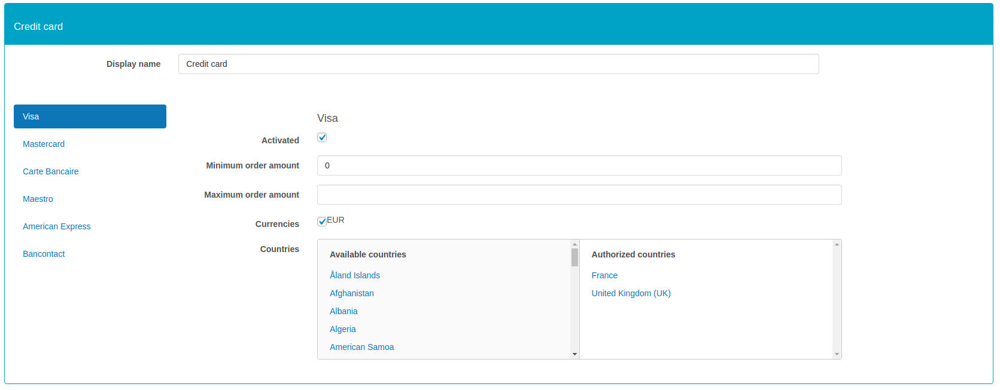

## Payment methods

After configuring the previous necessary information, this interface allows you to set 
global payment settings and settings specific to credit card payment method.

To activate a payment method, refer to this [example](https://docs.woocommerce.com/document/cheque/#section-1) of the WooCommerce official documentation.

### Global settings

This general configuration will be applied whatever the payment methods being used.

 | Name        | Description | Value |
 |:------------|:------------|:-----|
 | Operating mode | Defines if the payment form is displayed on the merchant's site or on a HiPay payment page. | - **Hosted Page**: Customer is redirected to a secured payment page hosted by HiPay.   - **Hosted Fields**: Customer completes his banking information directly on the merchant's site but the form fields are hosted by HiPay. This mode is only valid for credit cards. |
 | Capture        | Defines if payments should be captured manually or automatically. Manual capture will be possible either on the order page of the Woocomerce back office or on the HiPay Enterprise back office. Please refer to the section on [Capture mode](#capture-and-refund-capture).  | - **Manual**: All transactions will be captured manually either from your HiPay Enterprise back office or from your Woocommerce back office.   - **Automatic**: All transactions will be captured automatically.
 |  Customer's cart sending             | The customer's cart will be sent during the transaction. This option is required for Oney transactions.|"Yes"/"No"|
 | Logs information | Activates debug logs.  ||
 |  Activate 3-D Secure | Enables and configures 3DS rules. | You can choose between three options:   - **Disabled** (to bypass 3-D Secure authentication)   - **Try to enable for all transactions**   - **Force for all transactions**|
 |  Send url Notification | If so, then the url used by HiPay to send the notifications is directly filled in the order transaction. | "Yes"/"No" |

#### Hosted page

When you choose the "**_Hosted page_**" as operating mode, you have access to additional settings.

   | Name               | Description | Value |
 |:------------|:------------|:-----|
 | Display hosted page      | Defines if the hosted page is displayed in an iFrame or with a redirect. | -"Redirect"   -"Iframe"
 | Display card selector    | Shows card selector on the hosted page.| "Yes"/"No"
 | CSS URL                  | URL of your CSS (cascading style sheet) to customize your hosted page or iFrame | Https URL

#### Hosted Fields

When you choose the "**_Hosted Fields_**"  as operating mode, you have access to additional settings.

|  Name    |
|----------|
|  color    |
|  fontFamily |
| fontSize | 
| fontWeight |
| placeholder Color|
| caretColor |
| iconColor |

Those parameters allows you to override default CSS properties in hosted form fields.
For more information, please read the  [ HiPay SDK JS documentation](/doc/hipay-enterprise-sdk-js_3/Reference/).

To override the default template, please refer to the [Woocommerce documentation](https://docs.woocommerce.com/document/template-structure/). 

### Credit card

This section allows you to configure payment cards.
By default, all card types are enabled and set to default.
For each type of card, you can then define a different configuration.

   | Name               | Description | Value |
 |:------------|:------------|:-----|
 | Activated                     | Allows or not customers to use this type of card.   |"Yes" / "No"   If the card type is not activated, customers will have a warning message upon payment, inviting them to use another type of card.
 | Minimum order amount          | Indicates a minimum threshold for the type of card available for payment.| Amount with default currency   If the amount is not reached, customers will have a warning message upon payment, inviting them to use another type of card.|
 | Maximum order amount    | Indicates a maximum threshold for the type of card available for payment.| Amount with default currency   If the amount is not reached, customers will have a warning message upon payment, inviting them to use another type of card. |
 |  Currencies             | Currencies for which the card type will be activated. These are the installed and active currencies on your shop | Selection of one or more currencies|
 |  Countries        |Countries for which the card type will be activated   |Selection of one or more countries|

### Local payments

Local payments include all payments other than bank cards.
In this block you can find the link to all local payments settings interfaces.

Please refert to [Local payments](#local-payment-methods-configuration)

