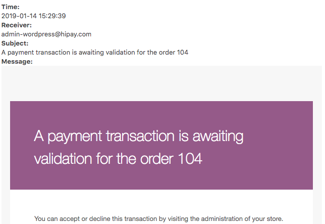

## Fraud screening

Based on the screening results of HiPay’s Fraud Protection Service, when a transaction
is suspected of being fraudulent, it is in "_challenged_" status. In your Woocomerce back office,
the order is flagged with "On-Hold" status:

An email is sent to the site administrator to warn him/her that a transaction has been
"challenged" and that the transaction must be accepted or denied.

With this interface, you can add recipients for the email notification about the "challenged" transaction.
you have to enter a valid email, during a transaction challenged an email will be sent to this address.

### Accepting or denying transactions

At the moment it is only possible from our HiPay Enterprise back office.
Once the transaction is accepted or refused the order is updated in your woocommerce.
