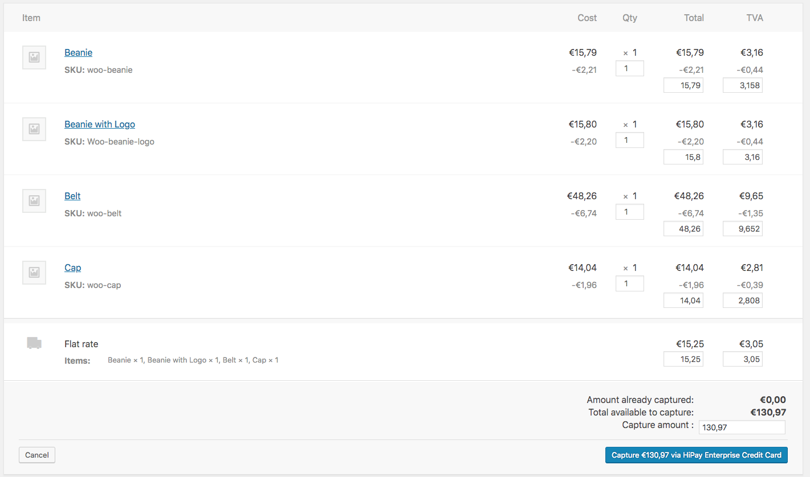
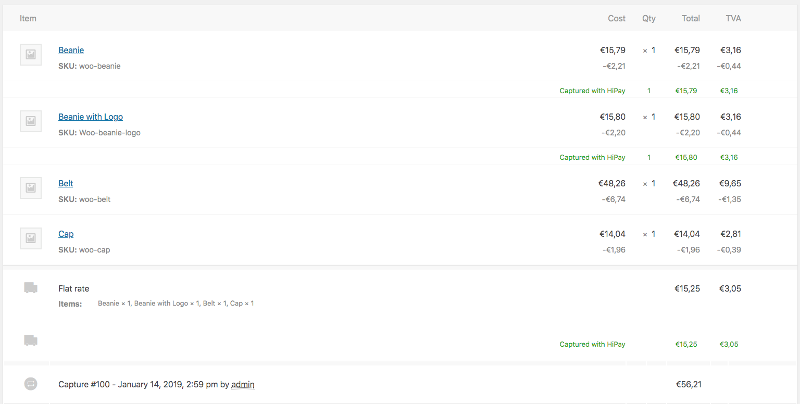

# Capture And Refund

## Capture

### "Automatic" mode

When making a purchase in "Automatic" mode, the capture is automatically requested right after authorization. For more information about requesting a new order (operation), please refer to our [Developer Portal](https://developer.hipay.com/doc-api/enterprise/gateway/#!/payments/requestNewOrder).

   - If the payment fails, the customer is redirected to an error page and the status is defined as "_Cancelled_".
   - If the payment is successful, the customer is redirected to the success page and the status is defined as "_Completed_".

### "Manual" mode

When making a purchase in "Manual" mode, the transaction status will be "_On-Hold_" until you ask for the capture.
Customers are not charged directly: you have seven days to "capture" the order and charge the customer. Otherwise, the order is canceled.

  - If the authorization fails, the customer is redirected to an error page and the status is defined as **"_Cancelled_"**.
  - If the authorization is successful, the customer is redirected to the success page and the status is defined as **"_On-Hold_"**.

#### Manual capture

To capture a transaction in your Woocommerce back office, got to your list order and select any order. 
The order status should be **“On-Hold”**.

Manual and partiel capture are not native woocommerce features.
If you are familiar with the system of refund of woocommerce, the principle of capture is based on this operation.

If the order is in the correct status and if the amount already captured does not reach the total of the order then you had to have a button "Capture" to the right of the button refund in the panel of the item.

Click the "_Capture_" button to start
Specify the quantity of the product(s) to be capture in the text box(es) that appear for each line item.
The capture amount will automatically adjust based on the products capture.
It's possible to adjust it.

You can also capture the delivery costs, be sure to fill in the tax.

Then click "_Capture €XX via hipay Enterperise Credit Card_"

Once the capture is created, for each item appears a line "Captured with HiPay" or are filled
quantities and amount captured.
The status of the order to evolve:
- **Partially captured**: If you have not captured all of the items in the order
- **Processing**: If you have captured all of the items

Partially captured status is a status added by the Hipay module that allows you to easily identify
order them partially captured.
You can think of it as Woocommerce's "on-hold" status. So all the actions plugged on a change of
status will be executed when the command changes to processing, complete.

## Refund

We support the native feature. So to do an refund please : 

1. Go to: "_WooCommerce > Orders_"
2. Select the order you wish to refund.
3. Click the grey Refund button to start.
4. Specify the quantity of the product(s) to be refunded in the text box(es) that appear for each line item. The refund amount will automatically adjust based on the products refunded. If inventory levels are not managed, you can also simply enter the Refund amount, without adjusting the product quantity. If the quantities of items are not set when issuing a refund then the order is not marked as refunded and the email that is sent will say “partial refund.”
5. Add refund notes, if desired.
6. Click Refund $X via HiPay

The status of the order to evolve:
- **Partially refunded**: If you have not refunded all of the items in the order
- **Refunded**: If you have refunded all of the items

Partially refunded status is a status added by the Hipay module that allows you to easily identify
order them partially refunded.

You can also do the “refund” directly in your HiPay Enterprise back office. The order will be automatically updated in your Woocommerce. 
NOTE: It only works for total refunds (not partial).

For more details you can consult the woocomerce documentation on [Refunds](https://docs.woocommerce.com/document/woocommerce-refunds/)
