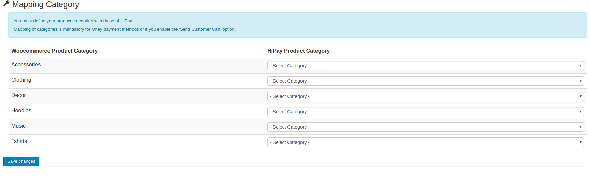
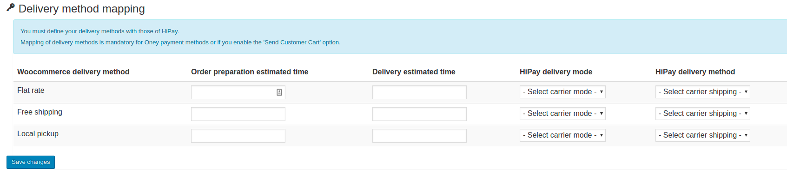

# Category and carrier mapping

The customer's basket information can be sent during the transaction if you enabled the option in the global settings.
This mapping is necessary to establish a correlation between your data and HiPay's.
It is mandatory to do all the mappings to use the **Oney Facily Pay** or **Klarna** payment methods.
If you add new categories or delivery methods, make sure to match the new corresponding data.

## Category mapping

In your Wordpress dashboard go to "_HiPay Enterprise -> Category mapping_".

Top-level product categories are displayed. You must match each of them with the corresponding HiPay categories.

All sub-categories will also be mapped when you commit your matches.

## Carrier mapping

In your Wordpress dashboard go to "_HiPay Enterprise -> Delivery method mapping_".

All the delivery methods active on your shop are listed. For each of them, you must fill in the necessary corresponding information.

This information is used to calculate an approximate delivery date.

| Name               | Description | Value |
|:------------|:------------|:-----|
| Order preparation estimated time     |  Estimated time to prepare your orders|Time of day|
| Delivery estimated time              | Estimated time for delivery |Time of day
| HiPay delivery mode              | Delivery mode |- **store**: At the store   - **carrier**: Delivery by carrier   - **relaypoint**: Delivery in a pick-up location   - **electronic**: To be filled in   - **travel**: To be filled in
| HiPay delivery method              |  Delivery method |- **standard**   - **express**   - **Priority 24H**   - **Priority 2H**   - **Priority 1H**   - **Instant**

