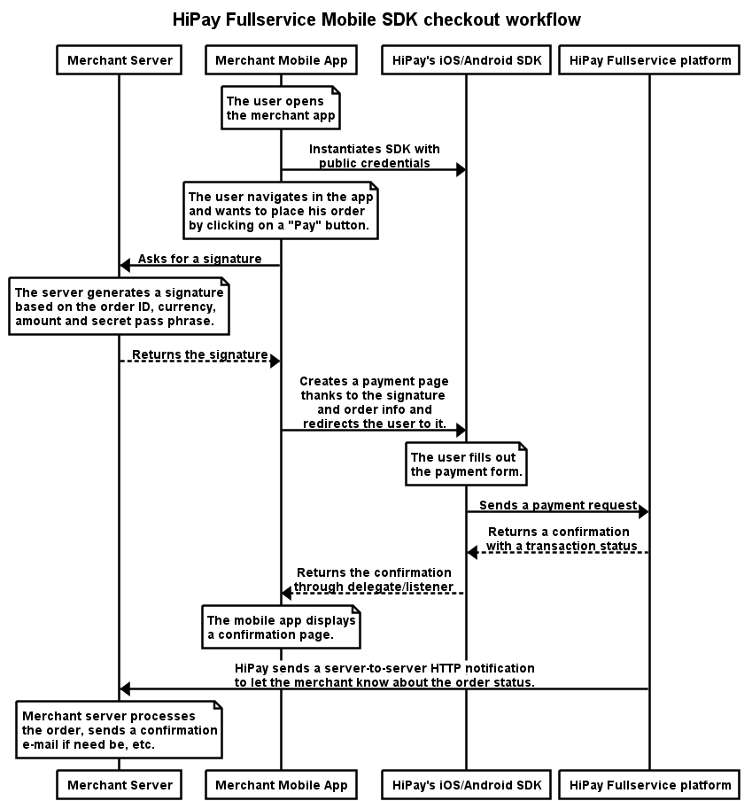

# Prerequisites and recommendations

## Build settings

The project *minSdkVersion* is 14 (Ice Cream Sandwich), which means that the SDK won't build on applications targeting a lower version of Android.

## Credentials

You need to generate *API credentials* in order for the SDK to send requests to the HiPay Fullservice platform. To do so, go to the "Integration" section of your HiPay Fullservice back office, then to "Security Settings".

**Warning: credentials included in the Android SDK must have a public accessibility, NOT a private accessibility.**  
To be sure that your credentials have the proper accessibility:

- Go to the "Integration" section of your HiPay Fullservice back office.
- Then, click on "Security Settings".
- Scroll down to "Api credentials".
- Click on the edit icon next to the credentials you want to use. 
- **Finally, make sure that the credentials are set up as displayed on the screenshot below**:

Your credentials must be granted to:

- Tokenize a card,
- Get transaction details,
- Process an order, 
- Create a payment page.

## Checkout workflow integration

This section informs you about the scope of the HiPay Fullservice SDK for Android. Some parts of the checkout are integrated on the client side (i.e., your mobile app, thanks to the SDK) while some other parts must be integrated on the server side.

### Authentication

When you redirect users to the HiPay Android SDK's payment page, the SDK will process transactions with users' payment details using the HiPay Fullservice payment platform. In order for our Android SDK to process payments on the HiPay Fullservice platform, you must provide the SDK with credentials (please refer to the Configuration section for more information).

However, credentials are not sufficient. For each order processed by the Android SDK, the HiPay Fullservice platform must authenticate the call and validate that the merchant has allowed it. To do so, HiPay Fullservice leverages a signature mechanism. Once your app needs to process a payment, it must contact your own server in order to get a signature, specific to the order to be processed.

To know how to generate a signature on the server side, please refer to the ["Generating a server-side signature"](#generating-a-server-side-signature) section.

Please refer to the diagram below (Mobile checkout workflow) to know when the signature should be generated in the checkout workflow.

### Order processing

Order information should not be generated on the client side. Most of the time, orders are generated on the server side (on your servers), following actions performed by your users on your mobile app. The HiPay Fullservice SDK for Android allows you to present a payment page to your users and process transactions directly on your mobile app. 

Thus, your mobile app will receive a confirmation with a transaction status indicating that the payment was successfully completed. You may display a confirmation screen upon this confirmation, but you must not process the order on the server side following this confirmation. For security reasons, orders must always be confirmed on your systems following the server-to-server notification.

Please refer to the diagram below (Mobile checkout workflow) to see when the server-to-server notification is triggered in the checkout workflow and, therefore, when you should validate orders.

### Mobile checkout workflow

Please find below a diagram describing the integration scope of the Mobile SDK and the roles of the server.

