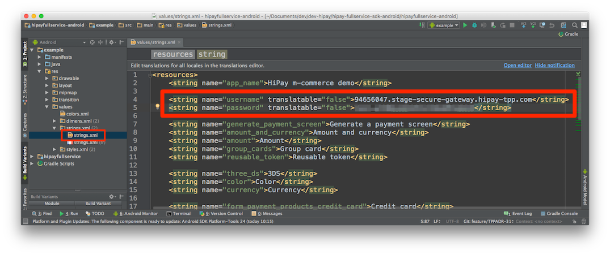

# Preamble

The HiPay Fullservice SDK for Android is shipped with a demo application which allows you to quickly test the built-in payment screen integration.

This demo application presents a screen that allows you to generate a payment screen based on many parameters such as: amount, payment product categories, etc.

This particular screen in not part of the SDK and your users will not see it. It's part of the demo application and has been created for testing purposes only.

# Installation guide

## Clone the repository

First, you need to check out the repository. Go in your projects folder and type the following command:

	$ git clone https://github.com/hipay/hipay-fullservice-sdk-android.git

Then, import the `hipay-fullservice-sdk-android` project folder into Android Studio/Eclipse to open the demo project.

## Add your credentials

To try the demo application with your HiPay Fullservice API test credentials, open the `/example/src/main/res/values/strings.xml` file and set your API username and password. 

## Run the demo app

Finally, build and run the `example` module.

[repo]: https://github.com/hipay/hipay-fullservice-sdk-ios
[cocoapods]: https://cocoapods.org/