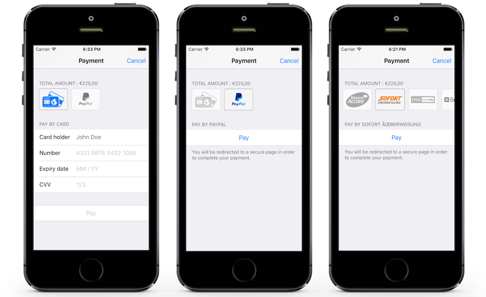

# HiPay Fullservice SDK for iOS

## Preamble

The **HiPay Fullservice SDK for iOS** is a library that allows you to **accept payments in your iOS application** by leveraging the HiPay Fullservice payment platform. The library is written in Objective-C and is based on Cocoa Touch. This repository contains the SDK as well as a demo application allowing you to generate a simple payment screen and demonstrating how to use the SDK.

## Objective
This documentation describes how to install the HiPay Fullservice SDK for iOS in order to accept payments in your own iOS (iPhone/iPad) application. You will be provided with several use cases including the usage of the built-in payment screen as well as implementation guides for custom integrations.

