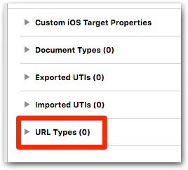
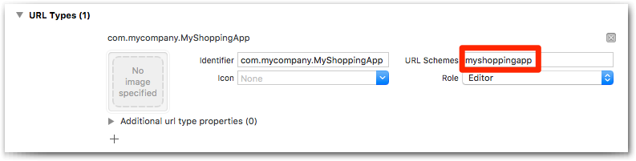

# Configuration

You need to follow all the steps below before integrating the payment workflow.

## Step 1 — Import header files

First and foremost, you need to add this line in order to use the SDK in an Objective-C app:

```Objective-C
#import <HiPayFullservice/HiPayFullservice.h>
```

## Step 2 — Configure the SDK

Then, you need to provide the SDK with a few parameters, such as credentials and targeted environement.

### Credentials

Get a valid HiPay Fullservice API username and password. If you don't have them, refer to the [Prerequisites and recommendations](#prerequisites-and-recommendations) page.

### Determine your app URL scheme

Sometimes, your user may be redirected to web pages, for example to follow the 3-D Secure workflow or to process payments for payment methods which cannot be natively supported in the SDK. 

To do so, the SDK presents your user with a `SafariViewController` web page (on iOS 9+). Eventually, your user will be redirected back to your app using an [app URL scheme][apple-scheme].

To find your app URL schemes, open your Xcode project's settings:


Make sure that your app project is selected:


Open the "Info" tab:


Expand the "URL Types" section:



At this time, you can either reuse an existing scheme or create a new one. To do so, click on the "+" button:


At this time, you can either reuse an existing scheme or create a new one. To do so, click on the "+" button. Fill out the form by setting a proper identifier and a URL scheme, as below:



Eventually, you will need to use one the values defined in the "URL schemes" field. In this case, it's **myshoppingapp**.

### Set up the configuration

The following code allows you to configure the SDK. We recommend you to put it in your *App Delegate*'s `application:didFinishLaunchingWithOptions:` method implementation.

#### Objective-C
```Objective-C
// AppDelegate.m — application:didFinishLaunchingWithOptions:

[[HPFClientConfig sharedClientConfig] setEnvironment:HPFEnvironmentStage
                                      username:@"YOUR API USERNAME"
                                      password:@"YOUR API PASSWORD"
                                      appURLscheme:@"myshoppingapp"];
```

#### Swift
```Swift
// AppDelegate.swift — application:didFinishLaunchingWithOptions:

HPFClientConfig.sharedClientConfig()
    .setEnvironment(HPFEnvironment.Stage,
    username: "YOUR API USERNAME",
    password: "YOUR API PASSWORD",
    appURLscheme: "myshoppingapp")

```

Do not forget to **replace the username and password arguments with your API username and password**. Also, **pass your own URL scheme** that you've got in the previous section.

Once your app goes live, you need to set the environement to `HPFEnvironmentProd`.

## Step 3 — Handle callback redirection

If the SDK presents your user with a web page (for 3-D Secure or specific payment methods), your user will eventually be redirected back to your app thanks to the app URL scheme.

In order for the SDK to be aware of the redirection and to receive the callback data, you need to implement the `application:handleOpenURL:` method in your *App Delegate*, as below:

### Objective-C
```Objective-C
// AppDelegate.m

- (BOOL)application:(UIApplication *)application handleOpenURL:(NSURL *)url {
    return [[HPFGatewayClient sharedClient] handleOpenURL:url];
}
```

### Swift
```Swift
// AppDelegate.swift 

func application(application: UIApplication, handleOpenURL url: NSURL) -> Bool {
    return HPFGatewayClient.sharedClient().handleOpenURL(url)
}
```

That's it, the HiPay Fullservice SDK for iOS is properly configured.

[apple-scheme]: https://developer.apple.com/library/ios/featuredarticles/iPhoneURLScheme_Reference/Introduction/Introduction.html#//apple_ref/doc/uid/TP40007899
