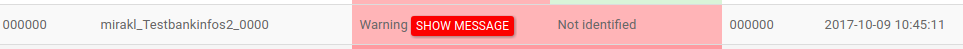

# Dashboard

The HiPay Marketplace cash-out integration for Mirakl provides you with a dashboard, which aims to:

- Inform you of your vendors' status, transfers and withdrawals,
- Give you the possibility to rerun a previously failed action,
- Centralize all information relating to interactions between HiPay and Mirakl.

You can access the dashboard at the following URL: `https://cashout.merchant-example.com/index.php` (the URL depends on your web server software configuration).

## Login

Use the HiPay web service credentials for the technical account to log in to the dashboard.

## Vendor management

Each processed vendor is saved in the HiPay Marketplace cash-out integration for Mirakl database.

Vendors logs are displayed with the following information:

|Name       | Description  |
|-----------|--------------|
| Mirakl ID  | Store ID in the Mirakl back office |
| Login  | Login for this store in the HiPay back office |
| Status  | Status of the vendors in the HiPay Marketplace cash-out integration for Mirakl. Possible values are `success` or `warning`. |
| Wallet account status  | Status of the HiPay wallet account. Possible values are `created`, `not created`, `identified` or `not identified`.  |
| HiPay ID  | ID of the wallet account |
| Date  | Date of log creation |
| Documents sent  | Click on `Show details` to see the status of sent documents. |

You can filter vendors logs by `status`, `wallet account status` and `time period`.

If the `status` of a vendor is `warning`, you can get the details of the error by clicking on the `Show message` tooltip.

## Transfer & withdrawal management

Each processed transfer and withdrawal is saved in the HiPay Marketplace cash-out integration for Mirakl database.

Operations logs are displayed with the following information: 

|Name       | Description  |
|-----------|--------------|
| Mirakl ID  | Store ID in the Mirakl back office |
| HiPay ID  | ID of the wallet account |
| Payment order Id  | ID of the voucher in the Mirakl back office |
| Amount | Amount of the operation |
| Transfer status  | Status of the transfer for this operation. Possible values are `OK` or `KO`. |
| Withdraw status  | Status of the withdrawal for this operation. Possible values are `OK (requested)`, `OK`, `KO (failed)` or `KO (cancel)`.  |
| Balance  | Balance of the wallet account |

You can filter transfer & withdrawal logs by `Transfer status` and `Withdraw status`.

If the `Transfer status` or `Withdraw status` of an operation is `KO`, you can get the details of the error by clicking on the `Show message` tooltip.

## Logs

Each application log is saved in the HiPay Marketplace cash-out integration for Mirakl database.

Logs are displayed with the following information: 

|Name       | Description  |
|-----------|--------------|
| Date  | Date of log creation |
| Information type  | Log level. Possible values are `DEBUG`, `INFO`, `NOTICE`, `WARNING`, `ERROR`, `CRITICAL`, `ALERT` or `EMERGENCY`. |
| Action  | Action linked to this log line |
| Mirakl ID  | Store ID in the Mirakl back office |
| Message  | Log message |

You can filter logs by `Information type` and `Time period`.

You can export logs to a CSV file.

## Settings

On the `Settings` page, you will be able to: 

- Run commands,
- Retrieve lists of executed batches,
- Get technical information.

### Run commands
You can run the following commands through the `Fix errors` form:

- `Wallet account creation` corresponding to the [vendor:process](#general-usage-available-commands-vendor-processing) command,
- `Transfer` corresponding to the [cashout:generate:process](#general-usage-available-commands-cash-out-generation) command,
- `Withdraw` corresponding to the [cashout:process:process](#general-usage-available-commands-cash-out-processing) command.

### Retrieve lists of executed batches

This section displays executed commands with their starting date and status.

If an error occurs during the command, an error message can be displayed in this list.

The list is refreshed every 30 seconds.

