# HiPay Marketplace integration for Izberg

## Preamble
HiPay is fully integrated into Izberg, allowing you to manage both cash-in and cash-out operations automatically. To do so, you just need to create a HiPay account and provide the Izberg back office with your HiPay account information. By doing so, HiPay will take care of processing payments of your end customers, will transfer funds to to your vendors' bank account and will also transfer commissions to the operator's bank account. This turnkey solution is fully compliant with European regulations.

# Prerequisites

## HiPay Marketplace solution information

Before going through this documentation, you may [read information about the HiPay Marketplace offer](/getting-started/platform-hipay-marketplace/overview/).

## Izberg account

You need an Izberg account. If you don't have one yet, check out their contact details on [the Izberg website](http://www.izberg-marketplace.com/).

## HiPay Enterprise account

You need a HiPay Enterprise account. The HiPay Enterprise platform will process payments of the end customers in a wide variety of payment methods (major credit and debit cards such as Visa, MasterCard and American Express as well as local payment methods).

If you don't have an account yet, contact us on [the HiPay Enterprise website](https://hipay.com/).

## HiPay Marketplace details

You need your HiPay Marketplace account information (e-wallet details). These information will be provided to you throughout your HiPay merchant onboarding process.

# Objective

The HiPay Marketplace integration for Izberg covers all your needs related to payments and financial matters. The whole solution is compliant with European regulations ([click here for more information](/getting-started/platform-hipay-marketplace/overview/)).

The integration addresses all the marketplace financial needs:

- cash-in operations: payments from end customers to your vendors
- cash-out operations: transfer of funds to the vendors as well as transfer of the operator commission to its bank account

# Configuration

You don't need to install any software in order to make this integration work. You just need to configure it through the Izberg operator back office.

Follow the steps below in order to have the whole solution working for both cash-in and cash-out.

## 1. Izberg backofice payment section

Log in to the Izberg back office and go to the payment section.

Once logged in, click on "**App setup**" from the "Settings" submenu:

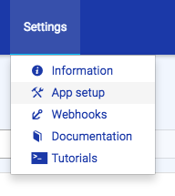

Then, go to the payment settings section by clicking on the "**Payment Config**" tab:

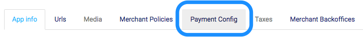

## 2. Backend provider

In the backend provider section, select HiPay. Then, click on "**Save**".

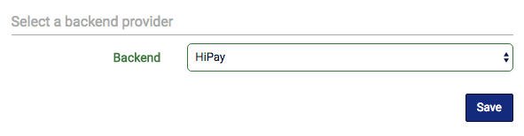

## 3. Configuration

In the configuration section, you may provide a description of the integration for the record. Make sure that the integration is active and that the sandbox mode is set to the proper value. If you provide HiPay test account credentials, this box must be checked. However, if you provide production HiPay account credentials, this box must not be checked.

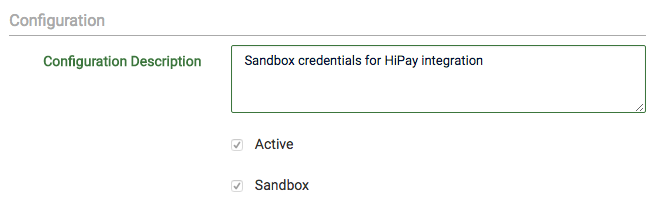

## 4. Cash-out

In the cash-out section, you need to provide your HiPay Marketplace (e-wallet platform) details:

- HiPay Wallet ***entity*** (named ***E-Wallet Api Entity*** on the screenshot)
- HiPay Wallet ***web service login*** (named ***E-Wallet Api Login*** on the screenshot)
- HiPay Wallet ***web service password*** (named ***E-Wallet Api Password*** on the screenshot)
- HiPay Wallet ***technical account ID*** (named ***Account ID*** on the screenshot)

All these information should have been provided to you beforehand by HiPay. If you don't have them, please submit a ticket or contact the HiPay IT Support team.

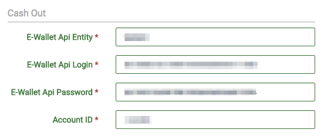

## 5. Cash-in

### HiPay Enterprise back office

Sign in to your [HiPay Enterprise merchant back office](https://merchant.hipay-tpp.com).

Once logged in to HiPay Enterprise, go to the "**Integration**" section:

Then, go to the "**security settings**" section:

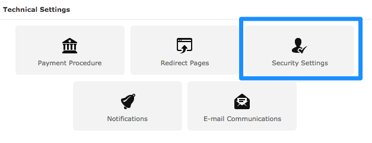

### REST API passphrase

On the HiPay Enterprise back office, if the *Secret Passphrase* field is empty, choose one by typing a secret string here. If the passphrase is already defined, do not modify it (unless it's not already in use). Here is an example of passphrase:

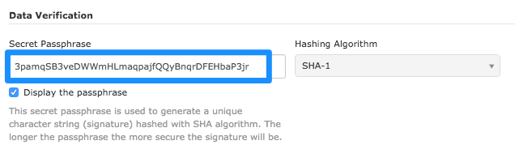

Then, copy and paste this secret passphrase into the *REST API passphrase* field on the Izberg operator back office:

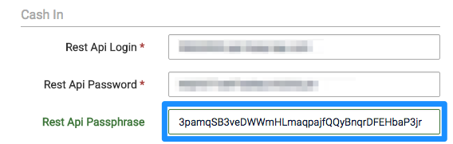

### REST API login and password

On your HiPay Enterprise back office, find the API credentials section (still in *Security settings*):

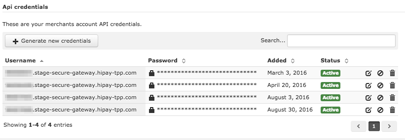

Choose the credentials you want to use for cash-in management in Izberg. You may select an existing set of credentials or generate a new one. In any case, make sure they are granted for each API action. If you are not sure, click on the edit icon and verify that all boxes are checked.

Then copy and paste the *Username* value into the *REST API Login* field and copy and paste the *Password* value into the *REST API Password* field in the Izberg back office:

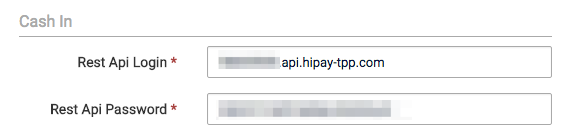

## 6. Payment form

### Payment form style and integration

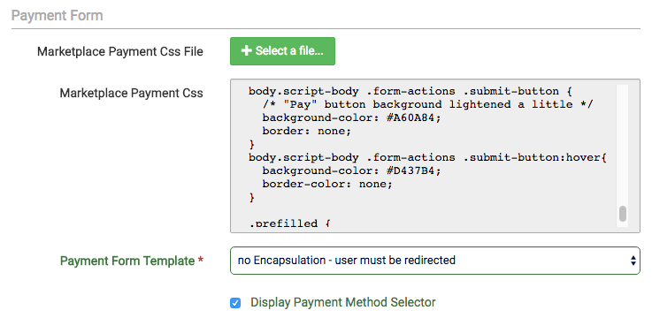

You may customize the cash-in payment page by uploading your own CSS (cascading style sheet) file. For more information, refer to the [HiPay Enterprise platform documentation](/getting-started/platform-hipay-enterprise/overview/).

The *Payment Form Template* option allows you to choose whether you want the end user to be fully redirected to our payment page or if you want the payment form to be integrated into the checkout.

You can also choose whether you want the payment methods list to be displayed on the payment page. If you have many payment methods (not only credit or debit cards), you should check this box.

### Redirect URLs

In the Redirect URL fields, make sure to insert your proper Izberg marketplace shop URLs:

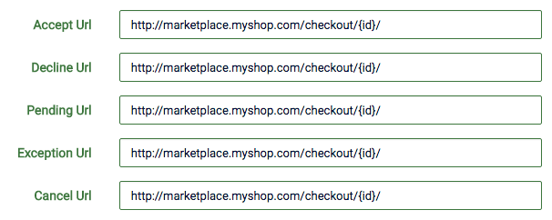

If you are not sure of what to insert in the fields above, contact the Izberg support.

## 7. Saving changes

Finally, save the changes:

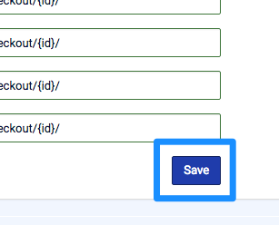

That's it. Your Izberg payment configuration is all set up. Test your integration to make sure everything is OK.