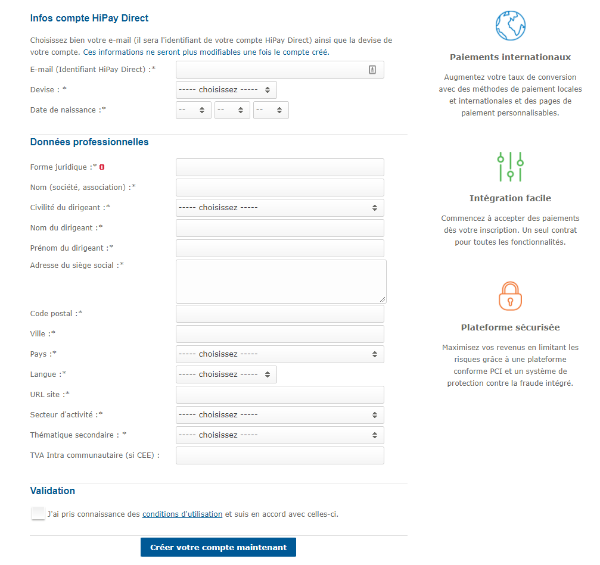
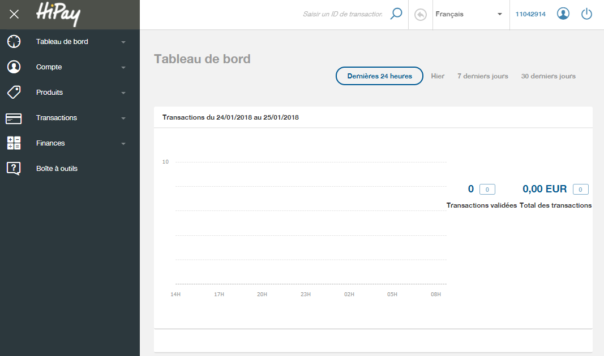
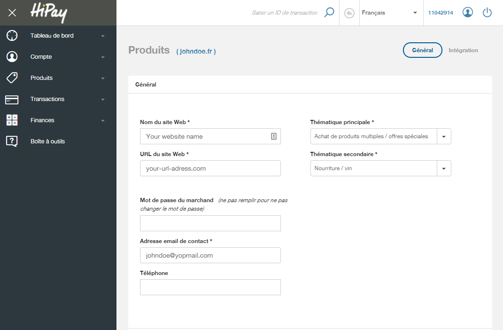
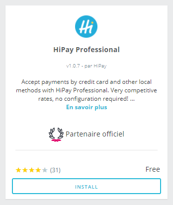
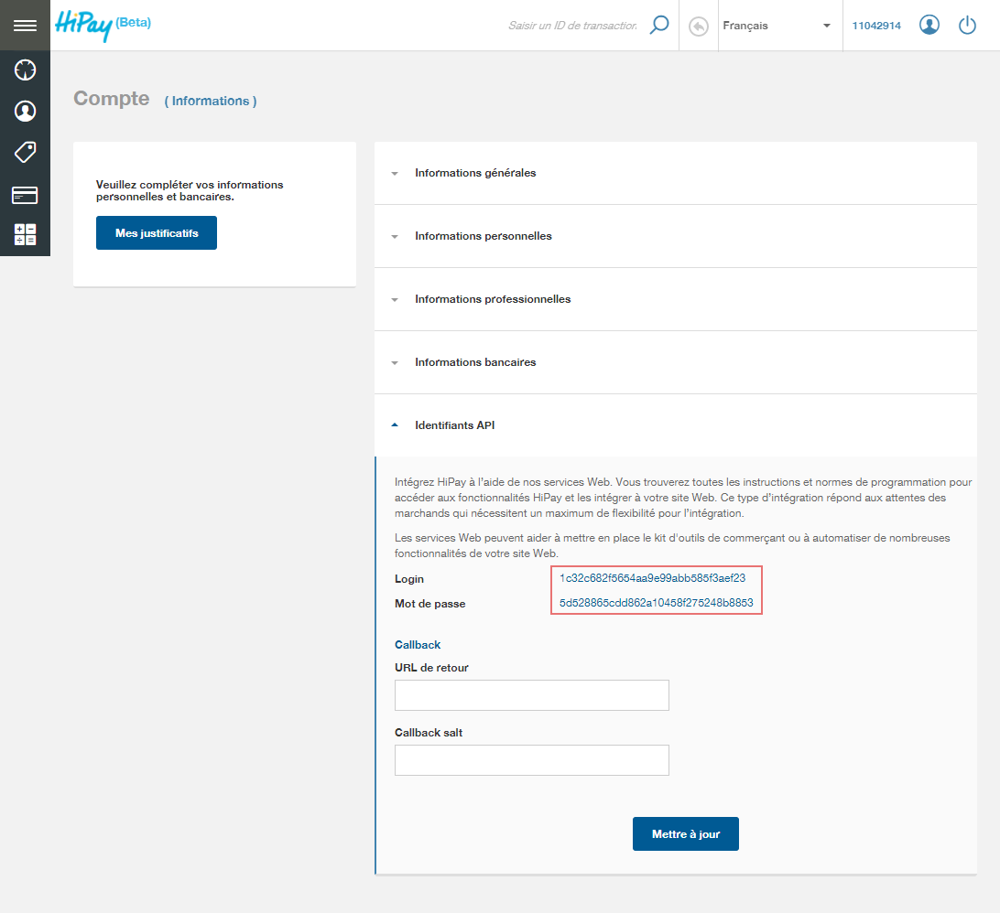
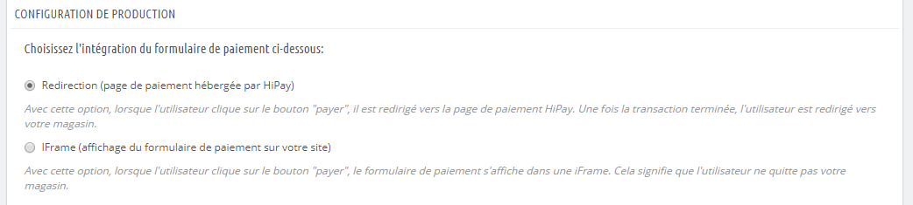
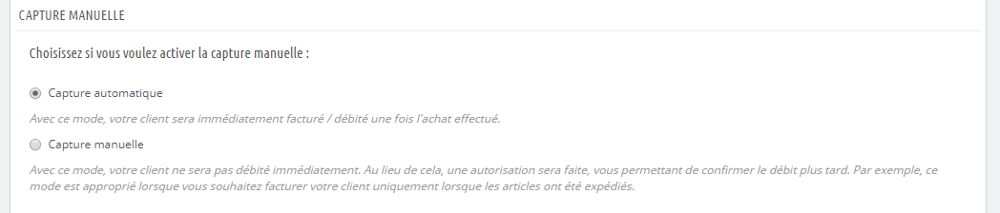
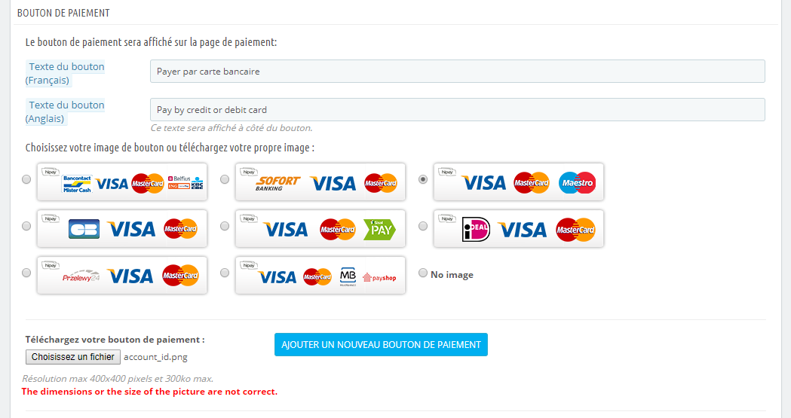

# Guide de configuration du module HiPay Professional pour Prestashop

#Introduction

Dans ce document, nous décrivons la méthode pour activer et utiliser le module Hipay pour Prestashop. Nous listons également les différents points de blocages qui peuvent survenir ainsi que leurs solutions.

**A savoir :**

-   Le module Hipay est présent en natif sur le CMS Prestashop. Il n’est
    donc pas nécessaire de le télécharger à part, il suffit de l’activer
    sur votre backoffice Prestashop, dans la rubrique « Modules »

-   Il est possible de télécharger le module en cas de réinstallation ou
    de mise à jour à cette adresse :
    [http://addons.prestashop.com/en/payments-gateways-prestashop-modules/1746-hipay.html](http://addons.prestashop.com/en/payments-gateways-prestashop-modules/1746-hipay.html)

-   Le module gère uniquement le paiement à l’acte. Hipay propose
    également un service d’abonnement, il faut dans ce cas nous
    contacter afin que l’on vous fournisse la documentation technique
    pour le développer.

-   Si vous souhaitez configurer plusieurs devises, vous devez ouvrir
    autant de sous-compte sur votre compte Hipay. Pour cela, cliquez sur
    « Synthèse des comptes » et « Créer un compte secondaire ».
    Remplissez le formulaire et choisissez la devise désirée.
    Attention : il faut inscrire votre site sur chaque sous-compte.

-   Le module gère notre plateforme de production ainsi que la plateforme de test.

#Pré-requis

##Inscription d’un compte marchand

Pour utiliser Hipay, vous avez besoin de posséder un compte marchand. C’est un processus simple qui se fait directement en ligne. Rendez vous sur [https://www.hipaydirect.com/registration/register](https://www.hipaydirect.com/registration/register), puis suivez les instructions. Une fois que vous aurez créé votre compte Hipay, vous recevrez une confirmation par email avec les instructions pour finaliser votre inscription.

Après avoir finalisé votre inscription, vous pourrez vous connecter sur votre compte via l'url suivante : [https://professional.hipay.com/](https://professional.hipay.com/)

 

#Inscrivez votre site internet

Inscrivez votre site internet dans votre compte marchand

Les informations demandées sont utilisés pour distinguer les
différents sites internet enregistrés dans votre compte.

Entrez le nom de votre site, l’URL, le thème principal et secondaire,le mot de passe marchand, l’email de contact et le téléphone
(optionnel).

#Installation et configuration

##Configuration du compte

Une fois votre site inscrit, rendez-vous sur votre backoffice
Prestashop.

Cliquez sur « Modules » et sur « Paiement ». Au niveau du module Hipay,cliquez sur « Installer » :

Cliquez ensuite sur « Configurer »

Vous devrez alors renseigner les identifiants API que vous trouverez sur votre compte préalableblement créé sur le Backoffice HiPay. Vous trouverez vos identifiants en cliquant sur l'onglet "Compte > Informations > Identifiants API" ()

#Configuration du compte de test

Si vous le souhaitez, il est possible de créer et configurer un compte de test. Pour cela il est nécessaire de se rendre sur le BO de test à l'adresse suivante : [https://test-www.hipaydirect.com/registration/register](*https://test-www.hipaydirect.com/registration/register*)
Vous devrez alors créer un compte de la même manière que le compte de production, puis renseigner les identifiants en cliquant sur le bouton "CONNECTER LE COMPTE DE TEST".
Vous pourrez alors switcherentre le compte de production et le compte de test.

#Paiement

##Type de paiement

Vous avez ici le choix entre le paiement en "Redirection" (page hébergée) ou en "Iframe" (sur votre site).

- Avec option "Redirection", lorsque l'utilisateur clique sur le bouton "payer", il est redirigé vers la page de paiement HiPay. Une fois la transaction terminée, l'utilisateur est redirigé vers votre magasin.
- Avec option "Iframe", lorsque l'utilisateur clique sur le bouton "payer", le formulaire de paiement s'affiche dans une iFrame. Cela signifie que l'utilisateur ne quitte pas votre magasin.

##Type de capture

Vous avez le choix entre plusieurs mode de capture pour les commandes reçues.

- Avec le mode de capture automatique, votre client sera immédiatement facturé / débité une fois l'achat effectué.
- Avec le mode de capture manuelle, votre client ne sera pas débité immédiatement. Au lieu de cela, une autorisation sera faite, vous permettant de confirmer le débit plus tard. Par exemple, ce mode est approprié lorsque vous souhaitez facturer votre client uniquement lorsque les articles ont été expédiés.

##Bouton de paiement

Choisissez le bouton de paiement que vous souhaitez voir apparaître sur votre page de commande et cliquez sur « Enregistrer les modifications ».
Vous pouvez également choisir un bouton de paiement personnalisé mais celui-ci doit restecter les dimentions autorisées (400px x 400px et 300 Ko maximum).

#Points de blocages

##Configuration du compte

> « Impossible de récupérer les catégories Hipay. Merci de vous référer
> à votre journal des erreurs pour plus de détails. »

-   Vérifiez votre id site, le système ne le reconnaît ou ne le
    trouve pas.

> « Les catégories Hipay ne sont pas définies pour chaque ID de site. »

-   Vous n’avez pas sélectionné la catégorie pour le compte dans le
    menu déroulant.

##Lors du paiement

> « Il y a 1 erreur :\[Hipay\] MerchantAccount or merchantUserSpace does
> not exist or disabled - Invalid login value : 0000000
> errorMerchantAccount or merchantUserSpace does not exist or disabled -
> Invalid login value : 0000000 ) »

-   Vérifiez votre id compte, le système ne le reconnaît ou ne le trouve
    pas.\
    Si l’identifiant est correcte, contactez notre service client à
    [*contact@hipay.com*](mailto:contact@hipay.com) pour connaître la
    raison de sa désactivation.

> « \[Hipay\] Invalid orderCategory value : 000 errorInvalid
> orderCategory value : 000 ) »

-   L’id de la catégorie sélectionné n’est pas correcte. Peut arriver
    suite à une modification des catégories sur votre compte Hipay.
    Recommencez la configuration sur votre backoffice Prestashop pour
    obtenir ou renouveler les catégories. Si deux catégories « Autres »
    apparaissent, choisissez la deuxième et validez.

> « \[Hipay\] Invalid merchant website password ! ( error Invalid
> merchant website password ! ) »

-   Le mot de passe marchand que vous avez indiqué n’est pas correct. Le
    mot de passe marchand est le mot de passe que vous avez choisi lors
    de l’inscription de votre site.\
    Si vous l’avez oublié, vous pouvez le renouveler en vous connectant
    sur votre compte Hipay, en cliquant sur « Création de bouton » et «
    Editer » à coté de votre site.

> «  Le paiement par Hipay n’est pas proposé sur la page de paiement ? »

-   Suivez cette manipulation :\
    Configurez vos informations de connexion sur le module, validez,
    retournez sur la liste des modules et réinitialisez le module Hipay,
    retournez sur la configuration du module, définissez les zones
    et validez. Le paiement par Hipay devrait être proposé.

#Support

En cas de question concernant les reversements et votre contrat, envoyez un email à [*prestashop@hipay.com*](mailto:prestashop@hipay.com)

En cas de question technique, contactez notre support technique à [*technique@hipay.com*](mailto:technique@hipay.com)
