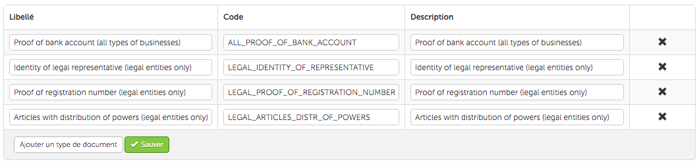

Before starting the installation, please read all instructions and make sure you've gone through the [[Prerequisites and recommendations]] section.
 
# Preamble

In order for us to validate the HiPay Wallet accounts, the connector needs to upload documents allowing us to identify your merchants.

Thus, you need to configure your Mirakl back office in order to be able to upload these documents for each of your shops. Then, these documents will be retrieved by the HiPay Wallet cash-out integration for Mirakl and sent to the HiPay Wallet platform.

# Configuration

Go in the **Manage Document Types** section by following these steps:

- Log in to your Mirakl operator account
- In the **Settings** tab, click on **Document Types**
- Click on **Store Documents**

You need to provide the following list of document types by clicking on *Add a document type*:

| Label | Code | 
|-------|------|
| Proof of bank account (all types of businesses) | `ALL_PROOF_OF_BANK_ACCOUNT` |
| Identity of legal representative (legal entities only) | `LEGAL_IDENTITY_OF_REPRESENTATIVE` | 
| Proof of registration number (legal entities only) | `LEGAL_PROOF_OF_REGISTRATION_NUMBER` | 
| Articles with distribution of powers (legal entities only) | `LEGAL_ARTICLES_DISTR_OF_POWERS` |  
| Identity (individuals only) | `SOLE_MAN_BUS_IDENTITY` |  
| Proof of registration number (individuals only) | `SOLE_MAN_BUS_PROOF_OF_REG_NUMBER` |  
| Proof of tax status (individuals only) | `SOLE_MAN_BUS_PROOF_OF_TAX_STATUS` |  

You can set whatever you want in the description field. In any case, **the codes must be exactly as displayed in the table**.

You should get something like this once you added all the document types:

Then, you will need to upload the documents on each of the shop pages.

Note: when uploading your files (on a shop page), **only upload files corresponding to the type of your shop**. For example, if the shop is managed by an individual, you can only upload the "individuals only" documents as well as the proof of bank account document, but not the documents flagged as "legal entities only".

If your marketplace only have legal entity business shops and no shops held by individuals (most probable scenario), **you may not add the document types flagged as "individuals" because you would never need to upload such types of documents**. In such a case, your Mirakl back office configuration would look like:

# Next step
Once you app is properly installed, go to the next section: [[Installation]]