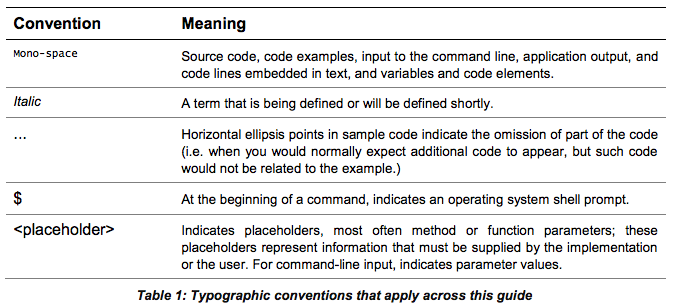
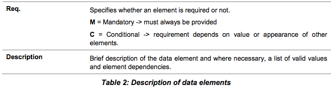
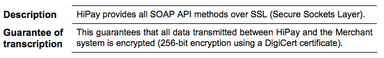

#Payment Gateway - API Integration Guide

This document is designed to provide you details on how to integrate your business to the HiPay Direct payment gateway. This document provides step-by-step instructions on how to simply and quickly get up and running with our services as well as detailed reference material.

#DISCLAIMER 
While every effort has been made to ensure the accuracy of the information contained in this publication, the information is supplied without representation or warranty of any kind, is subject to change without notice and does not represent a commitment on the part of HiPay. HiPay, therefore, assumes no responsibility and shall have no liability, consequential or otherwise, of any kind arising from this material or any part thereof, or any supplementary materials subsequently issued by HiPay. HiPay has made every effort to ensure the accuracy of this material. 

#TECHNICAL SUPPORT 
If you need any complementary information concerning the technical implementation of HiPay Direct don’t hesitate to contact our Technical Support team: Email: support.tpp@hipay.com Telephone: +33 (0)1 53 44 15 07

#About this Guide 

##Purpose
This document is designed to provide you details on how to integrate your business to the HiPay TPP payment gateway. This document provides step-by-step instructions on how to simply and quickly get up and running with our services as well as detailed reference material. Where applicable, this document refers to the related documentation with further details. 

##Intended Audience 
The intended audience is the merchant's technical staff or the merchant's system integrator. Because almost all communication between the merchant's system and the SOAP API is realized through predefined XML messages over the Internet using standard protocols, you will need basic XML/SOAP programming skills and knowledge of HTTP(S). 

##Copyright 
The information contained in this guide is proprietary and confidential to HiPay and its members. This material may not be duplicated, published, or disclosed, in whole or in part, without the prior written permission of HiPay. 

##Legal Notice 
This document contains the proprietary and confidential information of HiPay. Such information may not be used for any unauthorized purpose and may not be published or disclosed to third parties, in whole or part, without the express written permission of HiPay. You acknowledge and agree that between you and HiPay this document and all portions thereof, including, but not limited to, any copyright, trade secret and other intellectual property rights relating thereto, are and at all times shall remain the sole property of HiPay and that title and full ownership rights in the information contained herein and all portions thereof are reserved to and at all times shall remain with HiPay. You agree to safeguard the confidentiality of the information contained herein using the same standard you employ to safeguard your own confidential information of like kind, but in no event less than a commercially reasonable standard of care. If you do not agree with the foregoing conditions, you are required to return this document immediately to HiPay.

#How to Read this Guide

##Document Conventions
These conventions help to locate and interpreted information.
This guide uses several typographic conventions to highlight certain words, phrases and
point out specific pieces of information.
The following table clarifies the conventions used across this guide.



##Abbreviations used in tables
The tables of this document describe data elements. These data elements are equivalent
to parameters in a query or to fields of a response message. The following table helps
understanding the different attributes (columns) that define a data element.


##Acronyms and Abbreviations
The following acronyms and abbreviations are used in this guide.



#Chapter 1. API Overview

The API is based on SOAP principles; thus it is very easy to write and test applications.
How to access the API:

- Use your browser to access URLs,.
- Use almost any HTTP client in any programming language, to interact with the API.

##1.1 Security Considerations
HiPay Direct SOAP API service is protected to:

- ensure that only authorized Merchants use it,
- prevent payment information from being compromised

###Encrypted Communication


#Chapter 2. Integration Guidelines
This chapter outlines the basic integration requirements that you app must meet.

##2.1 Submitting a Request

###Service Endpoints
There are two endpoints (base URLs) that you can make your API calls to.

- Stage if you are testing your integration, and
- Production for when you have finished testing and want your application to go live.
All URLs referenced in this guide must have one of the following bases:


**Stage**: https://test-ws.hipay.com/

**Production**: https://ws.hipay.com/

###Authentication


###Character Encoding
All parameters accept UTF-8 encoded text via the API. All other encodings must be
converted to UTF-8 before sending them to the HiPay API in order to guarantee that the
data is not corrupted.

##2.2 Response Handling
Whether a request succeeded or not, it is indicated by the HTTP status code. A 2xx status
code indicates a success, whereas a 5xx status code indicates a failure.

###Response Status Codes
The HiPay API attempts to return appropriate HTTP status codes for every request.
These are the HTTP status codes you may receive and their meaning.



###Response Format

``` xml
<?xml version="1.0" encoding="UTF-8"?>
<SOAP-ENV:Envelope xmlns:SOAPENV="http://schemas.xmlsoap.org/soap/envelope/"
xmlns:ns1="https://ws.hipay.com/soap/payment-v2">
<SOAP-ENV:Body>
<ns1:generateResponse>
<generateResult>
<redirectUrl>https://payment.hipay.com/index/pay/payid/716…7106fc</redirectUrl>
<code>0</code>
<description>N/A</description>
</generateResult>
</ns1:generateResponse>
</SOAP-ENV:Body>
</SOAP-ENV:Envelope>
```

##2.3 Error Handling


