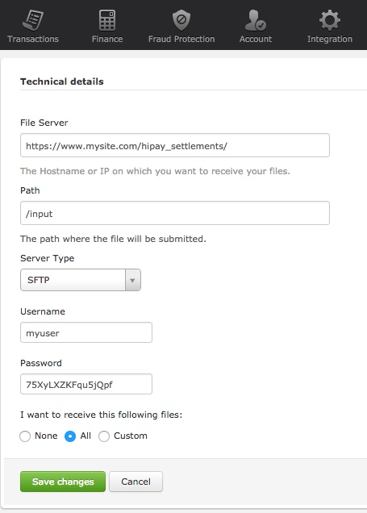
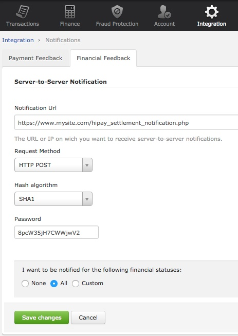

# HiPay Enterprise platform overview

# About this guide 

## Purpose

This document is designed to provide you with information to integrate your business with the HiPay Enterprise payment gateway. It gives you step-by-step instructions on how to simply and quickly get up and running with our services as well as detailed reference material.

Where applicable, this document refers to the related documentation for further details.

## Intended audience

This document is intended for the merchants' technical staff or system integrator.

Because almost all communications between the merchants' system and the
REST API are done through predefined XML or JSON messages over the
Internet using standard protocols, you will need basic XML/JSON
programming skills and knowledge of HTTP(S). Furthermore, it is
recommended to be familiar with the basics of tokenization
concepts.

# Acronyms and abbreviations

The following acronyms and abbreviations are used in this guide.

| Acronym   |      Full name    |
|----------|-------------|
| BIN |  Bank Identification Number
| PAN |  Primary Account Number
| PCI DSS |  Payment Card Industry Data Security Standards
| REST |  Representational State Transfer
| SDK |  Software Development Kit

# Technical integration

In order for you to accept payment through the HiPay Enterprise platform, you need to integrate our APIs. HiPay offers a wide variety of turnkey integrations for industry-standard e-commerce platforms as well as other SDKs and libraries. **[You can find all the HiPay Enterprise integrations here.](/enterprise)**

You may also integrate our REST API if you have specific technical needs. To this end, please check the next chapter of this guide: *API overview*.

# API overview

The APIs are based on REST principles. Thus, it is very easy to write and test applications.

HiPay Enterprise provides you with three main APIs, allowing you to **manage payment data**, **get paid** and **handle financial operations**. Detailed documentation and references for these APIs, including web service URLs and parameter information, are provided in interactive documentation tools. Please see below for more information.

## Gateway API

The Gateway API allows you to get paid as well as to manage orders and transactions. By leveraging this API, you will be able to present payment pages to your customers.

**[Click here to access the full interactive documentation and live testing tools for the HiPay Enterprise Gateway API](/doc-api/enterprise/gateway/).**

## Tokenization API

The Tokenization (Secure Vault) API allows merchants to retrieve and update data associated with their customers' payment information stored in the HiPay Enterprise Secure Vault. Using the Tokenization API, merchants eliminate the risk, liability and cost of storing sensitive data on their local servers and storage devices. The Tokenization API is to be used alongside the Gateway API. 

**[Click here to access the full interactive documentation and live testing tools for the HiPay Enterprise Tokenization API](/doc-api/enterprise/token/).**

## Finance API

When using HiPay Enterprise, all your sales are consolidated and settled (transferred to your bank account). The Finance API allows you to get all the details about settlements relating to your merchant account.

**[Click here to access the full interactive documentation and live testing tools for the HiPay Enterprise Finance API](/doc-api/enterprise/settlement/).**

# Security considerations

The HiPay Enterprise platform is protected to:

-   Ensure that only authorized merchants use it,
-   Prevent payment information from being compromised.

## PCI DSS requirements

**Description**:
HiPay Enterprise allows sending payment data, which means that the system will be transmitting, and possibly storing, card data.

**Storage (SAD) information**:
The Card Schemes (American Express, Discover Financial Services, JCB International, MasterCard Worldwide and Visa Inc.) have never permitted the storage of sensitive data (track data and/or CVV2). It is prohibited under "Requirement 3" of the Payment Card Industry Data Security Standard (PCI DSS).

**Warning**:
Merchants who store Sensitive Authentication Data (SAD) are exposed to fines from the Card Schemes.

**Data secure management**: If the Tokenization API is used, merchants must demonstrate that the system can handle these data securely and that they are taking full responsibility for their PCI DSS compliance.

**Contact**
For further information on PCI security standards, please visit [www.pcisecuritystandards.org](www.pcisecuritystandards.org).

## Encrypted communication

**Description**: HiPay Enterprise provides all REST API methods over TLS (Transport Layer Security). Please note that TLS 1.0 will be deprecated and that it is strongly recommended to use TLS 1.1 or 1.2.

**Guarantees**: All data transmitted between HiPay Enterprise and the merchants' system are encrypted (256-bit encryption using a DigiCert certificate).

## IP restriction

**Description**: When a request is sent to the platform, the IP address or IP address range from where the connection was made is verified.

If it matches with the IP address supplied by the merchant at a previous stage (in the HiPay Enterprise back office: Integration section), the request will be processed.

In case of missing or incorrect information, the server will respond with an appropriate error message, indicating the error in the request.

**Important**: When your IP address is changed, do not forget to ensure that all new IP addresses are configured for your account. If not, your server requests will be rejected.
  
## Authentication

Only authenticated users and system components are allowed to access the Gateway API.

# 3-D Secure integration

## Introduction

**Overview**: This chapter describes how to implement [3-D Secure authentication.](https://hipay.com/en/3d-secure-system)

**Description**: This process involves redirecting customers to an authentication page. This page is provided and hosted by the customer's card issuer. Therefore, we have no control over its appearance or functionality.

## About 3-D Secure

**3-D Secure history**: In early 2001, VISA introduced a security protocol called 3-D Secure to improve online transaction performance and to accelerate the growth of electronic commerce through increased consumer confidence. 

**Objective of 3-D Secure**: 3-D Secure aims to provide issuers with the ability to actually authenticate cardholders during online purchases, to reduce the likelihood of fraudulent usage of payment cards and to improve transaction performance to benefit merchants, customers and acquirers.
VISA’s branded 3-D Secure program is commonly known as Verified By VISA (VbV). Services based on the protocol have also been adopted by MasterCard, under the name MasterCard SecureCode™ (MSC).

## Benefits for merchants

**3-D Secure benefits**: The 3-D Secure process provides enhanced security when performing an authenticated transaction as well as a shift of liability in the event of fraudulent transactions. Authentication should strengthen your existing anti-fraud strategy and help protect your business, but bear in mind that the coverage of authentication programs is currently limited to Internet transactions. 

**Restriction**: This means that authentication programs do not cover fax, mail or phone orders (MO/TO), nor do they cover all card types. The additional security benefits and liability shift of authenticated transactions are currently only supported by Visa and MasterCard.

## 3-D Secure transaction workflow

### Procedure

Proceed as follows to carry out a transaction.

1. The merchant calls the HiPay Enterprise API with an `authentication_indicator` value of `1` or `2` (or the Fraud Protection Service (*FPS*) asks for 3-D Secure). Please note that in case of an `authentication_indicator` value of `0`, 3-D Secure is not triggered.
2. To complete the purchase, the cardholder clicks on the **Pay** button after filling in payment card details on the payment page: this activates the Merchant Plug-In (*MPI*) and initiates a transaction.    
3. The *MPI* identifies the card number and sends it to the Directory Server to determine if the card is in a participating card range.
4. If the issuer is participating for the card range, the Directory Server sends a Verify Enrollment Request message to the issuer's Access Control Server (*ACS*) to determine if authentication is available for the account number.
5. The *ACS* returns a Verify Enrollment Response to the Directory Server. 
	- If authentication is available for this card number, the response then provides the URL of the *ACS* where the cardholder can be authenticated.
If the payment is on a hosted payment page, the redirection to the *ACS* will be done automatically.
	- If authentication is not available, the HiPay server then receives a *Cardholder Not Enrolled* or *Unable to Authenticate* message and proceeds depending on  the `authentication_indicator` value:
		- `1`: Proceeds with standard transaction processing (skip to step 13).
		- `2`: The transaction is refused.
6. The Directory Server forwards the *ACS* response to the *MPI*.
7. The *MPI* sends an *Authentication Request* message to the cardholder’s browser for routing to the *ACS*.
8. The cardholder’s browser passes the *Authentication Request* to the *ACS*.
9. The *ACS* authenticates the cardholder.
10. The *ACS* creates, digitally signs and sends an *Authentication Response* to HiPay via the cardholder’s browser. The *ACS* also sends a transaction record to the Authentication History Server for storage.
11. The browser routes the *Authentication Response* back to the *MPI*.
12. The *MPI* validates the digital signature in the response, verifying that it is from a valid participating issuer.
13. HiPay formats and sends its acquirer an *Authorization Request* message, which includes information from the issuer’s *Authentication Response* — including the CVV and the ECI. The acquirer passes the *Authorization Request* to the card network and the transaction completes through standard processing.
14. HiPay sends a notification with the transaction status and 3-D Secure authentication result. *Please refer to the Authentication Results section*.

### Workflow overview


## Authentication results

The following table lists the enrollment messages and statuses.

| Status   | Enrollment message | Is 3-D Secure available? | ECI | Description |
|----------|:-------------:|----------|:-------------:|----------|:-------------:|
| `Y` | Authentication Available | Yes | - | The card is enrolled in the 3-D Secure program and the payer is eligible for authentication processing.
| `N` | Cardholder Not Enrolled | No | `6` | The card is not enrolled in the 3-D Secure program. **Chargeback Liability Shift**: If the cardholder later disputes the purchase, the issuer may not submit a chargeback to the merchant.
| `U` | Unable to Authenticate | No | `7` | The card associations were unable to verify if the cardholder is enrolled in the 3-D Secure program. Merchants can choose to accept the card nonetheless and process the purchase as non-authenticated when submitting the authorization. **Chargeback Liability Shift**: The acquirer/merchant retains liability if the cardholder later disputes making the purchase.
| `E` | Any error message here | No | `7` | An error occurred during the enrollment verification process. **Chargeback Liability Shift**: The card can be accepted for authorization processing, yet the merchant may not claim a liability shift on this transaction in case of a dispute with the cardholder.

The following table lists the authentication messages and statuses.

| Status   | Authentication message | ECI | Description |
|----------|-------------|----------|-------------|
| `Y` | Authentication Successful | `5` | The cardholder was successfully authenticated. The issuer has authenticated the cardholder by verifying the identity information or password.
| `A` | Authentication Attempted | `6` | Authentication could not be performed but a proof of authentication attempt was provided.
| `U` | Authentication Could Not Be Performed | `7` | The issuer is not able to complete the authentication request due to a technical error or another problem. Possible reasons include: invalid type of card such as a commercial card or any anonymous prepaid card. Unable to establish a TLS session with the cardholder's browser.
| `N` | Authentication Failed | - | The cardholder did not complete authentication and the card should not be accepted for payment. The following are reasons of failing an authentication: the cardholder fails to correctly enter the authentication information; the cardholder cancels the authentication process. An authentication failure may be a possible indication of a fraudulent user. **The authorization request should not be submitted.**
| `E` | Any error message here | - | An error occurred during the authentication process. **The authorization request should not be submitted.**

# Redirect pages

## Redirect your customers to a page of your choice

**Description**: The redirect pages are pages to which HiPay Enterprise redirects your customers' browser after the transaction is processed if it was made outside of your website (hosted payment page, local payments, 3-D Secure authentication, etc.).

**Objective**: Typically, this is a secure page on your site. The main purpose is to redirect your customers back to your website once they have completed a payment.

## Redirect pages setup

**Description**: You can configure redirect pages in the *Integration -> Redirect Pages* section of your HiPay Enterprise back office.
                
You can overwrite the default redirect pages by sending custom URLs along with the order details in your requests to the payment gateway. Please refer to the [HiPay Enterprise Gateway API documentation](/doc-api/enterprise/gateway/).

## Default redirect pages
  
| Field name   |      Description    |
|----------|-------------|
| Accept page |  Page where to redirect your customer if the transaction was successful.
| Decline page |  Page where to redirect your customer if the transaction was refused.
| Pending page |  Page where to redirect your customer if the transaction is pending.
| Cancel page |  Page where to redirect your customer if the transaction was cancelled.
| Exception page |  Page where to redirect the customer's browser after a system failure or when the payment gateway is temporarily unavailable. If the page is not defined, the default page for exceptions is displayed by the payment gateway.

## Feedback parameters

**Description**: Select this option in your HiPay Enterprise back office if you want HiPay Enterprise to send back transaction parameters to your redirect pages for further processing within your own website.

**Procedure**: To activate this option, you MUST specify at least an “Accept page” URL. Sent parameters are included in your redirect pages on HTTP GET.
  
##  Sent fields 

The following table lists and describes the fields sent to your redirect pages.

| Field name | Description
| ---- | ---- |
| `orderid` | Unique identifier of the order as provided by the merchant 
| `cid` | Unique identifier of the customer as provided by the merchant
| `state` | Transaction state. The value must be from the following list: `completed`, `pending`, `declined` or `error`.
| `status` | Transaction status. A list of possible transaction statuses can be found in the [Transaction statuses section.](../appendix/#transaction-statuses)
| `test` | `1` if the transaction is a test transaction; otherwise `0`.
| `reference` | Unique identifier of the transaction
| `approval` | Authorization code (up to 35 characters) generated for each approved or pending transaction by the acquiring provider
| `authorized` | Time when the transaction was authorized
| `ip` | IP address of the customer making the purchase
| `country` | Country code associated to the customer's IP address
| `lang` | Language code of the customer
| `email` | Email address of the customer
| `cdata1` `cdata2` … `cdata10` | Custom data
| `score` | Total score assigned to the transaction (main risk indicator)
| `fraud` | Overall result of risk assessment returned by the payment gateway. The value must be from the following list: **`pending`** (rules have not been checked), **`accepted`** (the transaction has been accepted), **`blocked`** (the transaction has been rejected due to reviewing system rules), **`challenged`** (the transaction has been flagged for review)
| `review` | Decision made when the overall risk result returns challenged. An empty value means no review is required. The value must be from the following list: **`pending`** (a decision to release or cancel the transaction is pending), **`allowed`** (the transaction has been released for processing), **`denied`** (the transaction has been cancelled).
| `avscheck` | Result of the Address Verification Service (AVS). Possible AVS result codes can be found in the [Address Verification Service section.](../appendix/#address-verification-service)
| `cvccheck` | Result of the CVC (Card Verification Code) check. Possible CVC result codes can be found in the [Card Verification Code section.](../appendix/#card-verification-code)
| `pp` | Payment product used to complete the transaction. Informs about the payment_method section type. Possible payment products can be found in the [Payment products section.](../appendix/#payment-products)
| `eci3ds` | 3-D Secure (3DS) electronic commerce indicator
| `veres` | 3-D Secure (3DS) enrollment status
| `pares` | 3-D Secure (3DS) authentication status. This field is only included if payment authentication was attempted and a value was received.
| `cardtoken` | Card token
| `cardbrand` | Card brand (e.g.: VISA, MASTERCARD, AMERICAN EXPRESS, MAESTRO)
| `cardpan` | Card number (up to 19 characters). Note that, due to the PCI DSS security standards, our system has to mask credit card numbers in any output (e.g.: ************4769).
| `cardexpiry` | Card expiry year and month (YYYYMM)
| `cardcountry` | Bank country code where the card was issued. This two-letter country code complies with *ISO 3166-1* (alpha 2).

# Server-to-server notifications

## What is a server-to-server notification?

**Description**: In order to inform you of events related to your payment system, such as a new transaction or a 3-D Secure transaction, the HiPay Enterprise platform can send your application a server-to-server notification.
 
## Setup

**Procedure**: To set your Notification URL, you must login into your HiPay Enterprise back office and go to “*Integration -> Notifications*”.


 
## Configuration parameters

| Field name   |      Description    |
|----------|-------------|
| Notification URL |  The URL or IP address on which you want to receive server-to-server notifications
| Request method |  The method with which you want to receive requests: XML / HTTP POST 
| Desired notifications |  Here you can define which notifications you want to receive based on the transaction status. 

[Please refer to the Transaction statuses section for a list of possible statuses](../appendix/#transaction-statuses)

## Response fields
The following table lists and describes the response fields received on the notification call.

| Field name   |      Description    |
|----------|:-------------:|
|`state`|Transaction state. The value must be from the following list: <br/>- `completed`<br/>- `pending`<br/>- `declined`<br/>- `error`<br/> For further details, please refer to the [Transaction workflow section.](#server-to-server-notifications-transaction-workflow)
|`reason` <br/>- `code` <br/>- `message`|Optional element. Reason why the transaction was declined.<br/>- code: Decline reason code <br/>- message: Decline reason description Possible decline reasons can be found in the [Decline reasons and error codes section.](../appendix/#decline-reasons-and-error-codes)
|`test`|True if the transaction is a test transaction; otherwise false
|`mid`|Your merchant account number (issued to you by HiPay Enterprise)
|`attempt_id`|Attempt ID of the payment
|`authorization_code`|Authorization code (up to 35 characters) generated for each approved or pending transaction by the acquiring provider
|`transaction_reference`|Unique identifier of the transaction
|`date_created`|Date when the transaction was created
|`date_updated`|Date when the transaction was last updated
|`date_authorized`|Date when the transaction was authorized
|`status`|Transaction status. A list of possible statuses can be found in the [Transaction statuses section](../appendix/#transaction-statuses)
|`message`|Transaction message
|`authorized_amount`|Transaction amount
|`captured_amount`|Captured amount
|`refunded_amount`|Refunded amount
|`decimals`|Decimal precision of the transaction amount
|`currency`|Base currency for the transaction.<br/>This three-character currency code complies with ISO 4217.
|`ip_address`|IP address of the customer making the purchase
|`ip_country`|Country code associated to the customer's IP address
|`device_id`|Unique identifier assigned to the device (the customer's browser) by HiPay
|`cdata1` <br/>- `cdata2`<br/>- `...` <br/>- `cdata10`|Custom data
|`avs_result`|Result of the Address Verification Service (AVS). Possible AVS result codes can be found in the [Address Verification Service section.](../appendix/#address-verification-service)
|`cvc_result`|Result of the CVC (Card Verification Code) check. Possible CVC result codes can be found in the [Card Verification Code section.](../appendix/#card-verification-code)
|`eci`|Electronic Commerce Indicator (ECI) Possible ECIs can be found in the [Electronic Commerce Indicator section.](../appendix/#electronic-commerce-indicator)
|`payment_product`|Payment product used to complete the transaction. Informs about the payment_method section type. Possible payment products can be found in the [Payment products section.](../appendix/#payment-products)
|`payment_method`|For further details, please refer to the Response fields specific to the payment product section.
|`three_d_secure`<br/>- `eci`<br/>- `enrollment_status` <br/>- `enrollment_message` <br/>- `authentication_status`<br/>- `authentication_message`<br/>- `authentication_token`<br/>- `xid`|Optional element. Result of the 3-D Secure Authentication.<br/>- 3-D Secure (3DS) Electronic Commerce Indicator<br/>- Enrollment status<br/>- Enrollment message<br/>- Authentication status<br/>- This field is only included if payment authentication was attempted and a value was received.<br/>- Authentication message. This field is only included if payment authentication was attempted and a value was received.<br/>- This is a value generated by the card issuer as a token to prove that the cardholder was successfully authenticated.<br/>- Unique transaction identifier generated by the payment server on behalf of the merchant to identify the 3-D Secure transaction.
|`fraud_screening`<br/>- `scoring`<br/>- `result`<br/>- `review`| Fraud screening result<br/>Total score assigned to the transaction (main risk indicator)<br/><br/>Overall result of risk assessment returned by the payment gateway<br/>The value must be from the following list:<br/>- `pending`: rules have not been checked<br/>- `accepted`: the transaction has been accepted<br/>- `blocked`: the transaction has been rejected due to reviewing system rules<br/>- `challenged`: the transaction has been flagged for review.<br/><br/>Decision made when the overall risk result returns challenged.<br/>An empty value means that no review is required.<br/>The value must be from the following list:<br/>- pending: a decision to release or cancel the transaction is pending<br/>- allowed: the transaction has been released for processing<br/>- denied: the transaction has been cancelled.
|`order`<br/>- `Id`<br/>- `dateCreated` <br/>- `attempts`<br/>- `amount`<br/>- `shipping`<br/>- `tax`<br/>- `decimals`<br/>- `currency`<br/>- `customer_id`<br/>- `language`<br/>- `email`|Information about the customer and their order:<br/>- Unique identifier of the order as provided by the merchant<br/>- Time when the order was created<br/>- Indicates how many payment attempts have been made for this order<br/>- Total order amount (e.g.: 150.00). It should be calculated as the sum of purchased items, plus shipping fees (if present) and tax (if present).<br/>- Order shipping fees<br/>- Order tax amount<br/>- Decimal precision of the order amount<br/>- Base currency for this order. This three-character currency code complies with ISO 4217.<br/>- Unique identifier of the customer as provided by the merchant<br/>- Language code of the customer<br/>- Email address of the customer
|`operation`<br/>- `type`<br/>- `id`<br/>- `reference`<br/>- `amount`<br/>- `currency`<br/>- `date`|If a maintenance operation was requested and an operation_id value was sent.<br/>- Type of last operation<br/>- Operation ID sent in maintenance operation<br/>- HiPay's Operation reference<br/>- Operation amount<br/>- Operation currency<br/>- Operation date

## Response fields specific to the payment product

**Credit card payments**: The following table lists and describes the response fields returned for transactions by credit/debit card.

| Field name   |      Description    |
|----------|:------------:|
|`token`|Card token 
|`brand`|Card brand (e.g., VISA, MASTERCARD, AMERICAN EXPRESS, MAESTRO).
|`pan`| Card number (up to 19 characters)<br/>Please note that, due to the PCI DSS security standards, our system has to mask credit card numbers in any output (e.g., 549619******4769).
|`card_holder`|Cardholder's name
|`card_expiry_month`|Card expiry month (2 digits)
|`card_expiry_year`|Card expiry year (4 digits)
|`issuer`|Card issuing bank name<br/>Do not rely on this value to remain static over time. Bank names may change due to acquisitions and mergers.
|`country`|Bank country code where the card was issued.<br/>This two-letter country code complies with ISO 3166-1 (alpha 2).

**QIWI payments**: The following table lists and describes the response fields returned for transactions by VISA QIWI Wallet.

| Field name   |      Description    |
|----------|:-------------:|
|`user`|QIWI user ID, to whom the invoice is issued.<br/>It is the user's phone number, in international format. Example: +79263745223

## Transaction workflow

**Description**: The HiPay Enterprise payment gateway can process transactions through many different acquirers using different payment methods and involving anti-fraud checks. All these aspects change the transaction processing flow significantly for you.

When you create a transaction, you receive a response describing the transaction state. Depending on the transaction state, there are five possible values:

| Transaction state   |      Description    |
|----------|-------------|
| completed |  If the transaction state is “completed”, you are done. This is the most common case for credit card transaction processing. Almost all credit card acquirers work that way. Then, you have to look into the status field of the response to know the exact transaction status.
| forwarding | If the transaction state is “forwarding”, you have to redirect your customer to a URL provided in the forward_url field of the response. In that case, transaction processing is not finished yet. You have to wait until the customer returns to your website after doing all redirects.
| pending |  The transaction request was submitted to the acquirer but the response is not available yet.
| declined |  The transaction was processed and declined by the gateway.
| error |  The transaction was not processed for some reason.

## Examples

The following are XML and HTTP Post response examples.

*XML response example*:

```xml
	<?xml version="1.0" encoding="UTF-8"?>
	<notification>
	  <state>completed</state>
	  <reason/>
	  <test>true</test>
	  <mid>00001326581</mid>
	  <attempt_id>1</attempt_id>
	  <authorization_code>test123</authorization_code>
	  <transaction_reference>388997073285</transaction_reference>
	  <date_created>2016-10-14T12:29:51+0000</date_created>
	  <date_updated>2016-10-14T12:29:55+0000</date_updated>
	  <date_authorized>2016-10-14T12:29:54+0000</date_authorized>
	  <status>117</status>
	  <message>Capture Requested</message>
	  <authorized_amount>5.00</authorized_amount>
	  <captured_amount>5.00</captured_amount>
	  <refunded_amount>0.00</refunded_amount>
	  <decimals>2</decimals>
	  <currency>EUR</currency>
	  <ip_address>83.167.62.196</ip_address>
	  <ip_country>FR</ip_country>
	  <device_id/>
	  <cdata1><![CDATA[My data 1]]></cdata1>
	  <cdata2><![CDATA[My data 2]]></cdata2>
	  <cdata3><![CDATA[My data 3]]></cdata3>
	  <cdata4><![CDATA[My data 4]]></cdata4>
	  <avs_result/>
	  <cvc_result/>
	  <eci>9</eci>
	  <payment_product>visa</payment_product>
	  <payment_method>
	    <token>ce5x096fx6xx05989x170x7x96f94432600491xx</token>
	    <brand>VISA</brand>
	    <pan>400000******0000</pan>
	    <card_holder>John Doe</card_holder>
	    <card_expiry_month>07</card_expiry_month>
	    <card_expiry_year>2018</card_expiry_year>
	    <issuer>MY BANK</issuer>
	    <country>FR</country>
	  </payment_method>
	  <three_d_secure>
	    <eci>5</eci>
	    <enrollment_status>Y</enrollment_status>
	    <enrollment_message>Authentication Available</enrollment_message>
	    <authentication_status>Y</authentication_status>
	    <authentication_message>Authentication Successful</authentication_message>
	    <authentication_token></authentication_token>
	    <xid></xid>
	  </three_d_secure>
	  <fraud_screening>
	    <scoring>120</scoring>
	    <result>accepted</result>
	    <review/>
	  </fraud_screening>
	  <order>
	    <id>1381753783</id>
	    <date_created>2016-10-14T12:29:51+0000</date_created>
	    <attempts>1</attempts>
	    <amount>5.00</amount>
	    <shipping>10.00</shipping>
	    <tax>0.98</tax>
	    <decimals>2</decimals>
	    <currency>EUR</currency>
	    <customer_id>UID1381753791</customer_id>
	    <language>fr_FR</language>
	    <email>customer@mail.com</email>
	  </order>
	</notification>
```

*HTTP POST response example*:

```xml
   	state = completed
   	reason = 
   	test = false
   	mid = 00001326581
   	attempt_id = 1
   	authorization_code = test123
   	transaction_reference = 781357613392
   	date_created = 2016-10-14T13:10:36+0000
   	date_updated = 2016-10-14T13:10:38+0000
   	date_authorized = 2016-10-14T13:10:38+0000
   	status = 116
   	message = Authorized
   	authorized_amount = 5.00
   	captured_amount = 0.00
   	refunded_amount = 0.00
   	decimals = 2
   	currency = EUR
   	ip_address = 83.167.62.196
   	ip_country = FR
   	device_id = 
   	cdata1 = My data 1
   	cdata2 = My data 2
   	cdata3 = My data 3
   	cdata4 = My data 4
   	avs_result = 
   	cvc_result = 
   	eci = 7
   	payment_product = visa
   	payment_method[token] = ce5x096fx6xx05989x170x7x96f94432600491xx
   	payment_method[brand] = VISA
   	payment_method[pan] = 400000******0000
   	payment_method[card_holder] = John Doe
   	payment_method[card_expiry_month] = 07
   	payment_method[card_expiry_year] = 2018
   	payment_method[issuer] = MYBANK 
   	payment_method[country] = FR 
   	three_d_secure[eci] = 5
   	three_d_secure[enrollment_status] = Y
   	three_d_secure[enrollment_message]=Authentication Available
   	three_d_secure[authentication_status]=Y
   	three_d_secure[authentication_message]=Authentication Successful
   	three_d_secure[authentication_token]=
   	three_d_secure[xid]=
   	fraud_screening[scoring] = 120
   	fraud_screening[result] = accepted
   	fraud_screening[review] = 
   	order[id] = 1381756231
   	order[date_created] = 2016-10-14T13:10:36+0000
   	order[attempts] = 1
   	order[amount] = 5.00
   	order[shipping] = 10.00
   	order[tax] = 0.98
   	order[decimals] = 2
   	order[currency] = EUR
   	order[customer_id] = UID1381756236
   	order[language] = fr_FR
   	order[email] = customer@mail.com
```

# Signature verification

## Introduction

**Directive**: It is strongly recommended to use a signature mechanism to verify the contents of a request or redirection made to your servers. This prevents customers from tampering with the data in the data exchanges between your servers and our payment system.

A unique signature is sent each time HiPay contacts any merchant's URL, notification or redirection.
        
## Setup

First of all, you need to set a secret passphrase in your HiPay Enterprise back office under “*Integration -> Security Settings -> Secret Passphrase*”.


**Secret passphrase**: The secret passphrase is used to generate a unique character string (signature) hashed with SHA algorithm. The security level of the password depends on its length. A long password is more secure.

## Verification

**Notification URL**: For the notification URL, the signature is sent on the HTTP header under the `HTTP_X_ALLOPASS_SIGNATURE` parameter. To check this point, you just need to concatenate the passphrase with the POST content of the query. Algorithm: SHA signature = SHA1(Raw POST Data + Secret Passphrase)

**Redirection URL**: For each redirection page (accept page, decline page, etc.), the signature is sent under the “hash” parameter. To check this point, you must concatenate the parameters, the values of each of them and the passphrase under the following conditions:
1. The parameter must be predefined,
2. The value can’t be empty,
3. The parameter must be sorted in alphabetical order.

Please note: you must remove any personal parameter from the query to only include the HiPay parameters.

- Algorithm:
	- a.	paramC = val3
	- paramA = val1
	- paramB = val2
	- SHA signature = `SHA1(paramAval1<passphrase>paramBval2<passphrase>paramCval3<passphrase>)`

*PHP signature validation*:

```php
   	$secretPassphrase = 'mypassphrase';       	
   	//Secret Passphrase 
   	$string2compute = '';
   	
   	if (isset($_GET['hash'])) {   		
   		// If it is a redirection
   		$signature = $_GET['hash'];
   		$parameters = $_GET;
   		unset($parameters['hash']);
   		ksort($parameters);
   		foreach ($parameters as $name => $value) {
   			if (strlen($value)>0) {
   		    		$string2compute .= $name . $value . $secretPassphrase;
   			}
   		}
   	}
   	else {				
   		// If it is a notification
   		$signature = $_SERVER['HTTP_X_ALLOPASS_SIGNATURE'];
   		$string2compute = file_get_contents("php://input"). $secretPassphrase;
   	}
   	$computedSignature = sha1($string2compute);
   	
   	// true if OK, false if not
   	if ($computedSignature == $signature) {
   	    $message = 'OK';
   	}
   	else {
   	    $message = 'KO';27   	}
```

# Device fingerprint integration

## Overview

The device fingerprint identifies devices through information collected by a client run on an end user’s computer. This client generates a black box that contains all the available device information.

Web applications obtain device information by sourcing dynamically generated JavaScript from HiPay Enterprise. The JavaScript determines what information is available and generates a black box from all available sources.

A black box will typically:

- Range up to 4,000 bytes (the average length being just under 1,000 bytes)
- Contain alphanumeric values and the following special characters: + / ; =
- Begin with 0200, 0400, 0500 or 0600

## Generate black box content
To integrate the client, you must specify a hidden field that the JavaScript will populate. This adds the black box as another field to be submitted along the other details in the form.

**What TO DO:**

1.	You MUST include a hidden form field with a “ioBB” ID  that will be populated with the value.
2.	You MUST call the HiPay Enterprise fingerprint JavaScript function to get the black box content: https://secure-gateway.hipay-tpp.com/gateway/toolbox/fingerprint

**What NOT TO DO:**

1.	DO NOT call HiPay Enterprise fingerprint JavaScript BEFORE including the hidden “ioBB” form field.
2.	DO NOT cache or use local copies of the JavaScript (JavaScript is dynamically generated for each customer and caching the script may cause unrelated devices to be identified as the same computer. The script also uses domain cookies to identify devices across subscribers.) 

# Settlements 

If you need an overview of your settlements or a list of operations
included in one of them, check out the [HiPay Enterprise Finance API interactive documentation](/doc-api/enterprise/settlement/).

## Settlement file transfer

### What is a file transfer?

**Description**:   In order to notify financial events related to your payment system, such as a new settlement file created, the HiPay Enterprise platform can send your application a settlement file by FTP/SFTP.

**Procedure**: To set up your financial file transfer system, you must login into your HiPay Enterprise back office and go to *“Integration -> File Transfer*”.

*Configuration screen*  


### Configuration parameters

| Field name   |      Description    |
|----------|-------------|
|File Server|     Hostname or IP address on which you want to receive your files
|Path      |      Path where the file will be submitted
|Server Type |    Type of server you will use: FTP / SFTP
|Username   |     Username to log into your server
|Password   |     Password to log into your server
|Desired files |  Files you want to receive

### Settlement file data

To get a list of fields included in settlement files, please refer to
the [HiPay Enterprise Finance API interactive documentation](/doc-api/enterprise/settlement/).

## Settlement file fields

The following table lists and describes all the fields included in each
settlement file.

| **Field name**   |      **Description**    |
|----------|-------------|
|Account |                 HiPay’s account number
|Account name |            HiPay’s account name
|Date |                    Date of collect
|Date value|               Transaction date value
|Invoice reference|        HiPay’s invoice reference
|Settlement ID|            Settlement ID
|Transaction ID|           HiPay’s transaction ID
|Order    |                Unique identifier of the order as provided by the merchant
|Product name |            Payment method
|Invoiced    |             Invoiced transaction (0/1)
|Settled    |              Settled transaction (0/1)
|Original amount |         Original amount of the operation
|Original currency |       Original currency of the operation
|Amount (Excl. Tax) |      Amount of the operation excluding tax
|Tax amount        |       Tax amount of the operation
|Amount (Incl. Tax)|       Amount of the operation including tax
|Currency          |       Invoice currency
|Operation        |        Operation type. Please refer to “*Operation types*” below.
|Settled amount   |        Settled amount
|Settlement currency  |    Settlement currency
|Original settlement ID|   Original settlement ID (if applicable)
|Customer ID          |    Unique identifier of the customer as provided by the merchant
|Merchant operation ID|    Operation ID sent in maintenance operation

## Operation types

Here are the different operation types that can appear on a list of
operations.

|  **Operation type**    |      **Description**    |
|----------|-------------|
|**Adjustment in favor of merchant**|   Amount credited on the merchant’s balance (E.g.: adjustment of commission billing errors, commercial incentives)
|**Adjustment in favor of TPP**|        Amount deducted from the merchant’s balance (E.g.: adjustment for fees not charged)
|**Already settled**  |                 Statement of an amount already paid by HiPay to the merchant
|**Asset settlement** |                 Operation following a negative balance, indicating that it has been paid off on the merchant’s account
|**Chargeback**     |                   Credit/debit card charge paid by the merchant to a customer after he/she successfully disputed an item on his/her bank statement
|**Chargeback refund**    |                  Amount of a chargeback credited back to the merchant after giving evidence that the product or service was duly delivered
|**Deferred settlement** |                   Settlement file issued in case the merchant’s HiPay Enterprise account shows a negative balance
|**Fixed fee**      |                        Commission charged on transactions when collecting amounts
|**Fixed reserve capture** |                 Amount transferred by the merchant or debited from the merchant’s balance and withheld for protection against potential risks
|**Fixed reserve release**|                  Fixed reserve amount released back to the merchant 180 days after its capture
|**IFF (Fraud Financial Impact)**   |        Fraudulent blocked transactions fee on the Carte Bancaire’s network paid by the merchant
| **Invoice carry-over (formerly Invoice asset)**     | Operation created to transfer the merchant’s remaining invoice amount to the next billing cycle
|**Invoice to be paid by TPP**  |            Not applicable (old status)
|**Invoice payment**    |                    Not applicable (old status)
|**Deferred invoice (formerly Invoice report)**   |                    Invoice deferred, in whole or in part, to the next billing cycle
|**Offsetting entry (formerly Merchant’s balance credit)**   |                   Entry on a balance sheet that sets another entry to zero. Does not impact billing.
|**Monthly fee**      |                      Fee charged every month
|**Refund**     |                            Reimbursement of a transaction
|**Rolling reserve capture**   |             Amount withdrawn from every payout and withheld for protection against potential risks
|**Rolling reserve release** |               Amount released back to the merchant after being held for 180 days
|**Sale**            |                       Sale or transaction amount
|**Settlement**      |                       Payout amount on D-day
|**Setup fee**      |                        Fee for the implementation of the project and account. It is billed on the first HiPay Enterprise invoice.
|**Split settlement** |                      Amount to be paid out on a specific bank account when allocating payouts among several bank accounts
|**Splitting settlement**  |                 Total amount to be paid out when allocating payouts among several bank accounts
|**Transferred from merchant** |             Transfer sent from a HiPay Enterprise account to another HiPay Enterprise account (between accounts of a same merchant). This operation is displayed on the sending account’s operations.
|**Transferred to merchant**  |              Transfer sent from a HiPay Enterprise account to another HiPay Enterprise account (between accounts of a same merchant). This operation is displayed on the receiving account’s operations.
|**Variable**       |                        Commission based on a percentage and calculated on amounts collected on the HiPay Enterprise account.

## Settlement notifications

This document is designed to provide you with details on how to integrate your business to the HiPay Enterprise Financial Gateway Notifications. It gives step-by-step instructions on how to simply and quickly get up and running with our services as well as detailed reference material.

## Settlement server-to-server notifications

### What is a server-to-server notification?

**Description**: In order to notify financial events related to your payment system, such as a new settlement file created, the HiPay Enterprise platform can send your application a server-to-server notification.

### Setup

**Procedure** To set up your Financial Feedback Notification URL, you must login into your HiPay Enterprise back office and go to *“Integration -> Notifications -> Financial Feedback*”.

*Configuration screen*   


### Configuration parameters

| Field name   |      Description    |
|----------|-------------|
|Notification URL  |      URL or IP address on which you want to receive financial server-to-server notifications
|Request method |         Method used to send you requests: XML / JSON / HTTP POST
|Hash algorithm|          Algorithm used to hash the password that will sign all sent notifications
|Password         |       Password used to generate a unique character string (signature) hashed with the defined algorithm. The security level of the password depends on its length. A long password is more secure.
|Desired notifications|   Financial notifications you want to receive


### Response fields

The following table lists and describes the response fields.

| Field name   |      Description    |
|----------|-------------|
|`notification_type`|      Type of notification (only in POST request)   
|`account`   |               Account ID
|`reference` |               Settlement ID
|`sales`     |               Sales amount
|`refunds`   |               Refunds amount
|`fees`       |              Fees amount
|`chargeback`  |             Chargebacks amount
|`rolling`      |            Rolling reserve amount
|`other`         |           Other amount
|`amount`         |          Settlement amount
|`currency`        |         Settlement currency

### Examples

The following are XML, JSON and HTTP POST response examples.

Response in XML format 
```xml
<?xml version="1.0" encoding="UTF-8"?>
<settlement>
  <account>987654</account>
  <reference>123456</reference>
  <sales>2839.000</sales>
  <refunds>0</refunds>
  <fees>90.040</fees>
  <chargeback>0</chargeback>
  <deferred>0</deferred>
  <rolling>0</rolling>
  <other>0</other>
  <amount>2748.040</amount>
  <currency><![CDATA[EUR]]></currency>
</settlement>
```

Response in JSON format        
```json
{  
   "settlement":{  
      "account":"987654",
      "reference":"123456",
      "sales":2839,
      "refunds":0,
      "fees":90.040,
      "chargeback":0,
      "rolling":0,
      "other":0,
      "amount":2748.040,
      "currency":"EUR"
   }
}
```

Response in HTTP POST format   
``` shell
notification_type=settlement&account=987654&reference=123456&sales=2839&refunds=0&fees=90&chargeback=0&rolling=0&other=2748.040&amount=0.000&currency=EUR
```

# SEPA Direct Debit (SDD)

## API reference

This payment product can be used with the HiPay Enterprise Gateway API. **[Click here to access the full interactive documentation and live testing tools for the HiPay Enterprise Gateway API](/doc-api/enterprise/gateway/).**

## Recurring payment request with client authentication

To initiate a SEPA mandate for a recurring payment with client
authentication, here are the parameters to add to a basic payment
request.

The bank account owner must be present to complete the SEPA
registration.

**Specific required fields**:

| Parameter name | Value |
| --- | --- |
| `payment_product` | `sdd`
| `eci` | `7` (e-commerce)
| `recurring_payment` | `1`


## Recurring payment request without client authentication

To initiate a SEPA mandate for a recurring payment without client
authentication, here are the parameters to add to a basic payment
request.

The bank account owner must be present to complete the SEPA
registration.

**Specific required fields**

| Parameter name | Value |
| --- | --- |
| `payment_product` | `sdd`
| `eci` | `7` (e-commerce)
| `recurring_payment` | `1`
| `firstname` | First name
| `lastname` | Last name
| `authentication_indicator` | `0`
| `gender` | `M`
| `issuer_bank_id` | `MARKDEF1100`


**New parameters**

| Parameter name | Value |
| --- | --- |
| `iban` | `DE23100000001234567890`
| `bank_name` | `Deutsche Bank`

## Recurring payment response

See below the received response. Please pay attention to the field `debit_agreement_id`, which is the most important here.

Merchants must save its value to make more transactions on the same
mandate.

## Response in XML format using order service

```xml
<?xml version="1.0" encoding="UTF-8"?>
<response>
  <state>forwarding</state>
  <reason/>
  	<forward_url>https://stage-secure-gateway.hipay-tpp.com/gateway/forward/c4ee.ac42c21</forward_url>
  	<test>false</test>
  	<mid>00035167042</mid>
  	<attempt_id>1</attempt_id>
  	<authorization_code/>
  	<transaction_reference>806735728402</transaction_reference>
    	. . .
  	<debit_agreement>
    		<id>574</id>
    		<status>available</status>
  	</debit_agreement>
</response>
```


## Response in XML format using Hpayment service

```xml
<?xml version="1.0" encoding="UTF-8"?>
<response>  
	<forward_url>https://stage-secure-gateway.hipay-tpp.com/payment/web/pay/12...55</forward_url>
  	<test>true</test>
  	<mid>00001328877</mid>
  	. . .
  	<order>
    		<id>5630ccbe32951</id>
    		<date_created>2016-10-28T13:30:47+0000</date_created>
    		<attempts>0</attempts>
    		<amount>113.25</amount>
    		<shipping>4.50</shipping>
    		<tax>0.50</tax>
    		<decimals>2</decimals>
    		<currency>EUR</currency>
    		<customer_id>test</customer_id>
    		<language>fr_FR</language>
    		<email>test@hipay.com</email>
  	</order>
</response>
```

At this point, the transaction status is `Authentication requested`. The merchant will redirect the customer to the HiPay payment page, which will redirect him or her to the pay4 payment page to complete the registration, as shown here.

 

After completing the registration, the customer is redirected to the success page specified by the merchant in the initial payment request (or to the error page in case of failure).
                                                                                                                             
The transaction status will change to `Authenticated`, then to `Authorization requested`. A few days later (approximately 5 bank working days), the transaction status will change from `Authorization requested` to `Captured` directly (due to the lack of information about the status change between the transmission and the receipt of the payment).

## Notification response in XML format

```xml
<?xml version="1.0" encoding="UTF-8"?>
<notification>
  <state>completed</state>
  <reason/>
  <test>true</test>
  <mid>00001328877</mid>
  <attempt_id>1</attempt_id>
  <authorization_code/>
  <transaction_reference>730844386388</transaction_reference>
    . . .
  <debit_agreement>
    <id>599</id>
 <status>available</status>
  </debit_agreement>
</notification>
```


# Initiating a transaction on an existing mandate

When a merchant wants to make a payment on an existing mandate, the bank
account owner doesn’t need to be present.

To proceed, the merchant has to send the value of the aforementioned
field `debit_agreement_id` to HiPay.

## Specific required fields

| Parameter name | Value |
| --- | --- |
| payment_product | `sdd`
| eci | `9` (recurring e-commerce)
| debit_agreement_id | `574` (example)
| recurring_payment | `1`


## Response

See below the received response. This time, the transaction status is
set to `Authorization requested` directly, as a confirmation is not
required to make another payment on an existing mandate.

### Response in XML format

```xml
<?xml version="1.0" encoding="UTF-8"?>
<response>
  <state>pending</state>
  <reason/>
  <forward_url/>
  <test>false</test>
  <mid>00035167042</mid>
  <attempt_id>1</attempt_id>
  <authorization_code/>
  <transaction_reference>937783482019</transaction_reference>
  <reference_to_pay/>
  <date_created>2016-10-05T16:40:21+0000</date_created>
  <date_updated>2016-10-05T16:40:29+0000</date_updated>
  <date_authorized/>
  <status>142</status>
  <message>Authorization Requested</message>
  . . . 
  <debit_agreement>
    <id>574</id>
    <status>available</status>
  </debit_agreement>
</response>
```


# Debit agreement statuses
  
| **Status**   |      **Description**    |
|----------|-------------|
| `pending` |  Created but not yet confirmed
| `available` |  Agreement correctly created
| `terminated` |  The agreement is no longer available
| `suspended` |  The agreement was suspended by the customer
| `error` |  An error occurred on agreement creation

## Creating a mandate without transaction

This is intended for merchants who want to create a debit agreement
without any first payment for further recurring payments.

### Endpoint

**Production**: [https://secure-gateway.hipay-tpp.com/rest/v2/debit-agreement](https://secure-gateway.hipay-tpp.com/rest/v2/debit-agreement)

### Specific required fields

| Parameter name | Value/Example value/info
|----------|-------------|
| payment_product | `sdd`
| currency | `EUR`
| iban | `DE23100000001234567890` (this is an example)
| issuer_bank_id | `MARKDEF1100` (this is an example)
| bank_name | `World bank` (this is an example)
| gender | `F` / `M`
| firstname | First name
| lastname | Last name
| authentication_indicator | `0`
| agreement_reference | `4465545` (this field is not mandatory; it is used to import an old mandate reference)


### Example response in XML format
```xml
<?xml version="1.0" encoding="UTF-8"?>
<response>
  <code>0</code>
  <message><![CDATA[success]]></message>
  <description><![CDATA[Debit agreement has been successfully created.]]></description>
  <debit_agreement>
    <id>992</id>
    <provider_reference><![CDATA[xbclql8lff2c81raderivxnqjwwhizrcbu4regh6]]></provider_reference>
    <status><![CDATA[available]]></status>
    <creation_date><![CDATA[2016-02-19T10:19:19+0100]]></creation_date>
    <properties>
      <iban><![CDATA[DE23100000001234567890]]></iban>
      <issuer_bank_id><![CDATA[MARKDEF1100]]></issuer_bank_id>
      <bank_name><![CDATA[World bank]]></bank_name>
      <gender><![CDATA[F]]></gender>
      <firstname><![CDATA[firstname]]></firstname>
      <lastname><![CDATA[lastname]]></lastname>
      <authentication_indicator><![CDATA[0]]></authentication_indicator>
      <unique_id><![CDATA[000164937158989160]]></unique_id>
      <agreement_reference><![CDATA[4465545]]></agreement_reference>
    </properties>
  </debit_agreement>
</response>
```

At this point, the merchant can initiate an SDD transaction with the
given debit agreement.
