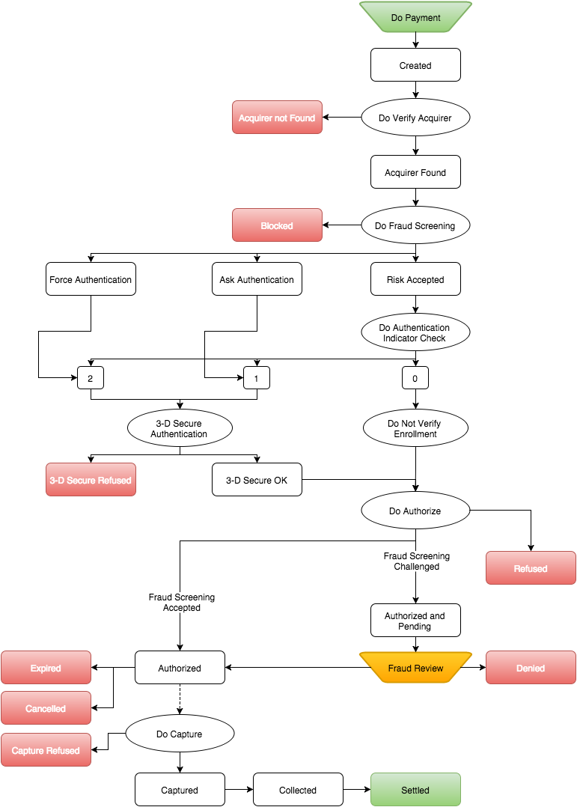

#HiPay Fullservice - Gateway API

#About this Guide 

##Purpose

This document is designed to provide you details on how to integrate
your business to the HiPay Fullservice TPP payment gateway. This
document provides step-by-step instructions on how to simply and quickly
get up and running with our services as well as detailed reference
material.

Where applicable, this document refers to the related documentation with
further details.

##Intended Audience

The intended audience is the merchant's technical staff or the
merchant's system integrator.

Because almost all communication between the merchant's system and the
REST API is realized through predefined XML or JSON messages over the
Internet using standard protocols, you will need basic XML/JSON
programming skills and knowledge of HTTP(S). Furthermore, it is
recommended that you are familiar with the basics of tokenization
concepts.

##Copyright

The information contained in this guide is proprietary and confidential
to HiPay and its members. This material may not be duplicated,
published, or disclosed, in whole or in part, without the prior written
permission of HiPay.

##Legal Notice

This document contains the proprietary and confidential information of
HiPay. Such information may not be used for any unauthorized purpose and
may not be published or disclosed to third parties, in whole or part,
without the express written permission of HiPay. You acknowledge and
agree that between you and HiPay this document and all portions thereof,
including, but not limited to, any copyright, trade secret and other
intellectual property rights relating thereto, are and at all times
shall remain the sole property of HiPay and that title and full
ownership rights in the information contained herein and all portions
thereof are reserved to and at all times shall remain with HiPay. You
agree to safeguard the confidentiality of the information contained
herein using the same standard you employ to safeguard your own
confidential information of like kind, but in no event less than a
commercially reasonable standard of care. If you do not agree with the
foregoing conditions, you are required to return this document
immediately to HiPay.

#How to Read this Guide

##Document Conventions

These conventions help to locate and interpret information.

This guide uses several typographic conventions to highlight certain
words, phrases and point out specific pieces of information.

The following table clarifies the conventions used across this guide.

IMG

##Abbreviations used in tables

The tables of this document describe data elements. These data elements
are equivalent to parameters in a query or to fields of a response
message. The following table helps understanding the different
attributes (columns) that define a data element.

IMG
IMG

##Acronyms and Abbreviations

The following acronyms and abbreviations are used in this guide.

  Acronym   Full Name
  --------- -----------------------------------------------
  BIN       Bank Identification Number
  PAN       Primary Account Number
  PCI DSS   Payment Card Industry Data Security Standards
  REST      Representational State Transfer

#API Overview

The API is based on REST principles; thus it is very easy to write and
test applications.

How to access the API:

-   Use your browser to access URLs.
-   Use almost any HTTP client in any programming language, to interact
    with the API.

##Security Considerations

HiPay TPP REST API service is protected

-   To ensure that only authorized Merchants use it,
-   To prevent payment information from being compromised.

### PCI DSS Requirements

IMG

###  Encrypted Communication

IMG

### IP Restriction

IMG
  
### Authentication

Only authenticated users and system components are allowed to access to
the Secure Gateway API.

#3-D Secure Integration

##Introduction

IMG

##About 3-D Secure

IMG

##Merchant Benefits

IMG

##Transaction Flow

### Procedure

Proceed as follow to carry out a transaction:
  1      Merchant call HiPay API with “authentication\_indicator” value of 1 or 2 or FPS system ask for 3-D Secure
         
         -- *Refer to parameters sent to API method used*.

  2      To complete the purchase; the cardholder press the **Pay** button after filling payment card details in payment page:
         
         -   This activates the Merchant Plug-In (MPI) and initiates a transaction.
         
  3      The MPI identifies the card number and sends it to the Directory Server to determine whether the card is in a participating card range.

  4      If the Issuer is participating for the card range, the Directory sends a Verify Enrollment Request message to the Issuer ACS to determine whether authentication is available for the account number.

  5      The ACS returns a Verify Enrollment Response to the Directory Server         

  6      The Directory Server forwards the ACS response to the MPI.

  7      The MPI sends an Authentication Request message to the cardholder’s browser for routing to the ACS.

  8      The cardholder’s browser passes the Authentication Request to the ACS.

  9      The ACS authenticates the cardholder.

  10     The ACS creates, digitally signs, and sends an Authentication Response to HiPay via the cardholder’s browser. The ACS also sends transaction record to the Authentication History Server for storage.

  11     The browser routes the Authentication Response back to the MPI.

  12     The MPI validates the digital signature in the response, verifying that it is from a valid participating Issuer.

  13     HiPay formats and sends to its Acquirer an Authorization Request message, which includes information from the Issuer’s Authentication Response — including the CVV and the ECI. The Acquirer passes the Authorization Request to the Card Network and the transaction completes through standard processing.

  14     HiPay send a notification with transaction status and 3-D Secure authentication result.
         
         -- *Refer to Authentication Results section*.

### Workflow overview

##Authentication Results

The following table lists the enrollment message and status:

#Redirect Pages

## Redirect your customer to a page of your choice.

  Description   The redirect pages are pages to which HiPay Fullservice TPP redirects your customer's browser after the transaction is processed if it was made out of your website (hosted payment page, local payments, 3-D Secure authentication, etc.).

  Objective     Typically, this is a secure page on your site. The main purpose is to redirect your customers back to your website once they have completed a payment.

## Redirect pages setup

Description  You can find redirect pages configuration over “*Integration -&gt; Redirect Pages*” on your HiPay TPP back-office.
                
You can overwrite the default redirect pages by sending custom URLs along with the order details in your requests to the payment gateway (*please refer to 3.1 section*).

## Default redirect pages

  Accept page      Page to redirect your customer if transaction was successful.
  Decline page     Page to redirect your customer if transaction was refused.
  Pending page     Page to redirect your customer if transaction is pending[^1].
  Cancel page      Page to redirect your customer if transaction was cancelled.
  Exception page   Page to which the customer's browser is redirected after a system failure or when the payment gateway is temporarily unavailable. If page is not defined, the default page for exceptions is displayed by the payment gateway.

## Feedback Parameters

Description   Select this option if you want that HiPay TPP send back the transaction parameters to your redirect pages for further processing within your own website.
  
##  Fields sent 

The following table lists and describes the fields sent to your redirect
pages.

table here

#Server-to-Server Notifications

##What is a Server-to-Server Notification?

  Description   In order to notify events related to your payment system, such as a new transaction or a 3-D Secure transaction, HiPay platform can send to your application a Server-to-Server notification.
 
##Setup

  Procedure      To set your Notification URL you must login into your Hipay Fullservice TPP back office and go to “*Integration -&gt; Notifications*”.
 
##Configuration Parameters

content here

##Response Fields

The following table lists and describes the response fields received on
the notification call.

##Response fields specific to the payment product

Credit Card payments   The following table lists and describes the response fields returned for transactions by credit/debit card.

##Transaction Workflow

Description   The HiPay TPP payment gateway can process transactions through many different acquirers using different payment methods and involving some anti-fraud checks. All these aspects change the transaction processing flow significantly for you.

## Examples

code example

#Signature verification

## Introduction

Directive   It is strongly recommended to use a signature mechanism to verify the contents of a request or redirection made to your servers. This prevents customers from tampering with the data in the data exchanges between your servers and our payment system.
        
## Setup

First of all you need to set a Secret Passphrase in your HiPay TPP back office under “*Integration -&gt; Security Settings -&gt; Secret Passphrase*”.

## Verification

URL Notification
  
### Example

#Device Fingerprint Integration

## Overview

The device fingerprint identifies devices through information collected by a client run on an end user’s computer. This client generates a black box that contains all device information available.

## Generate black box content
To integrate the client you must specify a hidden field that the JavaScript will populate. This adds the black box as another field to be submitted along the other details in the form.

### Example

#Settlements 

If you need an overview of your settlements or get operations list
included in one of them HiPay propose the following resources to do it:

## Optional Filter GET Parameters

content

## Examples

###Payment Product

####Payment Status Definitions

### Transaction Life Cycle

The life cycle of a transaction processed by the HiPay TPP Payment Service is characterised by the different events that mark a change in the status of the transaction.

####Diagram   

Figure 1: Typical Transaction Flow

####Electronic Commerce Indicator

The ECI indicates the security level at which the payment information is processed between the cardholder and merchant.

####Address Verification Service

The Address Verification Service (AVS) is a system that allows e-commerce merchants to check a cardholder's billing address. AVS provides merchants with a key indicator that helps verify whether or not a transaction is valid.

####Card Verification Code

The CVC is available on the following credit and debit cards: Visa (Card Verification Value CVV2), MasterCard (Card Validation Code CVC2), Maestro, Diners Club, Discover (Card Identification Number CID), and American Express (Card Identification Number CID).

####Decline Reasons and Error Codes

The HiPay TPP payment gateway can return multiple errors for any
operation.