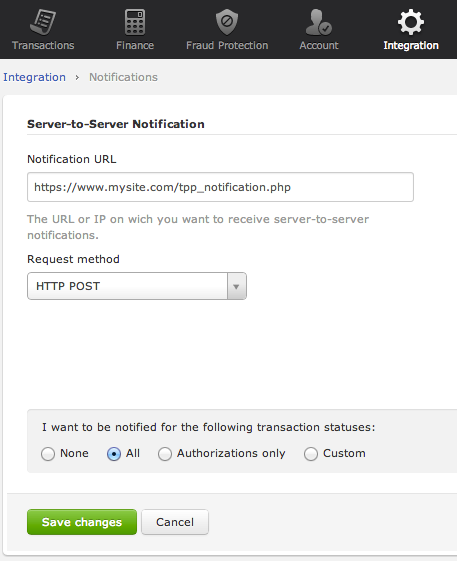
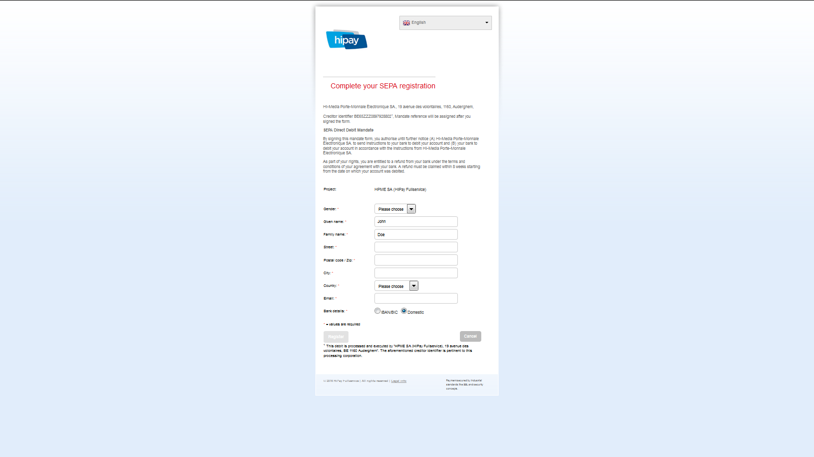

# HiPay Fullservice - Overview

# About this Guide 

## Purpose

This document is designed to provide you with details on how to integrate your business with the HiPay Fullservice payment gateway. This document provides step-by-step instructions on how to simply and quickly get up and running with our services as well as detailed reference material.

Where applicable, this document refers to the related documentation with further details.

## Intended Audience

The intended audience is the merchant's technical staff or the
merchant's system integrator.

Because almost all communication between the merchant's system and the
REST API is realized through predefined XML or JSON messages over the
Internet using standard protocols, you will need basic XML/JSON
programming skills and knowledge of HTTP(S). Furthermore, it is
recommended that you are familiar with the basics of tokenization
concepts.

# Acronyms and Abbreviations

The following acronyms and abbreviations are used in this guide.

| Acronym   |      Full Name    |
|----------|:-------------:|
| BIN |  Bank Identification Number
| PAN |  Primary Account Number
| PCI DSS |  Payment Card Industry Data Security Standards
| REST |  Representational State Transfer
| SDK |  Software development kit

# Technical integration

In order for you to accept payment through the HiPay Fullservice platform, you need to integrate our APIs. HiPay proposes a wide variety of turnkey integrations for industry-standard e-commerce platforms and other SDKs and libraries. **[You can find all the HiPay Fullservice integrations here.](/fullservice)**

You may also integrate our REST API if you have specific technical needs. To this end, please check the next chapter of this guide: *API Overview*.

# API Overview

The APIs are based on REST principles. Thus, it is very easy to write and test applications.

HiPay Fullservice exposes three main APIs, allowing you **manage payment data**, **get paid** and dealing you **finance operations**. The detailed documentation and reference of these APIs, including web service URLs and parameter information, are provided in interactive documentation tools, see below for more information.

## Gateway API

The Gateway API allows you to get paid and manage orders and transactions. By leveraging this API, you will be able to present payment pages to your customer.

**[Click here to access the full interactive documentation and live testing tools of the HiPay Fullservice Gateway API](/doc-api/fullservice/gateway/).**

## Tokenization API

The Tokenization (Secure Vault) API allows merchants to retrieve and update data associated with their customers' payment information stored in the HiPay Fullservice Secure Vault. Using the Tokenization API, merchants eliminate the risk, liability and cost of storing sensitive data on their local servers and storage devices. The Tokenization API aims to be used alongside the Gateway API. 

**[Click here to access the full interactive documentation and live testing tools of the HiPay Fullservice Tokenization API](/doc-api/fullservice/token/).**

## Finance API

When using HiPay Fullservice, all your sales are consolidated and settled (transferred to your bank account). The Finance API allows you to get all the details about settlements executed for your merchant account.

**[Click here to access the full interactive documentation and live testing tools of the HiPay Fullservice Finance API](/doc-api/fullservice/settlement/).**

# Security Considerations

The HiPay Fullservice platform is protected:

-   To ensure that only authorized merchants use it,
-   To prevent payment information from being compromised.

## PCI DSS Requirements

**Description**:
HiPay Fullservice allows sending payment data, that means that the system will be transmitting, and possibly storing card data.

**Storage (SAD) information**:
The Card Schemes, American Express, Discover Financial Services, JCB International, MasterCard Worldwide and Visa Inc. have never permitted the storage of sensitive data (track data and/or CVV2). It is prohibited under "Requirement 3" of the Payment Card Industry Data Security Standard (PCI DSS).

**Warning**:
Merchants who store Sensitive Authentication Data (SAD) are exposed to fines from the Card Schemes.

**Security management data**: If the Tokenization API is used, the merchant demonstrates that the system can handle this data securely and that he is taking full responsibility for his PCI DSS compliance.

**Contact**
For further information on PCI security standards, please visit [www.pcisecuritystandards.org](www.pcisecuritystandards.org).

## Encrypted Communication

**Description**: HiPay Fullservice provides all REST API methods over SSL (Secure Sockets Layer).

**Guarantees**: All data transmitted between HiPay Fullservice and the Merchant system is encrypted (256-bit encryption using a DigiCert certificate).

## IP Restriction

**Description**: When a request is sent to the platform, the IP address or IP address range from where the connection was made is verified.

If it matches with the IP address supplied by the Merchant at a previous stage (in the Merchant Interface: Technical Integration Section), the request will be processed.

In the case of missing or incorrect information, the server will respond with an appropriate error message, indicating the error in the request.

**Important**: When your IP address is changed, do not forget to ensure that all new IP addresses are configured for your account. If not, your server requests will be rejected.
  
## Authentication

Only authenticated users and system components are allowed to access to the Secure Gateway API.

# 3-D Secure Integration

## Introduction

**Overview**: This chapter describes how you should implement 3-D Secure Authentication.

**Description**: This process involves redirecting the shopper to an authentication page. This page is provided and hosted by the shopper's Card Issuer. As this page is hosted by the shopper’s card issuing bank, we have no control over its appearance or functionality.

## About 3-D Secure

**3-D Secure History**: In early 2001, VISA introduced a security protocol called 3-D Secure to improve online transaction performance and to accelerate the growth of electronic commerce through increased consumer confidence. 

**Objective of 3-D Secure**: The objective of 3-D Secure was to provide Issuers with the ability to actually authenticate cardholders during an online purchase, to reduce the likelihood of fraudulent usage of payment cards and to improve transaction performance to benefit merchants, consumers and acquirers.
VISA’s branded 3-D Secure Program is commonly known as Verified By VISA (VbV). Services based on the protocol have been also been adopted by MasterCard, under the name MasterCard SecureCode™ (MSC).

## Merchant Benefits

**3-D Secure Benefits**: The benefits of the 3-D Secure Process are the enhanced security available when performing an authenticated transaction as well as the shift of liability in the event of fraudulent transactions. Authentication should strengthen your existing anti-fraud strategy and help protect your business, but bare in mind that coverage of authentication programs is currently limited to Internet transactions. 

**Restriction**: This means that authentication programs do not cover fax, mail, or phone orders (MO/TO), nor do they cover all card types.The additional security benefits and liability shifts of authenticated transactions are currently only supported by Visa and MasterCard.

## Transaction Flow

### Procedure

Proceed as follow to carry out a transaction:

1. Merchant calls the HiPay Fullservice API with the `authentication_indicator` value of `1` or `2` (or the Fraud Protection System (FPS) system asks for 3-D Secure).
2. To complete the purchase; the cardholder clicks the **Pay** button after filling payment card details in payment page: This activates the Merchant Plug-In (MPI) and initiates a transaction.    
3. The MPI identifies the card number and sends it to the Directory Server to determine whether the card is in a participating card range.
4. If the Issuer is participating for the card range, the Directory sends a Verify Enrollment Request message to the Issuer *ACS* to determine whether authentication is available for the account number.
5. The *ACS* returns a Verify Enrollment Response to the Directory Server 
	- If authentication is available for this card number, then the response provides the URL of the *ACS* where the cardholder can be authenticated.
If the payment is in a hosted payment page, the redirection to *ACS* will be done automatically.
	- If authentication is not available, then the HiPay server receives a *Cardholder Not Enrolled* or *Authentication Not Available* message and proceeds depending on `authentication_indicator` value:
		- `1`: Proceed with a standard transaction processing (skip to step 13).
		- `2`: Transaction is refused.
6. The Directory Server forwards the *ACS* response to the MPI.
7. The MPI sends an Authentication Request message to the cardholder’s browser for routing to the *ACS*.
8. The cardholder’s browser passes the Authentication Request to the *ACS*.
9. The *ACS* authenticates the cardholder.
10. The *ACS* creates, digitally signs, and sends an *Authentication Response* to HiPay via the cardholder’s browser. The *ACS* also sends transaction record to the Authentication History Server for storage.
11. The browser routes the Authentication Response back to the MPI.
12. The MPI validates the digital signature in the response, verifying that it is from a valid participating Issuer.
13. HiPay formats and sends to its Acquirer an Authorization Request message, which includes information from the Issuer’s Authentication Response — including the CVV and the ECI. The Acquirer passes the Authorization Request to the Card Network and the transaction completes through standard processing.
14. HiPay sends a notification with transaction status and 3-D Secure authentication result. *Refer to Authentication Results section*.

### Workflow overview


## Authentication Results

The following table lists the enrollment message and status:

| Status   | Enrollment Message | 3-D Secure Available? | ECI | Description |
|----------|:-------------:|----------|:-------------:|----------|:-------------:|
| `Y` | Authentication Available | Yes | - | Card is enrolled in the 3-D Secure program and the payer is eligible for authentication processing.
| `N` | Cardholder Not Enrolled | No | `6` | Card is not enrolled in 3-D Secure program. **Chargeback Liability Shift**: If the cardholder later disputes the purchase, the issuer may not submit a chargeback to the merchant.
| `U` | Unable to Authenticate | No | `7` | The card associations were unable to verify if the cardholder is enrolled in the 3-D Secure program. Merchants can choose to accept the card nonetheless and proceed the purchase as non-authenticated when submitting the authorization. **Chargeback Liability Shift**: The Acquirer/Merchant retains liability if the cardholder later disputes making the purchase.
| `E` | Any error message here | No | `7` | An error occurred during the enrollment verification process. **Chargeback Liability Shift**: The card can be accepted for authorization processing, yet the merchant may not claim a liability shift on this transaction in case of a dispute with the cardholder.

The following table lists the Authentication message and status:

| Status   | Authentication Message | ECI | Description |
|----------|-------------|----------|-------------|
| `Y` | Authentication Successful | `5` | Cardholder was successfully authenticated.The Issuer has authenticated the cardholder by verifying the identity information or password.
| `A` | Authentication Attempted | `6` | Authentication could not be performed but a proof of authentication attempt was provided.
| `U` | Authentication Could Not Be Performed | `7` | The Issuer is not able to complete the authentication request due to a technical error or other problem. Possible reasons include:Invalid type of card such as a Commercial Card or any anonymous Prepaid Card.Unable to establish an SSL session with cardholder browser.
| `N` | Authentication Failed | - | The cardholder did not complete authentication and the card should not be accepted for payment. The following are reasons to fail an authentication: Cardholder fails to correctly enter the authentication information; Cardholder cancels the authentication process. An authentication failure may be a possible indication of a fraudulent user. **Authorization request should not be submitted.**
| `E` | Any error message here | - | An error occurred during the authentication process. **Authorization request should not be submitted.**

# Redirect Pages

## Redirect your customer to a page of your choice

**Description**: The redirect pages are pages to which HiPay Fullservice redirects your customer's browser after the transaction is processed if it was made out of your website (hosted payment page, local payments, 3-D Secure authentication, etc.).

**Objective**: Typically, this is a secure page on your site. The main purpose is to redirect your customers back to your website once they have completed a payment.

## Redirect pages setup

**Description**: You can find redirect pages configuration over *Integration -> Redirect Pages* on your HiPay Fullservice back office.
                
You can overwrite the default redirect pages by sending custom URLs along with the order details in your requests to the payment gateway. Please refer to the [HiPay Fullservice Gateway API documentation](/doc-api/fullservice/gateway/).

## Default redirect pages
  
| Field Name   |      Description    |
|----------|-------------|
| Accept page |  Page to redirect your customer if transaction was successful.
| Decline page |  Page to redirect your customer if transaction was refused.
| Pending page |  Page to redirect your customer if transaction is pending.
| Cancel page |  Page to redirect your customer if transaction was cancelled.
| Exception page |  Page to which the customer's browser is redirected after a system failure or when the payment gateway is temporarily unavailable. If page is not defined, the default page for exceptions is displayed by the payment gateway.

## Feedback Parameters

**Description**: Select this option in your HiPay Fullservice back office if you want that HiPay Fullservice sends back the transaction parameters to your redirect pages for further processing within your own website.

**Procedure**: To activate this option you “MUST” specify at least an “Accept Page” URL. Sent parameters are included in your redirect pages on HTTP GET.
  
##  Fields sent 

The following table lists and describes the fields sent to your redirect pages.

| Field Name | Description
| ---- | ---- |
| `orderid` | Unique identifier of the order as provided by Merchant. 
| `cid` | Unique identifier of the customer as provided by Merchant.
| `state` | Transaction state. Value must be a member of the following list: `completed`, `pending`, `declined` or `error`.
| `status` | Transaction status. A list of available statuses can be found in the appendices.
| `test` | `1` if the transaction is a testing transaction, otherwise `0`.
| `reference` | The unique identifier of the transaction.
| `approval` | An authorization code (up to 35 characters) generated for each approved or pending transaction by the acquiring provider.
| `authorized` | Time when transaction was authorized.
| `ip` | The IP address of the customer making the purchase.
| `country` | Country code associated to the customer's IP address.
| `lang` | Language code of the customer.
| `email` | Email address of the customer.
| `cdata1` `cdata2` … `cdata10` | Custom data.
| `score` | Total score assigned to the transaction (main risk indicator).
| `fraud` | The overall result of risk assessment returned by the Payment Gateway. Value must be a member of the following list: **`pending`** (rules were not checked), **`accepted`** (transaction accepted), **`blocked`** (transaction rejected due to review system rules), **`challenged`** (transaction has been marked for review)
| `review` | The decision made when the overall risk result returns challenged. An empty value means no review is required. Value must be a member of the following list: **`pending`** (a decision to release or cancel the transaction is pending), **`allowed`** (the transaction has been released for processing), **`denied`** (the transaction has been cancelled).
| `avscheck` | Result of the Address Verification Service (AVS). Possible result codes can be found in the appendices
| `cvccheck` | Result of the CVC (Card Verification Code) check. Possible result codes can be found in the appendices
| `pp` | Payment product used to complete the transaction. Informs about the payment_method section type.
| `eci3ds` | The 3-D Secure (3DS) electronic commerce indicator
| `veres` | The 3-D Secure (3DS) enrollment status.
| `pares` | The 3-D Secure (3DS) authentication status. This field is only included if payment authentication was attempted and a value was received.
| `cardtoken` | Card token.
| `cardbrand` | Card brand. (e.g., VISA, MASTERCARD, AMERICANEXPRESS, MAESTRO).
| `cardpan` | Card number (up to 19 characters). Note that, due to the PCI DSS security standards, our system has to mask credit card numbers in any output (e.g., ************4769).
| `cardexpiry` | Card expiry year and month (YYYYMM).
| `cardcountry` | Bank country code where card was issued. This two-letter country code complies with *ISO 3166-1* (alpha 2).

# Server-to-Server Notifications

## What is a Server-to-Server Notification?

**Description**: In order to notify events related to your payment system, such as a new transaction or a 3-D Secure transaction, the HiPay Fullservice platform can send to your application a Server-to-Server notification.
 
## Setup

**Procedure**: To set your Notification URL you must login into your HiPay Fullservice back office and go to “*Integration -> Notifications*”.


 
## Configuration Parameters

| Field Name   |      Description    |
|----------|-------------|
| Notification URL |  The URL or IP on which you want to receive server-to-server notifications.
| Request method |  The method you wish to receive the requests: XML / HTTP POST 
| Desired notifications |  Here you can define what notifications you want to receive based on transaction status. Refer to the appendices — "Appendix B. Payment definitions” — for the full list of available transaction statuses.

## Transaction Workflow

**Description**: The HiPay Fullservice payment gateway can process transactions through many different acquirers using different payment methods and involving some anti-fraud checks. All these aspects change the transaction processing flow significantly for you.

When you activate a server-to-server notification on HiPay Fullservice, you receive a response describing the transaction state. Depending on the transaction state there are five options to action:

| Transaction state   |      Description    |
|----------|-------------|
| completed |  If the transaction state is completed you are done. This is the most common case for credit card transaction processing. Almost all credit card acquirers works in that way. Then you have to look into the status field of the response to know the exact transaction status.
| pending |  Transaction request was submitted to the acquirer but response is not yet available.
| declined |  Transaction was processed and was declined by gateway.
| error |  Transaction was not processed due to some reasons.

#Signature verification

## Introduction

**Directive**: It is strongly recommended to use a signature mechanism to verify the contents of a request or redirection made to your servers. This prevents customers from tampering with the data in the data exchanges between your servers and our payment system.

A unique signature is sent each time that HiPay contact any merchant URL, notification or redirection.
        
## Setup

First of all you need to set a Secret Passphrase in your HiPay Fullservice back office under “*Integration -> Security Settings -> Secret Passphrase*”.


**Secret passphrase**: The secret passphrase is used to generate a unique character string (signature) hashed with SHA algorithm. The security level of the password depends on the length of the password. A long password is more secured.

## Verification

**URL Notification**: For the URL notification, the signature is sent on the HTTP header under the “HTTP_X_ALLOPASS_SIGNATURE” parameter. To check this point, you just need to concatenate the passphrase with the POST content of the query. Algorithm: SHA Signature = SHA1(Raw POST Data + Secret Passphrase)

**URL Redirection**: For each redirection page (accept page, decline page, etc.) the signature is sent under the “hash” parameter. To check this point, you must concatenate the parameters, the values of each and the passphrase under the following conditions:
1. The parameter must be predefined.
2. The value can’t be empty.
3. The parameter must be sorted in alphabetical order.


#Device Fingerprint Integration

## Overview

The device fingerprint identifies devices through information collected by a client run on an end user’s computer. This client generates a black box that contains all device information available.

Web applications obtain device information by sourcing dynamically generated JavaScript from HiPay Fullservice. The JavaScript determines what information is available and generates a black box from all available sources.

A black box will typically:

- Range up to 4,000 bytes (the average length being just under 1,000 bytes)
- Contain alphanumeric values and the special characters: + / ; =
- Begin with 0200, 0400, 0500 or 0600

## Generate black box content
To integrate the client you must specify a hidden field that the JavaScript will populate. This adds the black box as another field to be submitted along the other details in the form.

**You MUST :**

1.	Include a hidden form field with an ID “ioBB” that will be populated with the value.
2.	Call the HiPay Fullservice fingerprint JavaScript function to obtain the black box content: https://secure-gateway.hipay-tpp.com/gateway/toolbox/fingerprint

**You MUST NOT**

1.	DO NOT call HiPay Fullservice fingerprint JavaScript BEFORE including the hidden “ioBB” form field.
2.	DO NOT cache or use local copies of the JavaScript (JavaScript is dynamically generated for each customer and so caching of the script may cause unrelated devices to be identified as the same computer. The script also uses domain cookies to identify devices across subscribers.) 

#Settlements 

If you need an overview of your settlements or get operations list
included in one of them, check out [the HiPay Fullservice Finance API interactive documentation](/doc-api/fullservice/settlement/).

##Settlement File Transfer

###What is a file transfer?

**Description**:   In order to notify financial events related to your payment system, such as a new settlement file created, the HiPay platform can send your application a settlement file by FTP/SFTP.

**Procedure**: To set up your financial file transfer system, you must login into your HiPay Fullservice back office and go to *“Integration -> File Transfer*”.

*Configuration Screen*  


###Configuration parameters

| Field name   |      Description    |
|----------|-------------|
|File Server|     The Hostname or IP on which you want to receive your files.
|Path      |      The path where the file will be submitted.
|Server Type |    The type of server you will use: FTP / SFTP
|Username   |     The username to log in your server.
|Password   |     The password to log in your server.
|Desired files |  Files you want to receive.

###Settlement file data

To get a list of fields included in settlement files, please refer to
the [the HiPay Fullservice Finance API interactive documentation](/doc-api/fullservice/settlement/).

##Settlement file fields

The following table lists and describes all the fields included in each
settlement file.

| **Field name**   |      **Description**    |
|----------|-------------|
| Account |                  HiPay’s account number
|Account name |            HiPay’s account name
|Date |                    Date of collect
|Date value|               Transaction date value
|Invoice reference|        HiPay’s invoice reference
|Settlement ID|            Settlement ID
|Transaction ID|           HiPay’s transaction ID
|Order    |                Unique identifier of the order as provided by the merchant
|Product name |            Payment method
|Invoiced    |             Invoiced transaction (0/1)
|Settled    |              Settled transaction (0/1)
|Original amount |         Original amount of the operation
|Original currency |       Original currency of the operation
|Amount (Excl. Tax) |      Amount of the operation excluding tax
|Tax amount        |       Tax amount of the operation
|Amount (Incl. Tax)|       Amount of the operation including tax
|Currency          |       Invoice currency
|Operation        |        Operation type. Please refer to “*Operation types*” below.
|Settled amount   |        Settled amount
|Settlement currency  |    Settlement currency
|Original settlement ID|   Original settlement ID (if applicable)
|Customer ID          |    Unique identifier of the customer as provided by the merchant
|Merchant operation ID|    Operation ID sent in maintenance operation

##Operation types

Here are the different operation types that can appear on a list of
operations.

|  **Operation type**    |      **Description**    |
|----------|-------------|
|**Adjustment in favor of merchant**|   Amount credited on the merchant’s balance (E.g.: adjustment of commission billing errors, commercial incentives)
|**Adjustment in favor of TPP**|        Amount deducted from the merchant’s balance (E.g.: adjustment for fees not charged)
|**Already settled**  |                 Statement of an amount already paid by HiPay to the merchant
|**Asset settlement** |                 Operation following a negative balance, indicating that it has been paid off on the merchant’s account
|**Chargeback**     |                   Credit/debit card charge paid by the merchant to a customer after he/she successfully disputed an item on his/her bank statement
|**Chargeback refund**    |                  Amount of a chargeback credited back to the merchant after giving evidence that the product or service was duly delivered
|**Deferred settlement** |                   Settlement file issued in case the merchant’s HiPay Fullservice account shows a negative balance
|**Fixed fee**      |                        Commission charged on transactions when collecting amounts
|**Fixed reserve capture** |                 Amount transferred by the merchant or debited from the merchant’s balance and withheld for protection against potential risks
|**Fixed reserve release**|                  Fixed reserve amount released back to the merchant 180 days after its capture
|**IFF (Fraud Financial Impact)**   |        Fraudulent blocked transactions fee on the Carte Bancaire’s network paid by the merchant
| **Invoice carry-over (formerly Invoice asset)**     | Operation created to transfer the merchant’s remaining invoice amount to the next billing cycle
|**Invoice to be paid by TPP**  |            Not applicable
|**Invoice payment**    |                    Not applicable (old status)
|**Deferred invoice (formerly Invoice report)**   |                    Invoice deferred, in whole or in part, to the next billing cycle
|**Offsetting entry (formerly Merchant’s balance credit)**   |                   Entry on a balance sheet that sets another entry to zero. Does not impact billing.
|**Monthly fee**      |                      Fee charged every month
|**Refund**     |                            Reimbursement of a transaction
|**Rolling reserve capture**   |             Amount withdrawn from every payout and withheld for protection against potential risks
|**Rolling reserve release** |               Amount released back to the merchant after being held for 180 days
|**Sale**            |                       Sale or transaction amount
|**Settlement**      |                       Payout amount on D-day
|**Setup fee**      |                        Fee for the implementation of the project and account. It is billed on the first HiPay Fullservice invoice.
|**Split settlement** |                      Amount to be paid out on a specific bank account when allocating payouts among several bank accounts
|**Splitting settlement**  |                 Total amount to be paid out when allocating payouts among several bank accounts
|**Transferred from merchant** |             Transfer sent from a HiPay Fullservice account to another HiPay Fullservice account (between accounts of a same merchant).This operation is displayed on the sending account’s operations.
|**Transferred to merchant**  |              Transfer sent from a HiPay Fullservice account to another HiPay Fullservice account(between accounts of a same merchant).This operation is displayed on the receiving account’s operations.
|**Variable**       |                        Commission based on a percentage and calculated on amounts collected on the HiPay Fullservice account.

##Settlement notifications

This document is designed to provide you with details on how to integrate your business to the HiPay Fullservice Financial Gateway Notifications. It gives step-by-step instructions on how to simply and quickly get up and running with our services as well as detailed reference material.

##Settlement server-to-server notifications

###What is a server-to-server notification?

**Description**: In order to notify financial events related to your payment system, such as a new settlement file created, the HiPay platform can send to your application a server-to-server notification.

###Setup

**Procedure** To set up your Financial Feedback Notification URL, you must login into your HiPay Fullservice back office and go to *“Integration -> Notifications -> Financial Feedback*”.

*Configuration Screen*   


###Configuration parameters

| Field name   |      Description    |
|----------|-------------|
|Notification URL  |      The URL or IP on which you want to receive financial server-to-server notifications.
|Request method |         The method used to send you the requests: XML / JSON / HTTP POST
|Hash algorithm|          The algorithm used to hash the password that will sign all sent notifications.
|Password         |       The password used to generate a unique character string (signature) hashed with the defined algorithm.The security level of the password depends on the length of the password. A long password is more secure.
|Desired notifications|   Financial notifications you want to receive.


###Response fields

The following table lists and describes the response fields.

| Field name   |      Description    |
|----------|-------------|
|`notification_type`|      Type of notification (only in POST request)   
|`account`   |               Account ID
|`reference` |               Settlement ID
|`sales`     |               Sales amount
|`refunds`   |               Refunds amount
|`fees`       |              Fees amount
|`chargeback`  |             Chargebacks amount
|`rolling`      |            Rolling reserve amount
|`other`         |           Other amount
|`amount`         |          Settlement amount
|`currency`        |         Settlement currency

###Examples

The following examples are XML, JSON and HTTP Post responses.

```xml
<?xml version="1.0" encoding="UTF-8"?>
<settlement>
  <account>987654</account>
  <reference>123456</reference>
  <sales>2839.000</sales>
  <refunds>0</refunds>
  <fees>90.040</fees>
  <chargeback>0</chargeback>
  <deferred>0</deferred>
  <rolling>0</rolling>
  <other>0</other>
  <amount>2748.040</amount>
  <currency><![CDATA[EUR]]></currency>
</settlement>
```

Response in JSON Format        
```json
{  
   "settlement":{  
      "account":"987654",
      "reference":"123456",
      "sales":2839,
      "refunds":0,
      "fees":90.040,
      "chargeback":0,
      "rolling":0,
      "other":0,
      "amount":2748.040,
      "currency":"EUR"
   }
}
```

Response in HTTP POST Format   
``` shell
notification_type=settlement&account=987654&reference=123456&sales=2839&refunds=0&fees=90&chargeback=0&rolling=0&other=2748.040&amount=0.000&currency=EUR
```

#SEPA Direct Debit (SDD)

##API Reference

This payment product can be used using the HiPay Fullservice Gateway API. **[Click here to access the full interactive documentation and live testing tools of the HiPay Fullservice Gateway API](/doc-api/fullservice/gateway/).**

##Recurring payment request with client authentication

To initiate a SEPA mandate for a recurring payment with client
authentication, here are the parameters to add to a basic payment
request.

The bank account owner must be present to complete the SEPA
registration.

**Specific required fields**:

| Parameter name | Value |
| --- | --- |
| `payment_product` | `sdd`
| `eci` | `7` (e-commerce)
| `recurring_payment` | `1`


## Recurring payment request without client authentication

To initiate a SEPA mandate for a recurring payment without client
authentication, here are the parameters to add to a basic payment
request.

The bank account owner must be present to complete the SEPA
registration.

**Specific required fields**:

| Parameter name | Value |
| --- | --- |
| `payment_product` | `sdd`
| `eci` | `7` (e-commerce)
| `recurring_payment` | `1`
| `firstname` | The firstname
| `lastname` | The lastname
| `authentication_indicator` | `0`
| `gender` | `M`
| `issuer_bank_id` | `MARKDEF1100`


**New parameters:**

| Parameter name | Value |
| --- | --- |
| `iban` | `DE23100000001234567890`
| `bank_name` | `Deutsche Bank`

##Recurring payment response

See below the received response. Please pay attention to the field `debit_agreement_id`, which is the most important here.

Merchants must save its value to make more transactions on the same
mandate.

##Response in XML format using Order service

```xml
<?xml version="1.0" encoding="UTF-8"?>
<response>
  <state>forwarding</state>
  <reason/>
  	<forward_url>https://stage-secure-gateway.hipay-tpp.com/gateway/forward/c4ee.ac42c21</forward_url>
  	<test>false</test>
  	<mid>00035167042</mid>
  	<attempt_id>1</attempt_id>
  	<authorization_code/>
  	<transaction_reference>806735728402</transaction_reference>
    	. . .
  	<debit_agreement>
    		<id>574</id>
    		<status>available</status>
  	</debit_agreement>
</response>
```


##Response in XML format using Hpayment service

```xml
<?xml version="1.0" encoding="UTF-8"?>
<response>  
	<forward_url>https://stage-secure-gateway.hipay-tpp.com/payment/web/pay/12...55</forward_url>
  	<test>true</test>
  	<mid>00001328877</mid>
  	. . .
  	<order>
    		<id>5630ccbe32951</id>
    		<date_created>2015-10-28T13:30:47+0000</date_created>
    		<attempts>0</attempts>
    		<amount>113.25</amount>
    		<shipping>4.50</shipping>
    		<tax>0.50</tax>
    		<decimals>2</decimals>
    		<currency>EUR</currency>
    		<customer_id>test</customer_id>
    		<language>fr_FR</language>
    		<email>test@hipay.com</email>
  	</order>
</response>
```

At this point, the transaction status is `Authentication requested`. The merchant will redirect the customer to the HiPay payment page, which will redirect him or her to the pay4 payment page to complete the registration, as shown here.

 

After completing the registration, the customer is redirected to the success page specified by the merchant in the initial payment request (or to the error page in case of failure).
                                                                                                                             
The transaction status will change to `Authenticated`, then to `Authorization requested`. A few days later (approximately 5 bank working days), the transaction status will change from `Authorization requested` to `Captured` directly (due to the lack of information about the status change between the transmission and the receipt of the payment).

##Notification response in XML format

```xml
<?xml version="1.0" encoding="UTF-8"?>
<notification>
  <state>completed</state>
  <reason/>
  <test>true</test>
  <mid>00001328877</mid>
  <attempt_id>1</attempt_id>
  <authorization_code/>
  <transaction_reference>730844386388</transaction_reference>
    . . .
  <debit_agreement>
    <id>599</id>
 <status>available</status>
  </debit_agreement>
</notification>
```


#Initiating a transaction on an existing mandate

When a merchant wants to make a payment on an existing mandate, the bank
account owner doesn’t need to be present.

To proceed, the merchant has to send the value of the aforementioned
field `debit_agreement_id` to HiPay.

##Specific required fields:

| Parameter name | Value |
| --- | --- |
| payment_product | `sdd`
| eci | `9` (recurring e-commerce)
| debit_agreement_id | `574` (example)
| recurring_payment | `1`


##Response

See below the received response. This time, the transaction status is
set to `Authorization requested` directly, as a confirmation is not
required to make another payment on an existing mandate.

###Response in XML format

```xml
<?xml version="1.0" encoding="UTF-8"?>
<response>
  <state>pending</state>
  <reason/>
  <forward_url/>
  <test>false</test>
  <mid>00035167042</mid>
  <attempt_id>1</attempt_id>
  <authorization_code/>
  <transaction_reference>937783482019</transaction_reference>
  <reference_to_pay/>
  <date_created>2015-10-05T16:40:21+0000</date_created>
  <date_updated>2015-10-05T16:40:29+0000</date_updated>
  <date_authorized/>
  <status>142</status>
  <message>Authorization Requested</message>
  . . . 
  <debit_agreement>
    <id>574</id>
    <status>available</status>
  </debit_agreement>
</response>
```


#Debit agreement statuses
  
| **Status**   |      **Description**    |
|----------|-------------|
| `pending` |  Created but not yet confirmed
| `available` |  Agreement correctly created
| `terminated` |  The agreement is no longer available
| `suspended` |  The agreement was suspended by the customer
| `error` |  An error occurred on agreement creation

##Creating a mandate without transaction

This is intended for merchants who want to create a debit agreement
without any first payment for further recurring payments.

###Endpoint:

**Production**: [https://secure-gateway.hipay-tpp.com/rest/v2/debit-agreement](https://secure-gateway.hipay-tpp.com/rest/v2/debit-agreement)

###Specific required fields:

| Parameter name | Value/Example value/info
|----------|-------------|
| payment_product | `sdd`
| currency | `EUR`
| iban | `DE23100000001234567890` (this is an example)
| issuer_bank_id | `MARKDEF1100` (this is an example)
| bank_name | `World bank` (this is an example)
| gender | `F` / `M`
| firstname | The firstname
| lastname | The lastname
| authentication_indicator | `0`
| agreement_reference | `4465545` (this field is not mandatory; it is used to import an old mandate reference)


###Example response in XML format
```xml
<?xml version="1.0" encoding="UTF-8"?>
<response>
  <code>0</code>
  <message><![CDATA[success]]></message>
  <description><![CDATA[Debit agreement has been successfully created.]]></description>
  <debit_agreement>
    <id>992</id>
    <provider_reference><![CDATA[xbclql8lff2c81raderivxnqjwwhizrcbu4regh6]]></provider_reference>
    <status><![CDATA[available]]></status>
    <creation_date><![CDATA[2016-02-19T10:19:19+0100]]></creation_date>
    <properties>
      <iban><![CDATA[DE23100000001234567890]]></iban>
      <issuer_bank_id><![CDATA[MARKDEF1100]]></issuer_bank_id>
      <bank_name><![CDATA[World bank]]></bank_name>
      <gender><![CDATA[F]]></gender>
      <firstname><![CDATA[firstname]]></firstname>
      <lastname><![CDATA[lastname]]></lastname>
      <authentication_indicator><![CDATA[0]]></authentication_indicator>
      <unique_id><![CDATA[000164937158989160]]></unique_id>
      <agreement_reference><![CDATA[4465545]]></agreement_reference>
    </properties>
  </debit_agreement>
</response>
```

At this point, the merchant can initiate an SDD transaction with the
given debit agreement.
