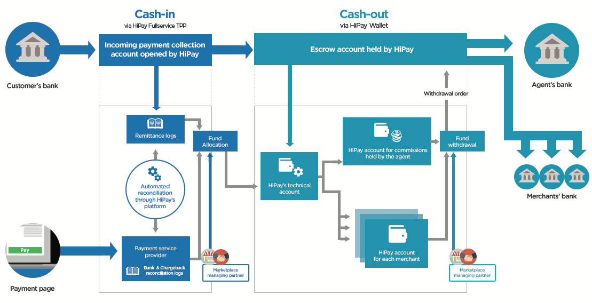
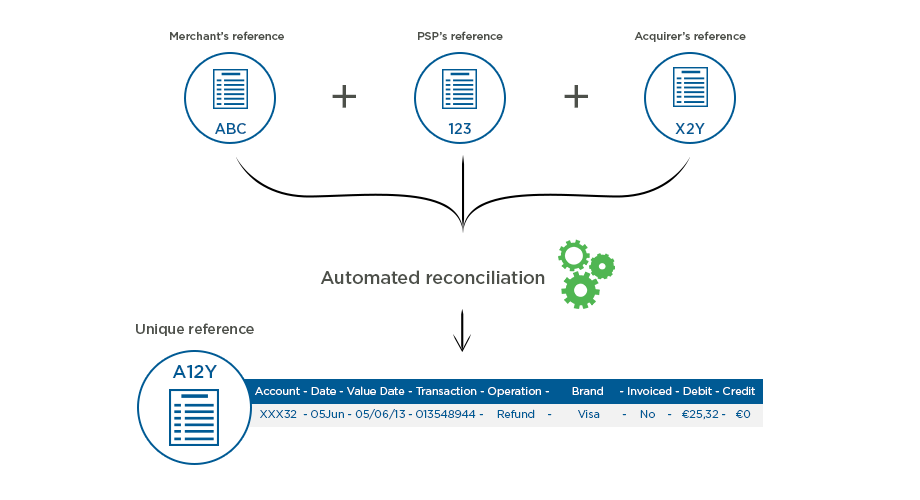
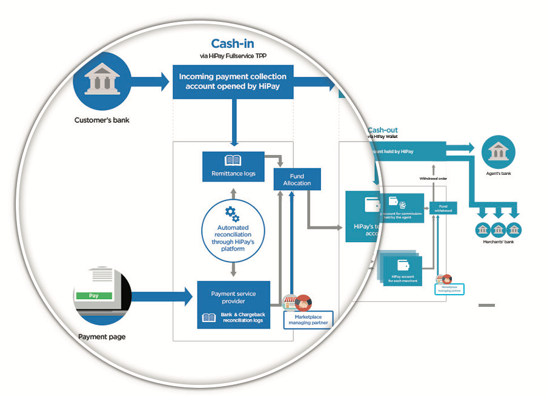
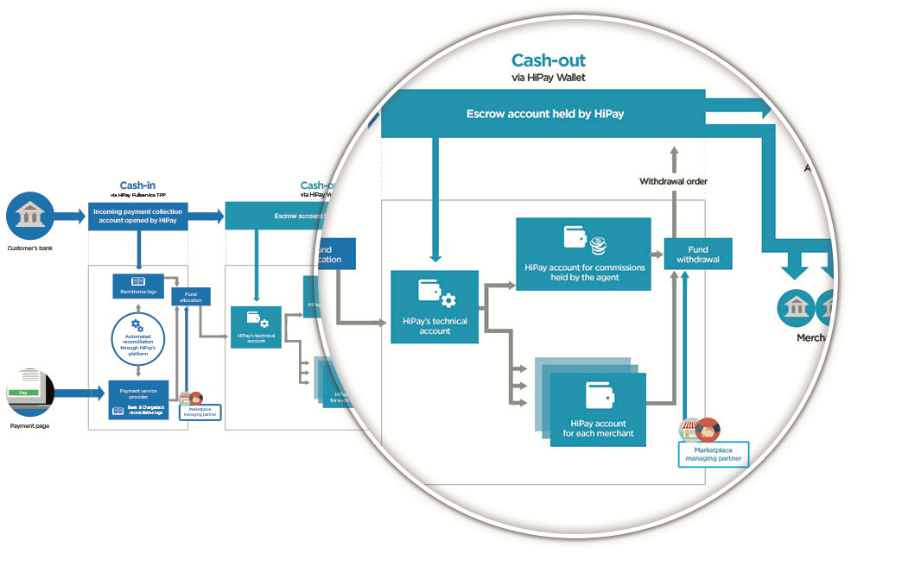

# How to comply with european regulations?

Connecting customers and merchants requires collecting money for third
parties. Besides, payment services are regulated by the French Monetary
and Financial Code (Article L521-2 et seq.).

In a nutshell, there are two ways to comply with European regulations:

-   either by having a license,
-   or by becoming an agent of a duly authorized intermediary.

As an authorized payment institution, HiPay can offer you a turnkey
solution for marketplaces, which complies with current regulations.

Indeed, HiPay’s solutions rely on two European banking licenses:

-   an accreditation as a **payment institution** from the ACPR/Autorité
    de contrôle prudentiel et de résolution (French Prudential
    Supervisory Authority), operating under the auspices of the French
    central bank (Banque de France),
-   and an accreditation as an **e-money issuer** from the National Bank
    of Belgium.

HiPay is therefore a licensed e-money issuer in Belgium and is
authorized to propose, under the terms of the free provision of
services, its electronic money and payment services, within the European
Union.

As such, HiPay can facilitate all your payment needs for third parties.

Moreover, our experts will help you get your activities regulatory
compliant with the supervisory authorities.

Basically, the supervisory authorities want to know:

-   the origin of the funds,
-   that funds are held in escrow,
-   and to whom the funds are redistributed.

Here is a recap of the KYC documents to submit.

-   For individuals: a copy of a valid identification document (passport
    or ID card) + a proof of address issued within the last three months
    (e.g.: rent receipt, utility bill)
-   For professionals: a certificate of incorporation + articles of
    association + a copy of a valid identification document (passport or
    ID card)

Please note that a certified translation is required for documents in
non-latin languages.

# Why choosing HiPay?

With over 12 million transactions processed every month, HiPay is an
expert in online payments.

We offer online publishers and e-tailers next generation payment
solutions in order to leverage their business.
We also bring added value to payment processing with specific solutions
on data, mobile and international development.

HiPay has offices in 6 European countries, Brazil and the United States.

Key figures:

- Founded in 2003
- 70 payment methods available in 85 countries
- European licenses: e-money issuer
- payment institution

# Advantages of HiPay’s integrated solutions

All our solutions have been designed on a one-stop shop model to help
you manage your transactions via a single interface for all payment
methods available in 150 currencies.

Therefore, HiPay Marketplace is based on two complementary platforms: cash-in is managed by HiPay Fullservice TPP, and cash-out by HiPay Wallet.

**HiPay Fullservice TPP: to simplify your cash-in transactions**

As a payment hub, HiPay Fullservice TPP facilitates fund collection. It
also offers the possibility to manage fund acquisition for you.
Moreover, you benefit from automated financial reconciliation.

With HiPay Fullservice TPP, HiPay Marketplace is even easier to
implement!

**HiPay Wallet: to easily manage e-money**

HiPay Wallet allows to deposit third-party collected funds on an escrow
account and to allocate them between merchants’ accounts within a legal
framework, before redistributing them accordingly at the agent’s
request.

Please note that agents keep control of cash flows, managing e-tailers
according to their own sales policy with merchants’ and customers’ trust
in mind.

To do so, agents must be able to manage financial flows with ease
between all the stakeholders.

This is exactly what HiPay Marketplace is designed for.

# The functionalities of HiPay Marketplace are fully adapted to the intermediation model

##Compliance

-   Regulatory compliance with third-party funds held in escrow
-   Prevention of money laundering through stakeholders’ identification

##Simplicity

-   Simplified commission and fee management
-   Fast payments to merchants and efficient collecting services
-   Automated financial reconciliation

##Autonomy

-   Payments between customers and merchants, refunds…
-   Everything can be managed via APIs for a better autonomy and an
    optimized time-to-market

##Security

-   Latest generation of our Fraud Protection Service (FPS)
-   PCI-DSS Level 1 compliance

##International outreach

-   Offer your customers the most popular local payment methods
-   Accept payments in over 150 currencies

##Enhanced conversion

-   Optimized customer experience
-   Recurring and 1-click payments, seamless payments on mobile devices

#How / When to use our APIs?

The implementation of HiPay Marketplace involves establishing connections between your marketplace platform and HiPay based on a simple integration through a set of APIs.

*Cash-in transactions: here is a brief recap of APIs for HiPay Fullservice TPP*
  
| API | Description
| --- | ---
| Request a new order | Create a transaction without going through the payment page
| Maintenance operations | Allows for partial or total capture, partial or full refunds and cancellation of the license
| Initialize a hosted payment page | Used to generate a card payment page
| Request information | Provides information on an already effected transaction about an existing transaction (status, currency, date, etc.)

Please refer to technical documentation *HiPay Fullservice - Payment Gateway API documentation* for further details.

*Cash-out transactions: here is a detailed description of APIs for HiPay Wallet*

| Account creation | Bank account information submission | Fund allocation | Withdrawal requests
| --- | --- | --- | ---
| CreateFullUserAccount API | BankInfosRegister API | Transfer API | Withdrawal API

##Operational APIs

There are four mandatory operational APIs dedicated to:

- Account creation *(CreateFullUserAccount)*
- Bank account information submission *(BankInfosRegister)*
- Fund allocation *(Transfer)*
- Withdrawal requests *(Withdrawal)*

### Account creation

- The agent signs a contract with a merchant.
- The agent gathers all the required identification/KYC information and
performs thorough checks.
- The agent checks the e-mail availability with the *isAvailable* API.
- The agent creates a HiPay account for merchants using the
*CreateFullUserAccount* API.
- The agent sends us the account number and the identification/KYC
information.
- HiPay validates the identification/KYC information within three days
and sends the agent a notification confirming that the merchant is fully
operational.

Please note that submitted information cannot be modified through APIs,
only by e-mail at <identification@hipay.com>.

This step has to be performed before allowing the withdrawal if the
following limits have been reached: €1,000 for cash-in, €2,500 for
cash-out. However, it can be done after collecting the money.

It is important to remember that the agent always remains in control of
financial flows. The agent is also responsible for account integrity and
must follow and ensure due process. To do so, our experts will support
you every step of the way.

In accordance with current regulations, KYC processing is the
responsibility of the payment institution.

Therefore, HiPay validates all the KYCs collected and submitted by the
agent: there is no risk for you!

### Bank account information submission

Here is a description of all the actions to perform in order to use HiPay Marketplace.

Please note that it is possible to submit bank account information any
time between account creation and withdrawal requests.

To register a HiPay account bank information, use the
*bankInfosRegister* API.

Other bank information related APIs are also available to the agent:

-   *BankInfosCheck* provides banking information registered on a HiPay
    account;
-   *BankInfosFields* provides the necessary information for a HiPay
    bank account based on the country of origin;
-   *BankInfosStatus* provides the status of banking information
    (validated, rejected, pending).

### Fund allocation

HiPay suggests performing fund allocation and withdrawal all at once. All the funds are held in escrow before being deposited on the technical account.

The *Transfer* API is then used to allocate funds from the technical
account to the merchants’ accounts.

The *Transfer* API allows a transfer request to be made on the agent’s
behalf or on the behalf of a third party. The technical account is therefore a monitoring tool that provides a clear view of fund allocation (fund remittance, refunds, chargebacks).

### Withdrawal requests

Once funds are allocated, there are two withdrawal possibilities:

- Whenever a transaction is made – please note that this option is not
recommended by HiPay;
- Whenever a withdrawal request is made – for example, every ten days,
depending on the agent.

When agents want to do a withdrawal, they need to check the merchant’s
account balance with the *getBalance* API:

- In case of a zero balance, funds can be allocated with the *Transfer*
API.
- If the balance equals the amount of the allocated funds, a fund
withdrawal request can be made with the *Withdrawal* API. (The *Withdrawal* API allows for a withdrawal request to transfer money to the merchant’s bank account and also to the partner’s bank account.)
- There must be a zero balance in the end.

## Check-related APIs

There are also check-related APIs for enhanced safety.

To secure the system and track fund movements, the agent may use the
following APIs that are optional, but strongly suggested, for:

- Status checking, using the *bankInfosStatus* API;
- Account balances, using the *getBalance* API;
- Transaction history, using the *getTransactions* API.

Please refer to technical documentation *HiPay Direct - API Integration Guide - Cash-out approach (Chapter 3. SOAP API Resources)* for further details.

# Server-to-server notifications

In order to notify events (e.g.: account identification, validation of
bank account information, fund transfers on the technical account), our
platform can send Server-to-Server notifications to your application.

Please note that you must send the URL that will receive these
notifications on your server to HiPay technical support.

## Cash-in server-to-server notifications

Please refer to technical documentation *HiPay Fullservice - Payment Gateway API documentation* for further details.

## Cash-out server-to-server notifications

Types of possible notification actions (represented by the value of $operation):

| Operation Type | Description
| --- | ---
| `Identification` |           Related account has now been identified.
| `bank_info_validation` |   	Bank account information added to an account has been validated.
| `withdrawal_validation` |   	Withdrawal transaction has been validated.
| `other_transaction` |       	Other kind of transactions, these transactions will have a label with detailed description. E.g.: `PAID` transactions: Batch n° XXXXXXXX dd month 20yy; `REFUNDED` transactions: Batch n° XXXXXXXX dd month 20yy; `REJECTED` transactions: Batch n° XXXXXXXX dd month 20yy

Types of possible notification status (represented by the value of $status):

| Operation Type | Description
| --- | ---
| `ok` |               Operation succeeded.
| `nok` |              Operation did not succeed.

# Breakdown of responsibilities between HiPay and the agent

## On HiPay’s side

Fund acquisition via HiPay Fullservice TPP:

-   Fund acquisition and processing
-   Fraud monitoring
-   Financial data reconciliation
-   Fund injection

Fund management:

-   Funds held in escrow
-   Fund representation within HiPay accounts
-   Checking of and responsibility for KYCs
-   Technical guarantee of the system and of fund allocation
-   Fund transfer to third parties’ bank accounts

## On the agent’s side

Flow management:

-   Creation of HiPay accounts via APIs
-   Gathering of KYCs
-   1st level control of KYCs
-   Fund allocation via APIs
-   Accounting management consistent with funds in HiPay accounts
-   Fund withdrawal requests
